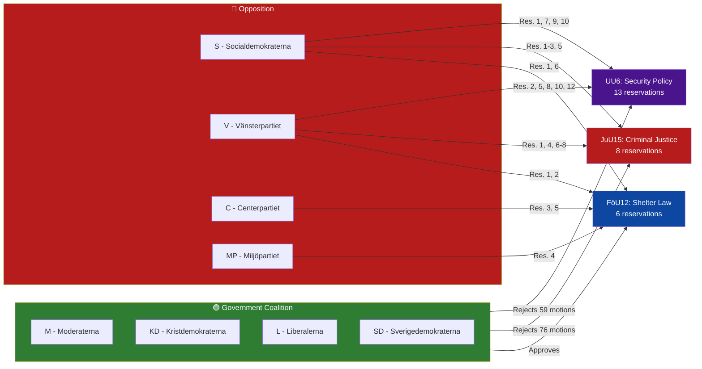

# SWOT Analysis — Committee Reports 2026-04-06

**Generated**: 2026-04-06 (AI-enriched)
**Confidence**: MEDIUM
**Riksmöte**: 2025/26

## Stakeholder SWOT Matrix

### 1. Citizens

| # | Type | Statement | Evidence (dok_id) | Confidence | Impact |
|---|------|-----------|-------------------|------------|--------|
| 1 | S | New shelter law provides modern civilian protection | HD01FöU12 — Prop. 2025/26:142 | HIGH | High |
| 2 | W | 76 criminal justice reform motions rejected — stagnation | HD01JuU15 — all motions rejected | HIGH | Medium |
| 3 | O | Dual healthcare reports may improve care access | HD01SoU16, HD01SoU17 | MEDIUM | Medium |
| 4 | T | Security policy divisions may delay defence coherence | HD01UU6 — 13 reservations | MEDIUM | Medium |

### 2. Government Coalition (M, KD, L, SD)

| # | Type | Statement | Evidence (dok_id) | Confidence | Impact |
|---|------|-----------|-------------------|------------|--------|
| 1 | S | Controls outcomes in all 10 betänkanden | All reports — majority position adopted | HIGH | High |
| 2 | S | Shelter law is signature defence reform | HD01FöU12 — new legislation | HIGH | High |
| 3 | W | 27+ opposition reservations create political friction | FöU12 (6), JuU15 (8), UU6 (13) | HIGH | Medium |
| 4 | O | Election momentum from completed legislative agenda | Session-wide pattern | MEDIUM | Medium |

### 3. Opposition Bloc (S, V, C, MP)

| # | Type | Statement | Evidence (dok_id) | Confidence | Impact |
|---|------|-----------|-------------------|------------|--------|
| 1 | S | Coordinated reservations show bloc discipline | FöU12, JuU15, UU6 — joint reservations | HIGH | Medium |
| 2 | W | Zero motions adopted — limited immediate policy impact | JuU15: 76 rejected; UU6: 59 rejected | HIGH | Low |
| 3 | O | Criminal justice and security become election issues | JuU15 stalemate, UU6 divisions | MEDIUM | High |
| 4 | T | Internal divisions on nuclear disarmament (V vs S) | HD01UU6 — S, V, MP separate reservations | MEDIUM | Medium |

### 4. Business/Industry

| # | Type | Statement | Evidence (dok_id) | Confidence | Impact |
|---|------|-----------|-------------------|------------|--------|
| 1 | S | Shelter law creates construction sector demand | HD01FöU12 — new building requirements | MEDIUM | Medium |
| 2 | W | UTP directive adds supply chain compliance burden | HD01MJU18 — late cancellation ban | MEDIUM | Low |
| 3 | O | Electricity market stability from NU17 outcomes | HD01NU17 — 132 motions reviewed | LOW | Medium |

### 5. Civil Society

| # | Type | Statement | Evidence (dok_id) | Confidence | Impact |
|---|------|-----------|-------------------|------------|--------|
| 1 | S | Gender equality policy maintained | HD01AU11 — discrimination measures | MEDIUM | Medium |
| 2 | W | Housing policy stagnation — 131 motions rejected | HD01CU18 — all motions rejected | HIGH | Medium |
| 3 | O | Minority language protection flagged by audit | HD01KU31 — Riksrevisionen report | MEDIUM | Low |

### 6. International/EU

| # | Type | Statement | Evidence (dok_id) | Confidence | Impact |
|---|------|-----------|-------------------|------------|--------|
| 1 | S | NATO-compatible defence legislation advancing | HD01FöU12 — shelter modernization | HIGH | High |
| 2 | W | Nuclear disarmament divisions complicate NATO position | HD01UU6 — Reservation 10 (S, V, MP) | MEDIUM | Medium |
| 3 | O | EU cultural strategy engagement | HD01KrU10 — Cultural Compass welcomed | LOW | Low |

### 7. Judiciary/Constitutional

| # | Type | Statement | Evidence (dok_id) | Confidence | Impact |
|---|------|-----------|-------------------|------------|--------|
| 1 | S | Constitutional committee reviews parliamentary process | HD01KU38 — MP-focused reform | MEDIUM | Low |
| 2 | O | Consumer rights framework modernization potential | HD01CU17 — 83 motions reviewed | LOW | Low |

### 8. Media/Public Opinion

| # | Type | Statement | Evidence (dok_id) | Confidence | Impact |
|---|------|-----------|-------------------|------------|--------|
| 1 | S | Defence reform generates public interest | HD01FöU12 — civilian protection topic | HIGH | High |
| 2 | W | Criminal justice gridlock frustrates voters | HD01JuU15 — no reform progress | MEDIUM | Medium |
| 3 | O | Security policy debate creates election narrative | HD01UU6 — 13 reservations | MEDIUM | High |

