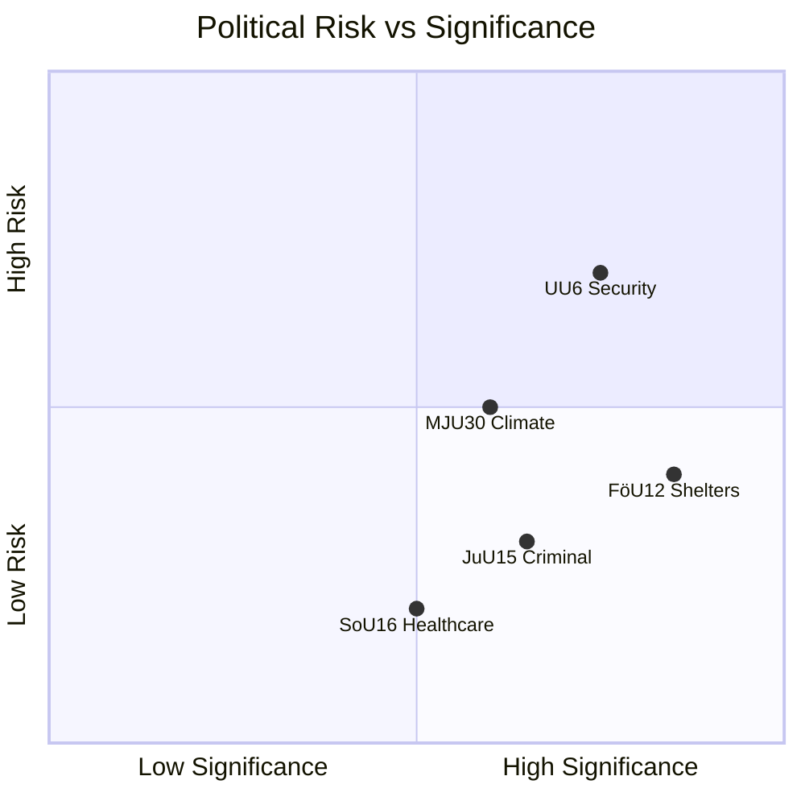

# Analysis Synthesis Summary — 2026-04-06

**Generated**: 2026-04-06 04:34 UTC (AI-enriched)
**Data Sources**: get_betankanden, get_dokument_innehall, search_voteringar
**Documents Analyzed**: 20 (10 with full content enrichment)
**Confidence**: MEDIUM
**Riksmöte**: 2025/26

## Summary

Twenty committee reports (betänkanden) from 2025/26 spanning 11 committees reveal broad legislative activity. The most significant reports address civilian shelter reform (FöU12), criminal justice (JuU15), and security policy (UU6). The government coalition (M, KD, L + SD) controls outcomes across all reports, with the opposition (S, V, C, MP) filing 27+ reservations across the three most contested betänkanden.

## Key Findings

1. **FöU12** — New civilian shelter law (Prop. 2025/26:142) endorsed with 6 reservations. Effective June 1, 2026. [HIGH]
2. **JuU15** — All 76 criminal justice motions rejected; 8 reservations filed (S, V, C, MP). [HIGH]
3. **UU6** — Security policy with 59 motions and 13 reservations — most contested report. [HIGH]
4. **SoU16/SoU17** — Dual healthcare reports on system organization and priorities. [MEDIUM]
5. **MJU30** — Climate targets still in preparation (scheduled June 2026). [MEDIUM]

## Top Documents by Significance

| Score | Committee | dok_id | Title | Reservations |
|-------|-----------|--------|-------|-------------|
| 9/10 | FöU | HD01FöU12 | Strengthened civilian protection | 6 (S, V, C, MP) |
| 8/10 | UU | HD01UU6 | Security policy | 13 (S, V, C, MP) |
| 7/10 | JuU | HD01JuU15 | Criminal justice matters | 8 (S, V, C, MP) |
| 5/10 | SoU | HD01SoU16 | Healthcare organization | TBD |
| 5/10 | SoU | HD01SoU17 | Healthcare priorities | TBD |
| 4/10 | AU | HD01AU11 | Gender equality measures | TBD |
| 4/10 | AU | HD01AU12 | Work environment | TBD |
| 3/10 | SfU | HD01SfU18 | Social insurance | TBD |
| 3/10 | MJU | HD01MJU18 | UTP directive implementation | TBD |
| 3/10 | FöU | HD01FöU11 | Maritime environmental rescue | TBD |

## SWOT Summary

## Risk Matrix

| Risk | Likelihood (1-5) | Impact (1-5) | L×I Score | Level |
|------|------------------|--------------|-----------|-------|
| Shelter law implementation delays | 2 | 4 | 8 | MEDIUM |
| Security policy opposition fragmentation | 3 | 3 | 9 | MEDIUM |
| Criminal justice reform gridlock until 2026 election | 4 | 3 | 12 | HIGH |
| Healthcare reform stagnation | 2 | 3 | 6 | LOW |

## Forward Indicators

1. **FöU12 Chamber Vote** — Expected within 2 weeks. Watch for amendment negotiations. [HIGH]
2. **UU6 Debate Scheduling** — 13 reservations guarantee extended debate. Monitor S positioning on nuclear disarmament. [HIGH]
3. **MJU30 Climate Preparation** — Beredning scheduled May 19, 2026. Key environmental flashpoint. [MEDIUM]
4. **Opposition bloc coordination** — Whether S holds unified opposition or V/MP push radical positions in chamber votes. [MEDIUM]

## Data Quality Notes

Overall confidence: **MEDIUM**. Full-text content available for FöU12, JuU15, UU6. Other reports have metadata + summary.
**Data Freshness**: Documents sourced from March 26 – April 2, 2026.
