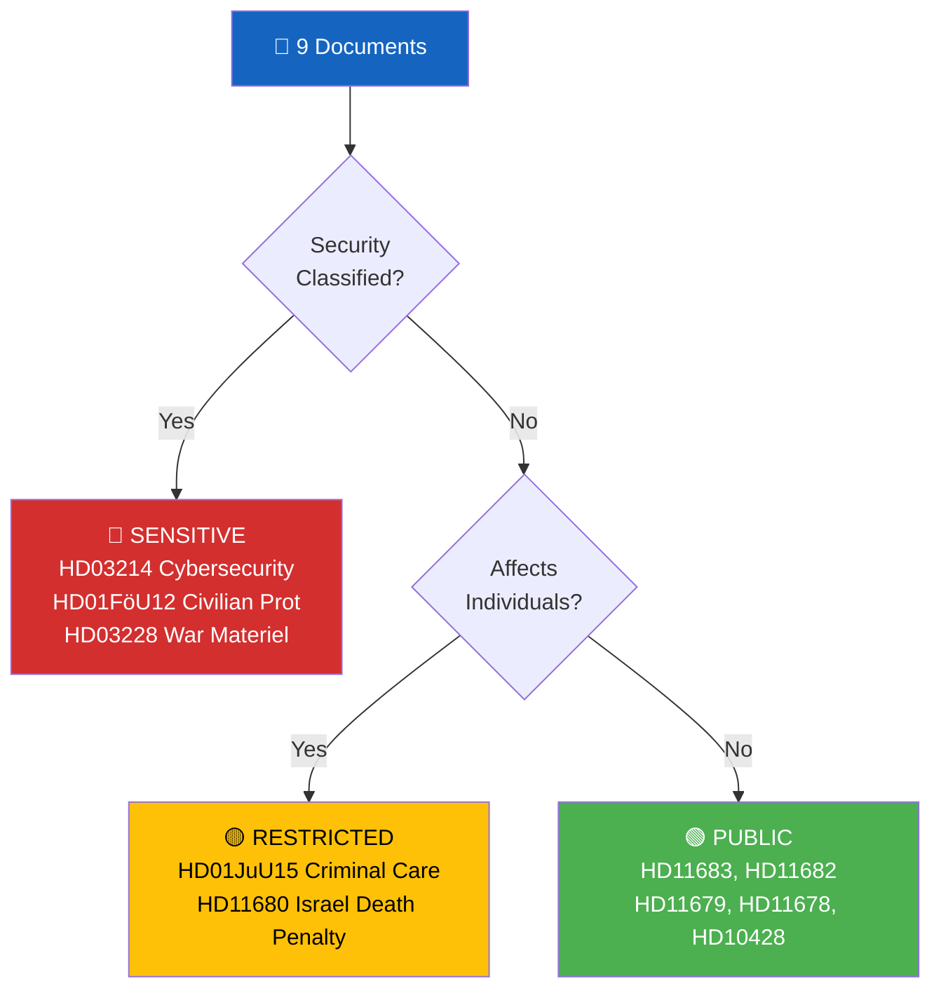

# Political Classification Results — 2026-04-06

| **Key** | **Value** |
|---------|-----------|
| **ID** | CLS-2026-04-06-EVE |
| **Date** | 2026-04-06 |
| **Riksmöte** | 2025/26 |
| **Confidence** | HIGH |
| **Documents Classified** | 9 |

## Sensitivity Decision Tree

## Per-Document Classification

| dok_id | Title | Sensitivity | Domain | Urgency | Significance (0-10) |
|--------|-------|-------------|--------|---------|---------------------|
| HD01JuU15 | Kriminalvårdsfrågor | RESTRICTED | Criminal Justice | Medium | 6/10 |
| HD01FöU12 | Starkare skydd för civilbefolkningen | SENSITIVE | Security & Defense | High | 8/10 |
| HD11683 | Förföljelse av kristna och minoriteter | PUBLIC | International/Human Rights | Low | 3/10 |
| HD11682 | Miljömålsberedningens nästa uppdrag | PUBLIC | Environment | Low | 4/10 |
| HD11681 | Norra Kärr | PUBLIC | Environment/Mining | Low | 2/10 |
| HD11680 | Israels nya dödsstraffslag | PUBLIC | International/Human Rights | Low | 3/10 |
| HD11679 | Arbetet med Stockholmsinitiativet | PUBLIC | International | Low | 3/10 |
| HD11678 | Bullerkameror lagändringar | PUBLIC | Transport/Environment | Low | 2/10 |
| HD10428 | Beredskapsflygplats Scandinavian Mountain Airport | PUBLIC | Infrastructure/Defense | Medium | 4/10 |

---
*Document Control: CLS-2026-04-06-EVE | Riksdagsmonitor Classification | 2026-04-06*
