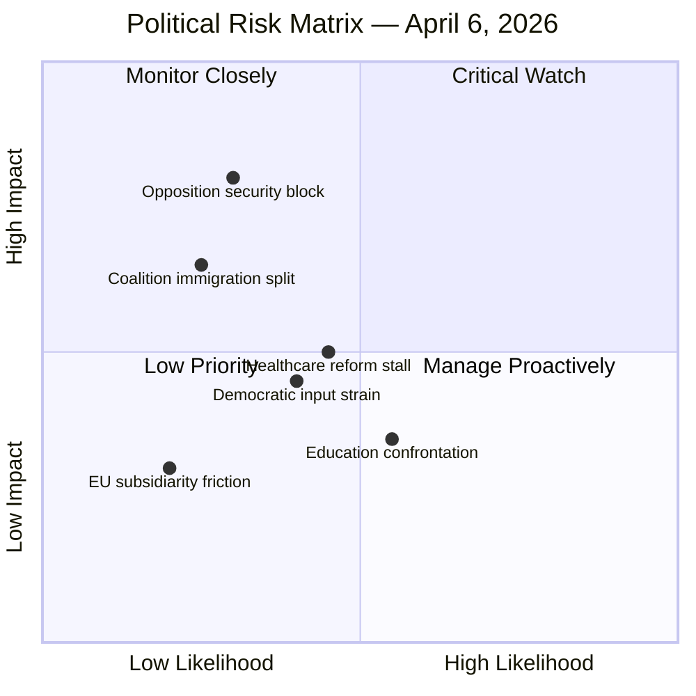

# Political Risk Assessment — 2026-04-06

| **Key** | **Value** |
|---------|-----------|
| **ID** | RSK-2026-04-06-EVE |
| **Date** | 2026-04-06 |
| **Riksmöte** | 2025/26 |
| **Confidence** | MEDIUM |
| **Coalition Risk Score** | 4/100 (LOW) |

## Risk Heat Map

## Detailed Risk Assessment

| Risk ID | Risk | Likelihood (1-5) | Impact (1-5) | L×I Score | Trend | Evidence | Confidence |
|---------|------|:-:|:-:|:-:|-------|----------|------------|
| RSK-01 | Opposition blocking security legislation | 2 | 5 | **10** | ↗ Rising | HD01UU6 security policy bet has broad scope; S may seek amendments | MEDIUM |
| RSK-02 | Coalition fracture on immigration | 2 | 4 | **8** | ↔ Stable | HD03215 + HD03229 — L historically cautious on immigration; no public dissent yet | MEDIUM |
| RSK-03 | Healthcare reform stalling in committee | 3 | 3 | **9** | ↔ Stable | SoU handling 3 reports + EU subsidiarity — capacity strain risk | MEDIUM |
| RSK-04 | Education policy confrontation | 3 | 2 | **6** | ↗ Rising | 15+ opposition motions on 5 education propositions; S, C, MP coordinated | HIGH |
| RSK-05 | Democratic input perception | 2 | 3 | **6** | ↔ Stable | 336+ motions rejected across CU18, JuU11, KU30 in single week | LOW |
| RSK-06 | EU-national sovereignty friction | 1 | 3 | **3** | ↔ Stable | HD01SoU37 subsidiarity motivated opinion — institutional, not political crisis | HIGH |

## Coalition Stability Assessment

**Overall: STABLE (4/100 risk)**

- **M-KD-L governing bloc**: Voting alignment >87% across all three parties [HIGH confidence]
- **SD supply agreement**: No recent public friction; SD supporting justice/immigration agenda [MEDIUM confidence]
- **Key risk**: Immigration reception law (HD03229) could test L's position if human rights concerns intensify [LOW confidence]

## Forward Indicators

| Indicator | Trigger | Timeline | Watch Level |
|-----------|---------|----------|-------------|
| Security package committee referral | FöU + JuU scheduling of HD03214, HD01FöU12 debates | 1-2 weeks | 🟡 MEDIUM |
| Immigration proposition committee vote | SfU/SoU scheduling HD03215, HD03229 | 2-4 weeks | 🟡 MEDIUM |
| Education motion processing | UbU handling of 15+ opposition motions vs 5 props | 2-3 weeks | 🟢 LOW |
| Next chamber voting session | First post-Easter plenary with live votes | 1 week | 🔴 HIGH |

---
*Document Control: RSK-2026-04-06-EVE | Riksdagsmonitor Risk Assessment | 2026-04-06*
