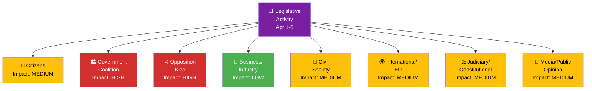

# Stakeholder Impact Analysis — 2026-04-06

| **Key** | **Value** |
|---------|-----------|
| **ID** | STA-2026-04-06-EVE |
| **Date** | 2026-04-06 |
| **Riksmöte** | 2025/26 |
| **Confidence** | MEDIUM |
| **Stakeholder Groups** | 8 analyzed |

## Impact Radar

## Stakeholder Assessment

### 1. Citizens
| Aspect | Assessment | Evidence | Confidence |
|--------|-----------|----------|------------|
| Healthcare access | Positive — HD03216 strengthens municipal healthcare competence | Prop 2025/26:216 | HIGH |
| Criminal justice | Mixed — stricter deportation (HD03235) vs criminal care reform (HD01JuU15) | Prop 2025/26:235, Bet JuU15 | MEDIUM |
| Consumer protection | Positive — new consumer credit law (HD03223) | Prop 2025/26:223 | MEDIUM |

### 2. Government Coalition (M, KD, L + SD supply)
| Aspect | Assessment | Evidence | Confidence |
|--------|-----------|----------|------------|
| Legislative agenda | Strong — 4 major propositions tabled April 1 | HD03214, HD03235, HD03228, HD03216 | HIGH |
| Coalition discipline | Stable — KD-M 88.5%, L-M 87.9% voting alignment | Voting data rm 2025/26 | MEDIUM |
| Security credibility | Strengthened — coordinated defense package | HD03214, HD01FöU12, HD03228 | HIGH |

### 3. Opposition Bloc (S, V, MP, C)
| Aspect | Assessment | Evidence | Confidence |
|--------|-----------|----------|------------|
| S strategy | Active — 15+ motions filed April 1; systematic counter-proposals on education, housing, finance | HD024008-HD024026 | HIGH |
| C engagement | Targeted — motions on education (HD024035, HD024041, HD024044) and rural policy (HD024038) | Multiple C motions | MEDIUM |
| MP/V position | Opposition — V and MP filing motions to reject welfare sanctions (HD024031, HD024052) | HD024031, HD024052 | HIGH |

### 4. Business/Industry
| Aspect | Assessment | Evidence | Confidence |
|--------|-----------|----------|------------|
| Regulatory environment | Neutral — business regulation debate (NU15) concluded; 55 motions rejected | HD01NU15, speeches on NU15 | MEDIUM |
| Energy policy | Under review — electricity market debate (NU17), 132 motions rejected | HD01NU17, speeches on NU17 | MEDIUM |
| Rural business | Mixed — rural policy proposition (HD024026, HD024038, HD024055) generating opposition motions | Various NU motions | LOW |

### 5. Civil Society
| Aspect | Assessment | Evidence | Confidence |
|--------|-----------|----------|------------|
| Housing access | Contentious — 131 housing motions rejected (HD01CU18); flexible rental market prop | HD01CU18, HD024011 | MEDIUM |
| Social services | Reform — social insurance reform (HD01SfU18) + social services work (HD01SoU18) | HD01SfU18, HD01SoU18 | MEDIUM |
| Children/youth | Active — 115 motions on children in social services rejected (HD01SoU19) | HD01SoU19 | MEDIUM |

### 6. International/EU
| Aspect | Assessment | Evidence | Confidence |
|--------|-----------|----------|------------|
| NATO/defense | Positive — war materiel modernization (HD03228) + cybersecurity center (HD03214) strengthen alliance contribution | HD03228, HD03214 | HIGH |
| EU subsidiarity | Friction — motivated opinion on GMO/organ directive (HD01SoU37) | HD01SoU37 | HIGH |
| Ukraine support | Active — aggression tribunal (HD01UU21) + compensation commission (HD01UU20) | HD01UU21, HD01UU20 | HIGH |

### 7. Judiciary/Constitutional
| Aspect | Assessment | Evidence | Confidence |
|--------|-----------|----------|------------|
| Security protection | Enhanced — property transfer security requirements (HD01JuU29) effective July 1, 2026 | HD01JuU29 | HIGH |
| Criminal law | Reform — youth crime investigation improvements (HD03227) | HD03227 | MEDIUM |
| Constitutional issues | Addressed — 83 constitutional motions processed (HD01KU30) | HD01KU30 | MEDIUM |

### 8. Media/Public Opinion
| Aspect | Assessment | Evidence | Confidence |
|--------|-----------|----------|------------|
| Security narrative | Government dominating — coordinated defense messaging | HD03214, HD01FöU12, HD03228 | MEDIUM |
| Immigration debate | Intensifying — deportation + reception + housing forming policy cluster | HD03235, HD03229, HD03215 | MEDIUM |
| Education politics | High engagement — multiple party positions generating debate material | 15+ education motions | LOW |

---
*Document Control: STA-2026-04-06-EVE | Riksdagsmonitor Stakeholder Analysis | 2026-04-06*
