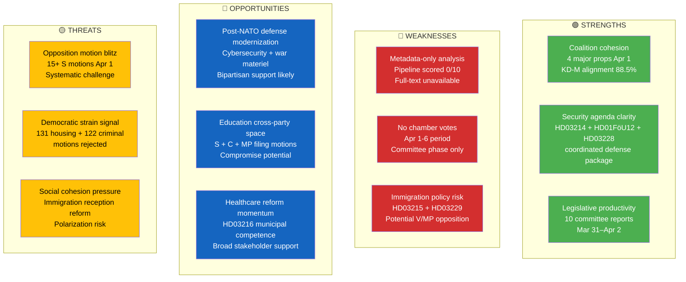

# Political SWOT Analysis — 2026-04-06

| **Key** | **Value** |
|---------|-----------|
| **ID** | SWT-2026-04-06-EVE |
| **Date** | 2026-04-06 |
| **Riksmöte** | 2025/26 |
| **Confidence** | MEDIUM |
| **Documents Analyzed** | 30+ (committee reports, propositions, motions) |

## SWOT Quadrant Map

## Detailed SWOT with Evidence

### Strengths

| # | Factor | Evidence | dok_id | Confidence |
|---|--------|----------|--------|------------|
| S1 | Coalition legislative cohesion | 4 major government propositions tabled on April 1: cybersecurity (HD03214), deportation (HD03235), war materiel (HD03228), municipal healthcare (HD03216) | HD03214, HD03235, HD03228, HD03216 | HIGH |
| S2 | Security agenda coordination | Defense committee report on civilian protection (HD01FöU12) aligns with cybersecurity center proposition — coordinated security posture | HD01FöU12, HD03214 | HIGH |
| S3 | Cross-party voting alignment | KD-M alignment 88.5%, L-M 87.9%, indicating stable governing bloc cohesion in votes | Voting data rm 2025/26 | MEDIUM |

### Weaknesses

| # | Factor | Evidence | dok_id | Confidence |
|---|--------|----------|--------|------------|
| W1 | No recent chamber votes | No votes recorded for April 1-6; all activity in committee preparation phase | Voting search rm 2025/26 | HIGH |
| W2 | Healthcare committee overload | SoU handling 3 major reports simultaneously (SoU16, SoU17, SoU37) plus EU subsidiarity check | HD01SoU16, HD01SoU17, HD01SoU37 | MEDIUM |
| W3 | Immigration policy tension | Time-limited housing (HD03215) and new reception law (HD03229) face V/MP opposition per motion filings | HD03215, HD03229, HD024052 | MEDIUM |

### Opportunities

| # | Factor | Evidence | dok_id | Confidence |
|---|--------|----------|--------|------------|
| O1 | Defense modernization momentum | Post-NATO accession: cybersecurity center + modern war materiel framework + civilian protection strengthening | HD03214, HD03228, HD01FöU12 | HIGH |
| O2 | Education policy engagement | S (6 motions), C (4 motions), MP (3 motions) all engaging with education propositions — cross-party compromise space | HD024025, HD024035, HD024054 | MEDIUM |
| O3 | Crime victim focus | Victim-centered compensation reform (HD03222) has broad potential support across parties | HD03222 | MEDIUM |

### Threats

| # | Factor | Evidence | dok_id | Confidence |
|---|--------|----------|--------|------------|
| T1 | Opposition systematic challenge | S filed 15+ motions on April 1 across education, housing, finance, social insurance — coordinated strategy | HD024008-HD024026 | HIGH |
| T2 | Rejected motion volume | 131 housing motions (CU18), 122 criminal law (JuU11), 83 constitutional (KU30) rejected — democratic input concerns | HD01CU18, HD01JuU11, HD01KU30 | MEDIUM |
| T3 | EU subsidiarity tension | Riksdag found EU GMO/organ directive not fully compatible with subsidiarity — signals EU-national friction | HD01SoU37 | LOW |

---
*Document Control: SWT-2026-04-06-EVE | Riksdagsmonitor SWOT Analysis | 2026-04-06*
