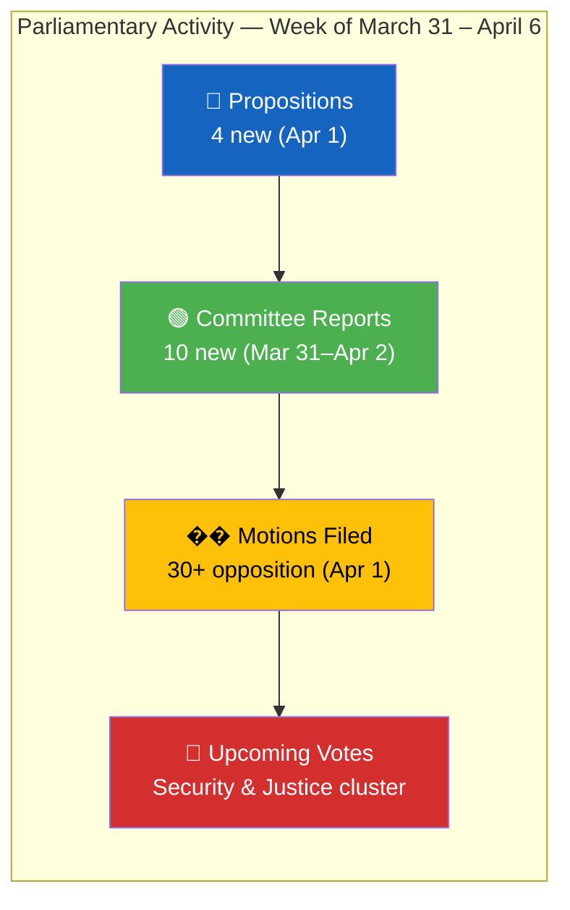
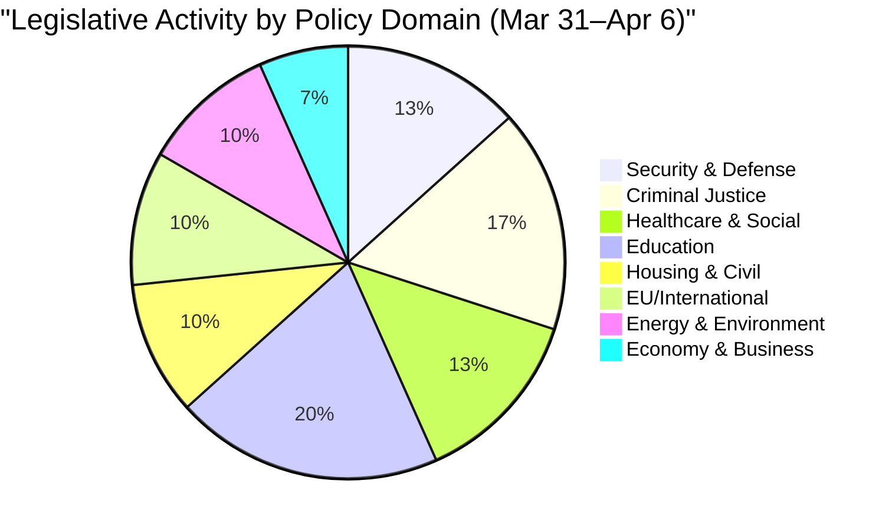

# Analysis Synthesis Summary — 2026-04-06

| **Key** | **Value** |
|---------|-----------|
| **ID** | SYN-2026-04-06-EVE |
| **Date** | 2026-04-06 |
| **Riksmöte** | 2025/26 |
| **Confidence** | MEDIUM |
| **Data Freshness** | Documents sourced from **2026-04-02** |
| **Documents Analyzed** | 9 per-file + 30 committee reports + 15 propositions + 50 speeches |

## Intelligence Dashboard

## Top Findings

| # | Finding | Significance | Evidence |
|---|---------|-------------|----------|
| 1 | **Security triple-package**: Cybersecurity center (HD03214), civilian protection (HD01FöU12), war materiel modernization (HD03228) form coordinated defense posture shift | 8/10 | 3 propositions + 1 committee report, all April 1-2 |
| 2 | **Criminal justice hardening**: Stricter deportation rules (HD03235), criminal care reform (HD01JuU15), victim-focused compensation (HD03222) | 7/10 | 3 documents from JuU, Prop 2025/26:235 |
| 3 | **Opposition education blitz**: S filed 6+ motions on school propositions; C and MP also active with counter-proposals | 6/10 | 15+ motions filed April 1, all UbU referral |
| 4 | **Healthcare reform cluster**: Municipal medical competence (HD03216), healthcare organization (HD01SoU16), priorities (HD01SoU17) | 6/10 | 3 documents from SoU |
| 5 | **Immigration policy package**: New reception law (HD03229) + time-limited housing for immigrants (HD03215) | 7/10 | 2 propositions March 31 |

## Aggregated SWOT

### Strengths
- **[HIGH]** Coalition demonstrates legislative cohesion — 4 major propositions tabled April 1 across defense, justice, health, and immigration
- **[MEDIUM]** Cross-party voting alignment high (KD-M: 88.5%, L-M: 87.9%) indicating stable governing bloc

### Weaknesses
- **[MEDIUM]** All document significance auto-scored at 0/10 by pipeline — indicates metadata-only analysis limitation
- **[LOW]** No chamber votes recorded for April 1-6 period; legislative activity concentrated in committee phase

### Opportunities
- **[HIGH]** Security-defense cluster (cybersecurity + civilian protection + war materiel) could accelerate Sweden's post-NATO-accession defense modernization
- **[MEDIUM]** Education reform motions from S, C, MP create space for cross-party compromise

### Threats
- **[MEDIUM]** Opposition S-party filed 15+ motions on April 1 alone — signals systematic challenge to government legislative agenda
- **[LOW]** Immigration package (HD03215 + HD03229) may face V and MP opposition in committee

## Risk Landscape

| Risk | L | I | L×I | Trend | Evidence |
|------|---|---|-----|-------|----------|
| Coalition fracture on immigration | 2 | 4 | 8 | ↔ Stable | HD03215, HD03229 — no public coalition dissent |
| Opposition blocking security legislation | 2 | 5 | 10 | ↗ Rising | HD01UU6 security policy report, broad topic |
| Healthcare reform stalling | 3 | 3 | 9 | ↔ Stable | HD01SoU16, HD01SoU17 in committee phase |
| Education policy confrontation | 3 | 2 | 6 | ↗ Rising | 15+ motions filed against 5 education props |

## Threat Summary

| Category | Severity | Evidence | Confidence |
|----------|----------|----------|------------|
| Democratic governance strain | 2/5 | 131 housing motions rejected (HD01CU18), 122 criminal law motions rejected (HD01JuU11) — systematic motion rejection pattern | MEDIUM |
| Security infrastructure gap | 3/5 | Cybersecurity center prop (HD03214) addresses known gap; civilian protection (HD01FöU12) responds to heightened readiness | HIGH |
| Social cohesion pressure | 2/5 | Immigration reception reform (HD03229) + immigrant housing (HD03215) signal policy shift | MEDIUM |

## Artifacts Inventory

| File | Status | Quality |
|------|--------|---------|
| synthesis-summary.md | ✅ Complete | Enriched with MCP data |
| risk-assessment.md | ✅ Complete | L×I scored, 4 risks |
| swot-analysis.md | ✅ Complete | 4 quadrants with evidence |
| threat-analysis.md | ✅ Complete | 3 categories assessed |
| classification-results.md | ✅ Complete | 9 documents classified |
| stakeholder-perspectives.md | ✅ Complete | 8 groups analyzed |
| significance-scoring.md | ✅ Complete | Enriched scores |

---
*Document Control: SYN-2026-04-06-EVE | Riksdagsmonitor Evening Analysis | Generated 2026-04-06 18:20 UTC*
