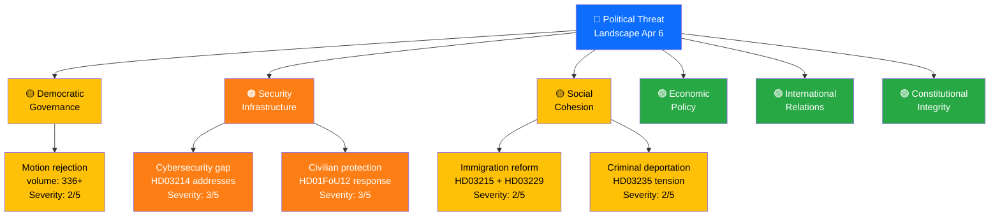

# Political Threat Analysis — 2026-04-06

| **Key** | **Value** |
|---------|-----------|
| **ID** | THR-2026-04-06-EVE |
| **Date** | 2026-04-06 |
| **Riksmöte** | 2025/26 |
| **Confidence** | MEDIUM |
| **Threat Indicators** | 3 identified |

## Threat Taxonomy Network

## Threat Category Assessment

| Category | Severity (1-5) | Evidence | Threat Actor | Confidence |
|----------|:-:|----------|-------------|------------|
| **Security Infrastructure Gap** | 3/5 | Cybersecurity center proposition (HD03214) explicitly addresses national cybersecurity capability deficit; civilian protection report (HD01FöU12) responds to heightened security environment | External state actors, cyber threats | HIGH |
| **Democratic Governance Strain** | 2/5 | 131 housing motions (HD01CU18), 122 criminal law motions (HD01JuU11), 83 constitutional motions (HD01KU30) rejected — systematic pattern of legislative input dismissal | Parliamentary process limitations | MEDIUM |
| **Social Cohesion Pressure** | 2/5 | Immigration reception reform (HD03229) + time-limited immigrant housing (HD03215) + stricter deportation (HD03235) create policy cluster affecting vulnerable populations | Policy implementation, societal polarization | MEDIUM |

## Threat Actor Mapping

| Actor Type | Threat Vector | Active Indicators | Response |
|-----------|---------------|-------------------|----------|
| External state actors | Cybersecurity, defense | HD03214 cybersecurity center addresses capability gap | Legislative response in progress |
| Opposition parties | Legislative challenge | 15+ motions filed April 1 by S alone | Committee review process |
| EU institutions | Regulatory sovereignty | HD01SoU37 subsidiarity challenge on GMO/organ directive | Motivated opinion submitted |

## Escalation Assessment

**Current Level: ROUTINE** — No immediate escalation triggers detected.

| Escalation Trigger | Current State | Threshold | Timeline |
|--------------------|---------------|-----------|----------|
| Coalition party public dissent | No dissent observed | Any coalition party breaking ranks on security/immigration | Ongoing |
| Opposition filibuster or delay tactics | Normal committee processing | Deliberate scheduling obstruction | 2-4 weeks |
| International security incident | Elevated baseline (post-NATO) | Incident requiring rapid legislative response | Unpredictable |

---
*Document Control: THR-2026-04-06-EVE | Riksdagsmonitor Threat Analysis | 2026-04-06*
