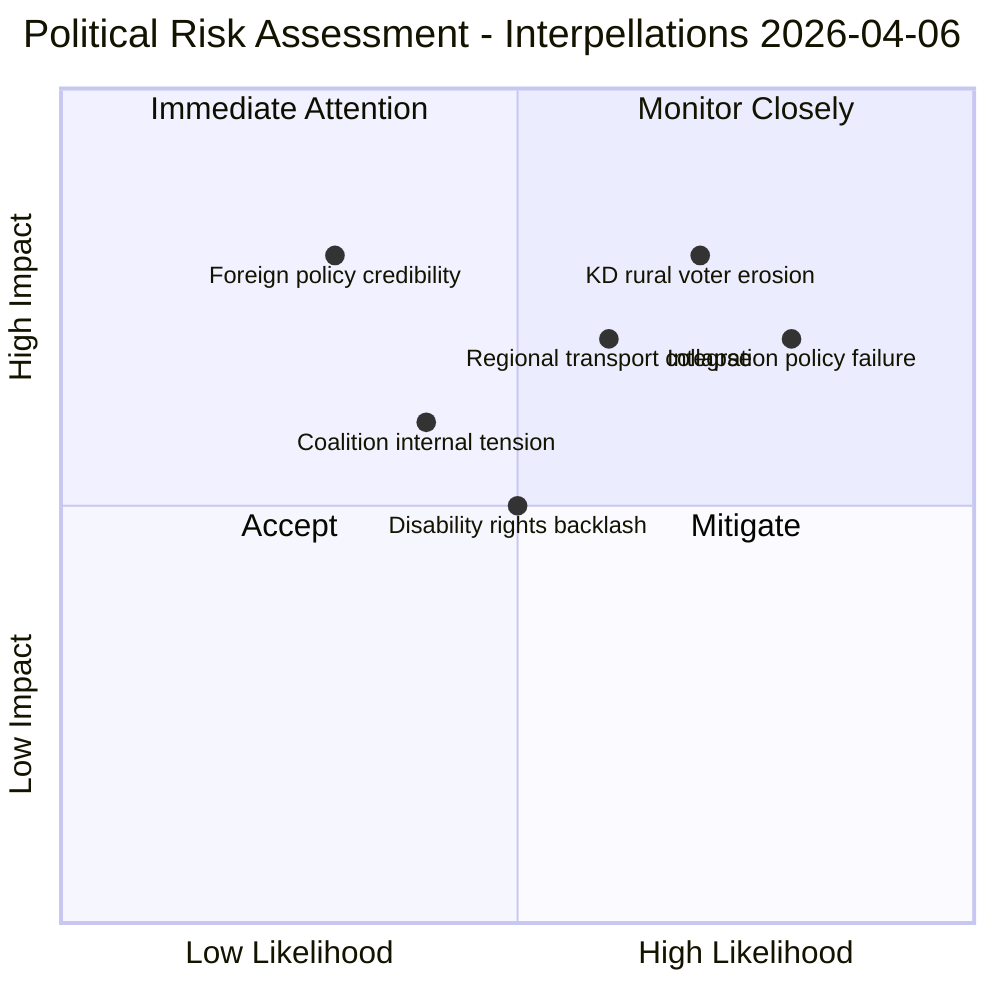

# Political Risk Assessment — 2026-04-06

**Generated**: 2026-04-06 07:03 UTC
**Data Sources**: get_interpellationer, CIA coalition data
**Documents Analyzed**: 15
**Confidence**: MEDIUM

## Risk Matrix

| # | Risk | Likelihood (1-5) | Impact (1-5) | L×I Score | Confidence |
|---|------|-------------------|--------------|-----------|------------|
| 1 | KD loses rural voter base due to regional transport cuts | 4 | 4 | 16 | HIGH |
| 2 | Government fails to respond within 4-week statutory deadline | 3 | 3 | 9 | MEDIUM |
| 3 | Integration metrics worsen despite government claims | 4 | 3 | 12 | HIGH |
| 4 | Coalition tension between L and M/KD on integration approach | 2 | 4 | 8 | LOW |
| 5 | Foreign policy inconsistency on human rights (Israel) | 2 | 4 | 8 | MEDIUM |
| 6 | Police discrimination case expands to systemic review | 3 | 3 | 9 | MEDIUM |

## Coalition Stability Assessment

**Coalition Risk Score**: 4/100 (LOW)
**Majority Margin**: 176/349 seats (adequate)
**Voting Discipline**: Strong (88%+ alignment across M-KD-L)

The interpellation wave does not threaten coalition survival but exposes policy vulnerabilities that could erode electoral support — particularly for KD in rural constituencies where regional transport is a salient issue.

## Forward Indicators

| Indicator | Trigger | Timeline | Watch For |
|-----------|---------|----------|-----------|
| Minister Carlson's response to transport interpellations | Statutory 4-week deadline | By May 1, 2026 | Substantive policy commitment vs. procedural deflection |
| Trafikverket infrastructure plan update | National transport plan revision | Q2 2026 | Whether regional air routes preserved |
| Integration employment statistics | SCB quarterly data | Q2 2026 | Foreign-born employment rate trend |
| DO vs. Police discrimination case | Court proceedings | 2026 | Whether systemic discrimination finding |

## Data Quality Notes

Risk assessment based on interpellation metadata and CIA coalition stability metrics. Direct minister response data unavailable via MCP speech search.
