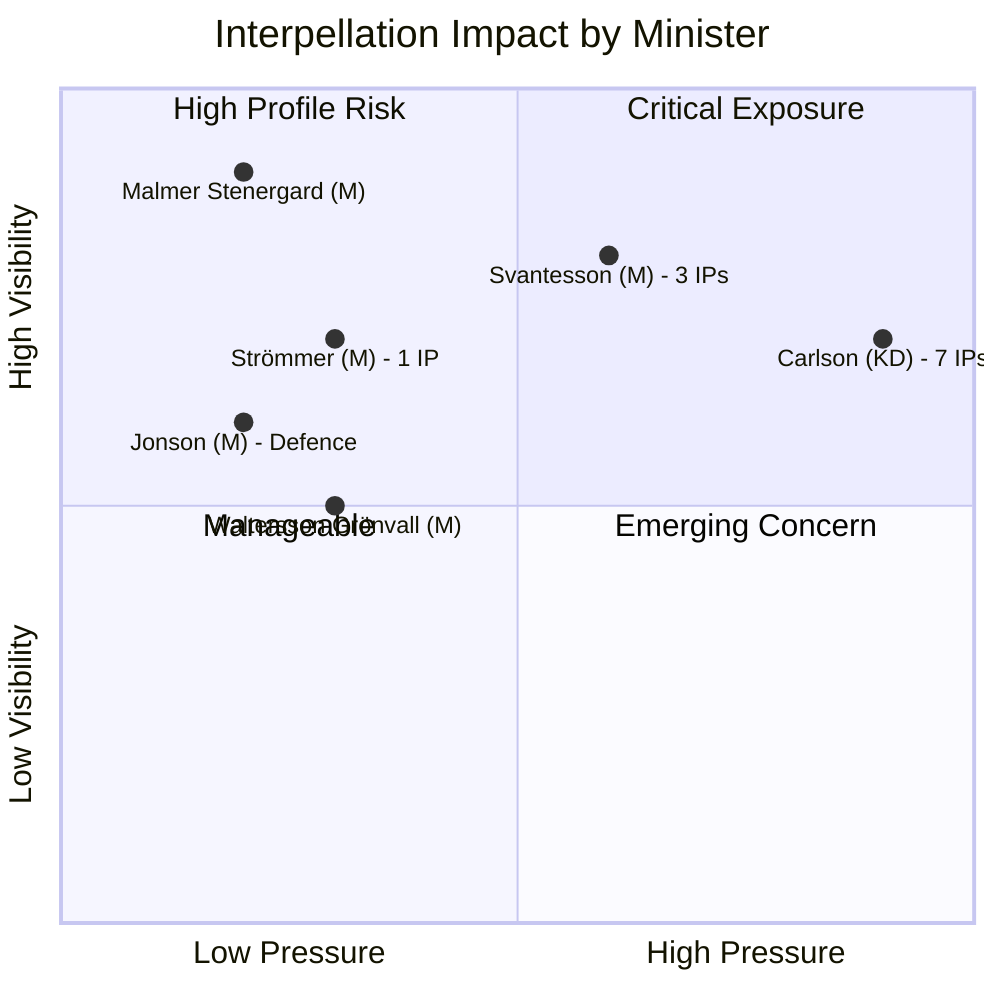

# Political SWOT Analysis — 2026-04-06

**Generated**: 2026-04-06 07:03 UTC
**Data Sources**: get_interpellationer (15 documents, rm 2025/26)
**Confidence**: MEDIUM

## Summary

Multi-stakeholder SWOT analysis of 15 interpellations filed March 25–April 2, 2026.

## Citizens
| # | Statement | Evidence | Confidence | Impact |
|---|-----------|----------|------------|--------|
| 1 | Regional transport cuts threaten rural connectivity | HD10424, HD10410 (flights/railways) | HIGH | Citizens in Värmland, Dalarna lose essential transport links |
| 2 | Social dumping shifts vulnerable people between municipalities | HD10423 (social dumpning) | MEDIUM | Socially vulnerable citizens face inadequate support |
| 3 | Disability rights gaps in infrastructure and services | HD10412, HD10416, HD10411, HD10409 | HIGH | People with disabilities face accessibility barriers |

## Government Coalition
| # | Statement | Evidence | Confidence | Impact |
|---|-----------|----------|------------|--------|
| 1 | **Strength**: Coalition maintains legislative majority (176/349 seats) | CIA coalition data | HIGH | Can survive interpellation pressure without policy concessions |
| 2 | **Weakness**: KD's infrastructure minister absorbs 47% of all interpellations | HD10428, HD10424, HD10410, HD10418, HD10417, HD10413, HD10412 | HIGH | Undermines KD's "regional party" brand |
| 3 | **Weakness**: Cross-ministerial spread (8 ministers) prevents unified defense | All 15 interpellations | MEDIUM | Each minister must prepare individual responses |

## Opposition Bloc
| # | Statement | Evidence | Confidence | Impact |
|---|-----------|----------|------------|--------|
| 1 | **Strength**: S demonstrates disciplined coordination (13/15 interpellations) | Filing pattern analysis | HIGH | Builds coherent regional neglect narrative |
| 2 | **Strength**: Lawen Redar (S) files 3 interpellations to 3 ministers in one week | HD10420, HD10421, HD10422 | HIGH | Individual MP demonstrates cross-portfolio capability |
| 3 | **Opportunity**: V carves complementary disability rights niche | HD10412, HD10416 (Awad) | MEDIUM | Expands opposition scrutiny without duplicating S themes |

## Business/Industry
| # | Statement | Evidence | Confidence | Impact |
|---|-----------|----------|------------|--------|
| 1 | Datacenter expansion needs national energy plan | HD10414 (From to Busch) | MEDIUM | Tech industry competitiveness depends on electricity access |
| 2 | Postnord governance affects commercial logistics | HD10427 (From to Svantesson) | MEDIUM | State-owned enterprise management impacts delivery services |
| 3 | Regional airport closures affect tourism industry | HD10428 (Hultqvist), HD10424 (Dahlqvist) | HIGH | Malung-Sälen tourism economy threatened |

## Civil Society
| # | Statement | Evidence | Confidence | Impact |
|---|-----------|----------|------------|--------|
| 1 | Funktionsrätt Sverige review creates accountability baseline | HD10416 (Awad to Waltersson Grönvall) | MEDIUM | Independent CSO evaluation pressures government |
| 2 | Integration failure affects half million foreign-born residents | HD10421, HD10422 (Redar) | HIGH | Civil society organizations supporting integration strained |

## International/EU
| # | Statement | Evidence | Confidence | Impact |
|---|-----------|----------|------------|--------|
| 1 | Israel death penalty legislation raises human rights questions | HD10426 (Muranovic to Malmer Stenergard) | HIGH | Sweden's foreign policy consistency tested |
| 2 | NATO membership increases defense infrastructure demands | HD10425 (Olsson), HD10428 (Hultqvist) | MEDIUM | Allied expectations for northern strategic depth |

## Judiciary/Constitutional
| # | Statement | Evidence | Confidence | Impact |
|---|-----------|----------|------------|--------|
| 1 | DO suing Police for discrimination tests institutional accountability | HD10420 (Redar to Strömmer) | HIGH | Ombudsman enforcement mechanisms under scrutiny |
| 2 | Supreme Court Road 62 ruling exhausts legal remedies | HD10418 (Dahlqvist) | HIGH | Forces political action where courts cannot intervene |

## Media/Public Opinion
| # | Statement | Evidence | Confidence | Impact |
|---|-----------|----------|------------|--------|
| 1 | Regional transport narrative has strong media resonance | HD10424, HD10410, HD10428 | MEDIUM | Local media amplifies rural infrastructure concerns |
| 2 | Uppdrag granskning coverage of LSS failures drives public attention | HD10409 (Seye Larsen) | HIGH | Investigative journalism creates political pressure |

## Data Quality Notes

SWOT confidence: MEDIUM. Based on interpellation metadata and summaries. Full-text analysis would increase confidence. Minister response data unavailable via MCP speech search.
