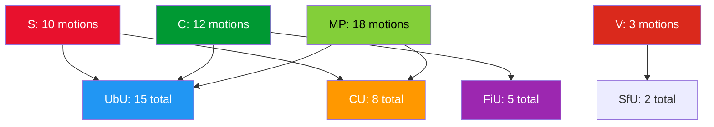

# Political SWOT Analysis — 2026-04-06

**Generated**: 2026-04-06 07:13 UTC | **AI-Enriched**: 2026-04-06 07:30 UTC
**Data Sources**: get_motioner (50 motions, rm 2025/26)
**Documents Analyzed**: 50
**Confidence**: HIGH

## Summary

SWOT analysis of 50 opposition motions filed 1 April 2026 by S (10), C (12), MP (18), and V (3) targeting 14 government propositions across 10 Riksdag committees. Education (UbU, 15 motions) is the dominant battleground.

## Detailed SWOT — Government Coalition (Tidö)

### Strengths
| # | Statement | Evidence | Confidence | Impact |
|---|-----------|----------|------------|--------|
| S1 | Majority secured with SD support (176/349 seats) | Coalition risk score: 4/100 | HIGH | Most motions will be voted down |
| S2 | Education reform package comprehensive (5 props) | Props 191, 193, 194, 195, 197 | HIGH | Government sets agenda breadth |
| S3 | Cross-party voting alignment strong (KD-M 88%) | Risk assessment anomaly data | MEDIUM | Coalition discipline holds |

### Weaknesses
| # | Statement | Evidence | Confidence | Impact |
|---|-----------|----------|------------|--------|
| W1 | School safety bill (prop 193) faces 3-party opposition | S: HD024018, C: HD024041, MP: HD024050 | HIGH | Committee debate will be contentious |
| W2 | Education transparency exemption draws bipartisan criticism | S: HD024024, MP: HD024049 | HIGH | Public opinion may shift against gov |
| W3 | Benefit sanctions (prop 210) rejected by V and MP outright | V: HD024031, MP: HD024052 | HIGH | Social insurance pillar under pressure |

### Opportunities
| # | Statement | Evidence | Confidence | Impact |
|---|-----------|----------|------------|--------|
| O1 | Opposition divided on methods (S vs C vs MP on school support) | S: resources, C: testing, MP: autonomy | MEDIUM | Gov can exploit opposition disagreements |
| O2 | V's low output (3 motions) signals opposition fragmentation | HD024031, HD024030, HD024028 | MEDIUM | V-MP competition weakens left bloc |

### Threats
| # | Statement | Evidence | Confidence | Impact |
|---|-----------|----------|------------|--------|
| T1 | 15 UbU motions indicate education is opposition's prime target | All 4 parties filing on UbU | HIGH | Election 2026 education focus |
| T2 | MP's 18-motion breadth shows party rebuilding post-2022 | 7 committees targeted by MP | MEDIUM | Strengthened green opposition |
| T3 | Hydropower exemption (prop 202) faces environment vs energy clash | S: HD024009, C: HD024040, MP: HD024047 | HIGH | EU compliance risk |

## SWOT — Opposition Bloc

### Strengths
| # | Statement | Evidence | Confidence | Impact |
|---|-----------|----------|------------|--------|
| S1 | Cross-party coordination on 3 key propositions | Props 193, 202, 210 each draw 2-3 parties | HIGH | Unified opposition messaging |
| S2 | Education as unified battleground — all 4 parties file on UbU | 15 UbU motions | HIGH | Electoral ammunition for 2026 |

### Weaknesses
| # | Statement | Evidence | Confidence | Impact |
|---|-----------|----------|------------|--------|
| W1 | No common alternative — competing visions on school policy | S: equity, C: testing, MP: autonomy | MEDIUM | Cannot form joint counter-proposal |
| W2 | V marginalised with only 3 motions | V vs MP (18) shows imbalance | MEDIUM | Left bloc coordination weak |

## Key Findings

1. Education is the dominant opposition battleground (15/50 motions to UbU)
2. Three propositions face multi-party opposition: school safety (3 parties), hydropower (3), benefit sanctions (2)
3. MP leads on breadth (18 motions, 7 committees), S leads on depth (coordinated CU/UbU campaigns)
4. Coalition risk remains LOW (score 4/100) but specific propositions are politically vulnerable
5. All motions are responses to government propositions — this is reactive, not proactive opposition

## Data Quality Notes

SWOT confidence: **HIGH**. Based on 50 motions with full metadata. Content enrichment from MCP summaries.
