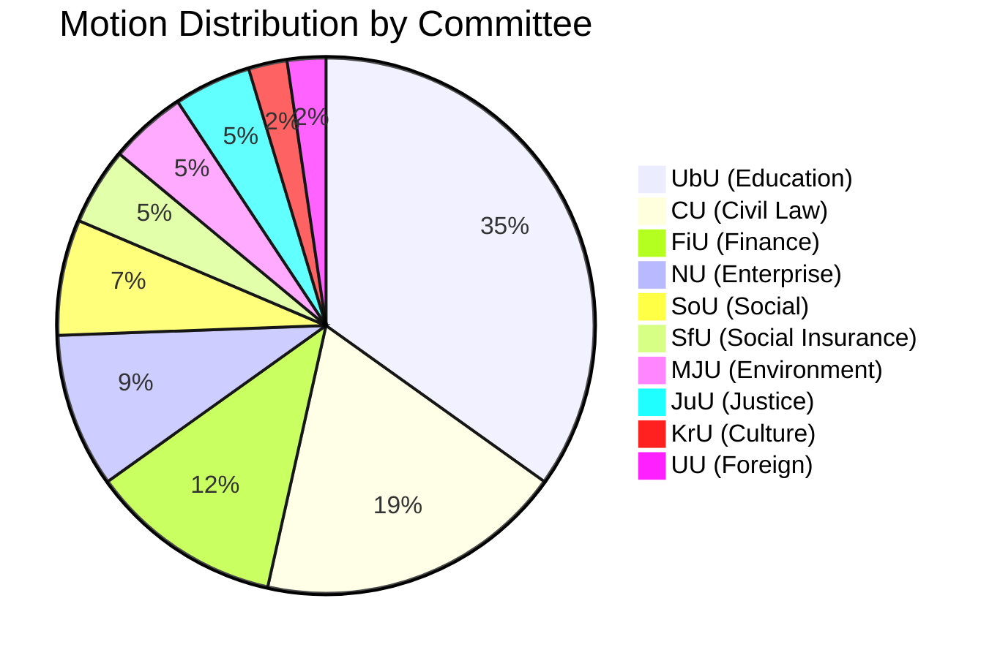

# Analysis Synthesis Summary — 2026-04-06

**Generated**: 2026-04-06 07:13 UTC | **AI-Enriched**: 2026-04-06 07:30 UTC
**Data Sources**: get_motioner (riksmöte 2025/26)
**Documents Analyzed**: 50
**Confidence**: HIGH
**Data Freshness**: Documents sourced from 2026-04-01 via lookback (article date: 2026-04-06)

## Summary

Four opposition parties (S, C, MP, V) filed 50 motions on 1 April 2026 targeting 14 government propositions. Education dominates (15 motions to UbU), followed by civil law/housing (8 to CU) and finance (5 to FiU). The Green Party (MP) leads on volume (18 motions) across the broadest committee spread (7 committees), while S leads on strategic depth with coordinated campaigns by Ygeman (UbU) and Järrebring (CU).

## Key Findings

1. **Education as the opposition's primary target** — 15 of 50 motions target UbU, with all 4 opposition parties filing. The government's 5-proposition education reform package (grading, school safety, curricula, support, transparency) is under coordinated attack.
2. **Three propositions face multi-party opposition**: School safety (prop. 193: S, C, MP), hydropower exemptions (prop. 202: S, C, MP), benefit sanctions (prop. 210: V, MP).
3. **Party strategies diverge**: S plays "responsible alternative" (detailed counter-proposals), C plays "pragmatic reformer" (standardised testing, cash accessibility), MP builds breadth (18 motions, 7 committees), V concentrates on welfare defence (3 motions).
4. **Coalition risk remains LOW** (score 4/100) — the 176-seat majority with SD support means most motions will be rejected, but committee debates will generate electoral ammunition.
5. **Data sourced from 2026-04-01** via lookback fallback — all 50 motions are dated 1 April 2026.

## Top Documents by Strategic Significance

| Rank | dok_id | Title (translated) | Party | Committee | Strategic Value |
|------|--------|---------------------|-------|-----------|----------------|
| 1 | HD024018 | School safety and study peace | S (Ygeman) | UbU | 3-party opposition (S, C, MP) |
| 2 | HD024031 | Benefit sanctions rejection | V (Haddou) | SfU | V + MP demand full rejection |
| 3 | HD024009 | Hydropower/Habitats Directive | S (Järrebring) | CU | 3-party opposition, EU compliance |
| 4 | HD024024 | School transparency | S (Ygeman) | UbU | S + MP consensus on transparency |
| 5 | HD024011 | Housing market flexibility | S (Järrebring) | CU | Tenant protection election issue |

## Implications

The 50 motions constitute the opposition's most concentrated legislative challenge to the Tidö coalition since its formation. While the government's majority ensures most will be defeated, the strategic value lies in:
- **Electoral framing**: Each rejected motion becomes a campaign commitment
- **Committee debates**: Multi-party opposition forces public deliberation
- **Government exposure**: Education and benefit sanctions are politically sensitive domains

## Data Quality Notes

Overall confidence: **HIGH**. All 50 motions have complete metadata. Enriched via MCP summaries.
