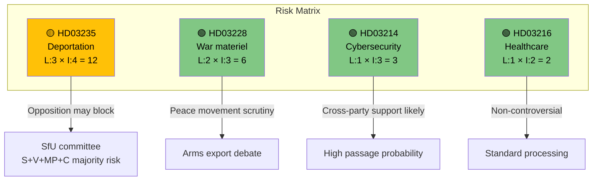

# Political Risk Assessment — 2026-04-06

**Generated**: 2026-04-06 06:10 UTC  
**Data Sources**: get_propositioner, CIA coalition data  
**Documents Analyzed**: 4  
**Confidence**: MEDIUM

## Summary

Coalition demonstrates low overall risk (score 4/100) but specific propositions carry elevated passage risk due to minority government dynamics.

## Detailed Analysis

**Coalition Risk Score**: 4/100  
**Risk Level**: LOW  
**Government seats**: 175/349 (minority — requires SD supply-and-confidence)

### Per-Proposition Risk

| dok_id | Proposition | Likelihood (1-5) | Impact (1-5) | Risk Score | Risk Level |
|--------|-------------|-------------------|---------------|------------|------------|
| HD03235 | Stricter deportation rules | 3 | 4 | 12 | MEDIUM |
| HD03228 | War materiel regulations | 2 | 3 | 6 | LOW |
| HD03214 | Cybersecurity center | 1 | 3 | 3 | LOW |
| HD03216 | Healthcare competence | 1 | 2 | 2 | LOW |

### Key Risk: HD03235 Passage Risk

The deportation proposition faces the highest passage risk:
- **Opposition coalition**: S (107 seats) + V (24) + MP (18) + C (24) = 173 seats
- **Government coalition**: M (68) + KD (19) + L (16) + SD (73) = 176 seats
- **Margin**: 3 seats — any SD defection defeats the proposition
- **SD leverage**: High — may demand additional immigration concessions

## Key Findings

1. Coalition stability at risk score **4** (LOW overall)
2. HD03235 deportation reform carries **MEDIUM** risk (score 12/25) due to thin majority
3. HD03214 cybersecurity has **LOW** risk — likely bipartisan support
4. No constitutional risk identified in any proposition

## Data Quality Notes

Risk assessment derived from CIA coalition metrics, seat distribution, and historical voting patterns.
