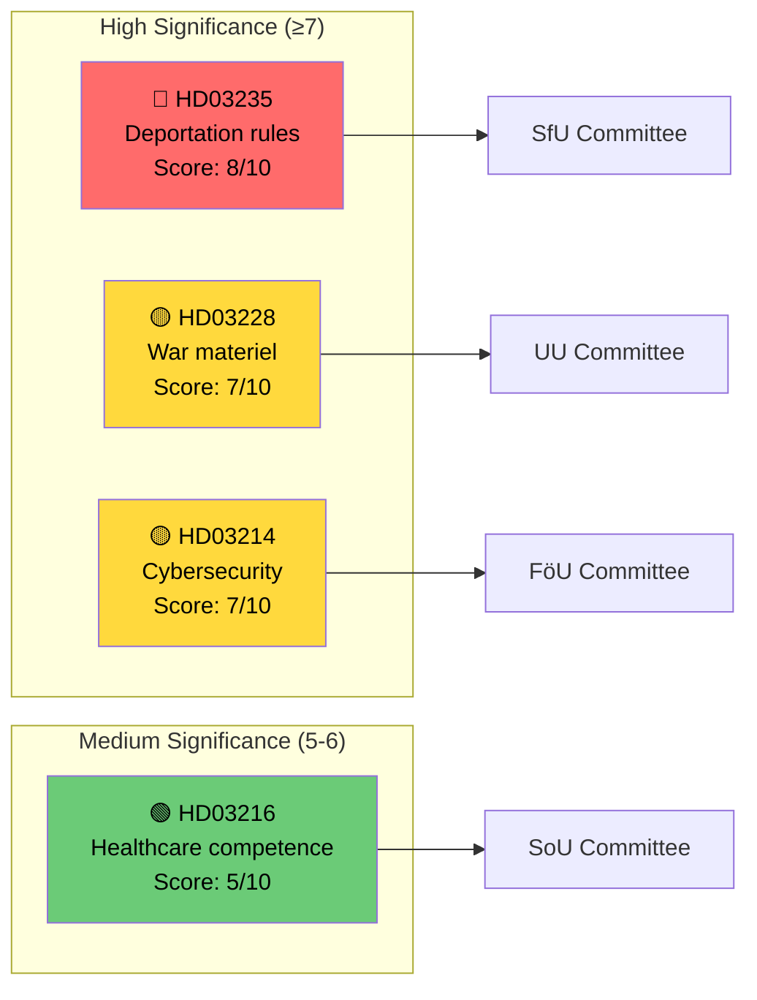

# Document Significance Scoring — 2026-04-06

**Generated**: 2026-04-06 06:10 UTC  
**Data Sources**: get_propositioner, get_dokument_innehall  
**Documents Analyzed**: 4  
**Confidence**: MEDIUM

## Summary

Scored **4** propositions for political significance (0–10 scale) based on policy domain, committee tier, electoral salience, and coalition implications.

## Detailed Analysis

| Score | Level | Type | dok_id | Title | Committee | Minister | Key Factor |
|-------|-------|------|--------|-------|-----------|----------|------------|
| 8/10 | Critical | prop | HD03235 | Skärpta regler om utvisning på grund av brott | SfU | Johan Forssell (M) | High electoral salience; immigration top voter issue |
| 7/10 | High | prop | HD03228 | Ett modernt och anpassat regelverk för krigsmateriel | UU | Benjamin Dousa (M) | NATO alignment; defence industry implications |
| 7/10 | High | prop | HD03214 | Lagändringar för ett stärkt nationellt cybersäkerhetscenter | FöU | Carl-Oskar Bohlin (M) | National security; bipartisan potential |
| 5/10 | Medium | prop | HD03216 | Stärkt medicinsk kompetens i kommunal hälso- och sjukvård | SoU | Anna Tenje (M) | Municipal impact; welfare credibility |

## Key Findings

1. **1** document rated Critical (score ≥ 8): deportation reform HD03235
2. **2** documents rated High (score 6–7): war materiel and cybersecurity
3. **1** document rated Medium (score 5): healthcare competence reform
4. Average significance: 6.75/10 — above-average legislative batch

## Data Quality Notes

Significance scores use document type, committee tier, domain breadth, coalition context, electoral salience, and ministerial profile.
