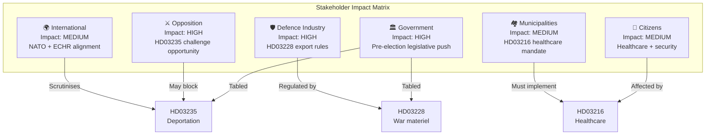

# Stakeholder Perspective Analysis — 2026-04-06

**Generated**: 2026-04-06 06:10 UTC  
**Data Sources**: get_propositioner  
**Documents Analyzed**: 4  
**Confidence**: MEDIUM

## Summary

Applied **6 analysis lenses** to **4** propositions spanning healthcare, defence, security, and immigration policy.

## Detailed Analysis

### 1. Government Perspective
- **Strategic assessment**: Coordinated 4-proposition package signals governing capacity and pre-election agenda-setting
- **Key proposition**: HD03235 (deportation) — highest electoral salience but also highest risk
- **Ministers involved**: Anna Tenje (SoU), Benjamin Dousa (UU), Johan Forssell (Ju), Carl-Oskar Bohlin (Fö)

### 2. Opposition Perspective
- **S (Socialdemokraterna)**: Likely to oppose HD03235 on proportionality grounds; may support HD03214 (cybersecurity)
- **V (Vänsterpartiet)**: Strong opposition to HD03235 and HD03228; may support HD03216 (healthcare)
- **MP (Miljöpartiet)**: Opposes deportation reform; may challenge arms export modernisation
- **C (Centerpartiet)**: Swing vote on HD03235; likely supports HD03214

### 3. Citizens/Public Perspective
- Healthcare competence reform (HD03216) directly impacts primary care quality in 290 municipalities
- Deportation reform (HD03235) affects non-citizens convicted of crimes
- Cybersecurity center (HD03214) strengthens digital infrastructure protection

### 4. Municipal Perspective
- HD03216 creates new competence requirements for municipal healthcare — resource implications
- Implementation timeline and funding mechanism critical for municipal budget planning

### 5. Defence Industry Perspective
- HD03228 modernises arms export framework — potential expansion of eligible export markets
- Alignment with NATO standards creates new commercial opportunities for Swedish defence firms (Saab, BAE Systems Hägglunds)

### 6. International Perspective
- HD03228 aligns with NATO membership requirements for interoperable defence procurement
- HD03235 may face ECHR proportionality review — Sweden has previously been criticised for deportation practices
- HD03214 contributes to EU NIS2 directive compliance

## Key Findings

1. Government and Opposition are most directly impacted — high-stakes pre-election dynamics
2. Defence industry is a significant secondary stakeholder for HD03228
3. Municipal governments face implementation burden from HD03216
4. International scrutiny focused on deportation (HD03235) and arms exports (HD03228)

## Data Quality Notes

Aggregate confidence: **MEDIUM**. Analysis based on proposition metadata, committee referrals, and political context.
