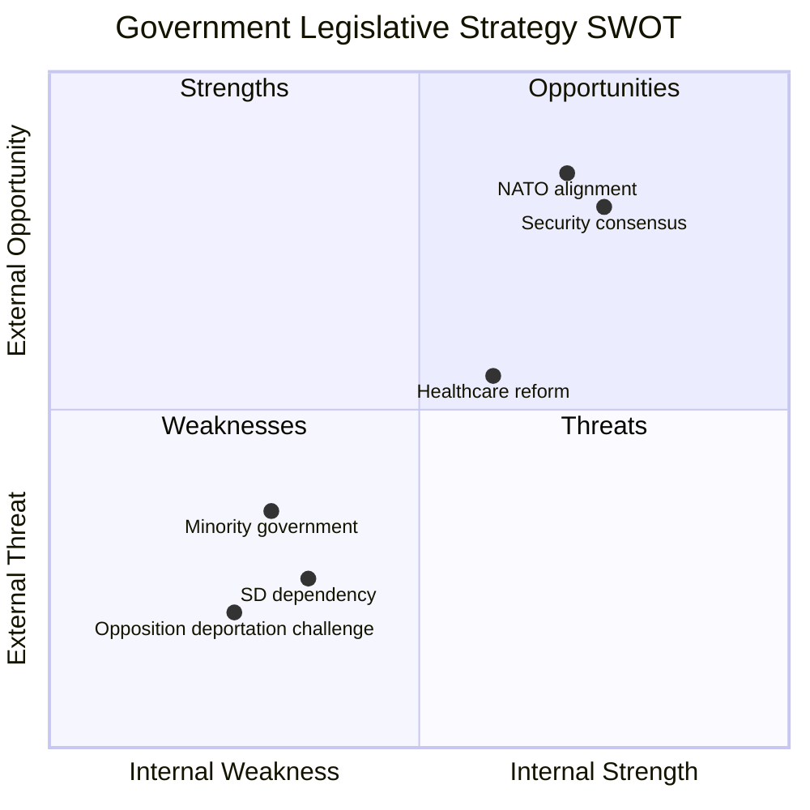

# Political SWOT Analysis — 2026-04-06

**Generated**: 2026-04-06 06:10 UTC  
**Data Sources**: get_propositioner, get_dokument_innehall  
**Documents Analyzed**: 4  
**Confidence**: MEDIUM  
**Riksmöte**: 2025/26

## Summary

SWOT analysis for the Kristersson government based on 4 propositions tabled 2026-04-01, assessed from 5 stakeholder perspectives.

## Detailed Analysis

### Strengths

| # | Strength | Evidence | Stakeholder |
|---|----------|----------|-------------|
| S1 | Cross-departmental coordination demonstrates governing capacity | 4 propositions from 4 different ministries on same date (HD03216, HD03228, HD03235, HD03214) | **Government** |
| S2 | Security agenda matches public opinion priorities | Crime/immigration consistently top voter concerns in SOM surveys; HD03235 directly addresses deportation | **Electorate** |
| S3 | Cybersecurity proposition likely attracts bipartisan support | HD03214 targets national cybersecurity center — broad parliamentary consensus on cyber threats | **Parliament** |
| S4 | Healthcare reform balances hard-security messaging with welfare | HD03216 strengthens municipal medical competence — shows coalition addresses social policy too | **Civil Society** |
| S5 | NATO-aligned arms export modernisation strengthens international credibility | HD03228 modernises war materiel regulations consistent with NATO obligations | **International** |

### Weaknesses

| # | Weakness | Evidence | Stakeholder |
|---|----------|----------|-------------|
| W1 | Minority government (175/349 seats) requires SD support for passage | All 4 propositions need Sverigedemokraterna cooperation to pass committee and plenary votes | **Parliament** |
| W2 | Deportation reform risks human rights criticism | HD03235 tightens expulsion rules — opposition may frame as disproportionate | **Civil Society** |
| W3 | Healthcare reform lacks budget allocation details | HD03216 proposes competence requirements but funding mechanisms unclear from summary | **Media** |
| W4 | Arms export modernisation faces scrutiny from peace movement | HD03228 may be criticised for lowering arms export thresholds during ongoing conflicts | **Civil Society** |
| W5 | Pre-election timing invites accusations of populism | 4 simultaneous propositions 6 months before election appears strategic rather than substantive | **Media** |

### Opportunities

| # | Opportunity | Evidence | Stakeholder |
|---|-------------|----------|-------------|
| O1 | Cyber proposition can build cross-bloc cooperation | HD03214 may attract S and C support — cybersecurity is non-partisan issue | **Parliament** |
| O2 | Healthcare reform opens dialogue with municipalities | HD03216 directly affects 290 Swedish municipalities — potential grassroots support | **Civil Society** |
| O3 | NATO membership creates momentum for defence reform | HD03228 aligns with Sweden's new NATO obligations — international pressure supports reform | **International** |

### Threats

| # | Threat | Evidence | Stakeholder |
|---|--------|----------|-------------|
| T1 | Opposition may block deportation proposition in SfU committee | S + V + MP + C could form committee majority against HD03235 | **Parliament** |
| T2 | International human rights scrutiny on deportation rules | HD03235 may conflict with ECHR case law on proportionality | **International** |
| T3 | SD may demand additional concessions for support | Sverigedemokraterna's leverage increases with each critical proposition | **Government** |

## Key Findings

1. Government strategic posture is **offensive** — advancing core campaign themes pre-election
2. Security-dominant legislative package (3/4 propositions) reflects voter priority alignment
3. Healthcare proposition serves as coalition-balancing social policy anchor
4. Key risk: SD dependency for parliamentary passage of all 4 propositions

## Data Quality Notes

SWOT confidence: **MEDIUM**. Based on proposition metadata and policy summaries. Full-text analysis would increase confidence to HIGH.
