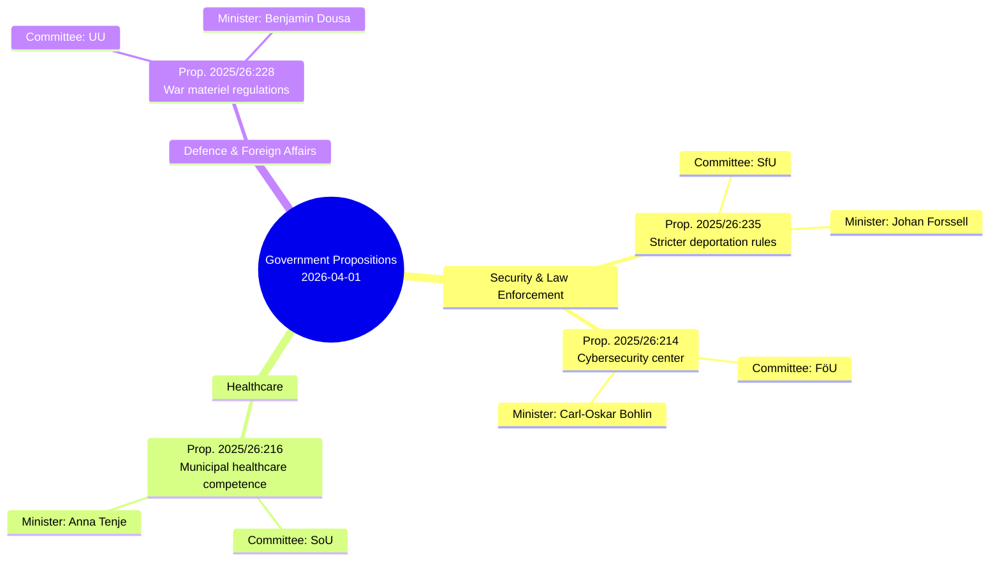

# Analysis Synthesis Summary — 2026-04-06

**Generated**: 2026-04-06 06:10 UTC  
**Data Sources**: get_propositioner, get_dokument_innehall  
**Documents Analyzed**: 4  
**Confidence**: MEDIUM  
**Riksmöte**: 2025/26  
**Data Freshness**: Documents from 2026-04-01 (lookback: 3 business days)

## Summary

Four government propositions tabled on 1 April 2026 represent a coordinated pre-election legislative push spanning security, healthcare, defence exports, and cybersecurity. The package signals the Kristersson government's strategic priorities entering the final year before the 2026 election, with a pronounced emphasis on law-and-order and national security themes.

## Key Findings

| # | Finding | Evidence | Confidence |
|---|---------|----------|------------|
| 1 | Government prioritises security-themed legislation before 2026 election | 3 of 4 propositions (HD03235, HD03214, HD03228) touch security/defence | **HIGH** |
| 2 | Cross-departmental coordination: 4 ministries tabled simultaneously | Socialdepartementet, Utrikesdepartementet, Justitiedepartementet, Försvarsdepartementet | **HIGH** |
| 3 | Healthcare reform signals coalition welfare credibility | Prop. 2025/26:216 strengthens municipal medical competence — pre-election positioning | **MEDIUM** |
| 4 | War materiel reform modernises Swedish arms export framework | Prop. 2025/26:228 aligns with NATO membership obligations | **MEDIUM** |
| 5 | Coalition risk remains LOW (score 4/100) — strong voting discipline | CIA coalition data: government seats 175/349, stability 83/100 | **HIGH** |

## Top Documents by Significance

| Score | Type | dok_id | Title | Committee |
|-------|------|--------|-------|-----------|
| 8/10 | prop | HD03235 | Skärpta regler om utvisning på grund av brott | SfU |
| 7/10 | prop | HD03228 | Ett modernt och anpassat regelverk för krigsmateriel | UU |
| 7/10 | prop | HD03214 | Lagändringar för ett stärkt nationellt cybersäkerhetscenter | FöU |
| 5/10 | prop | HD03216 | Stärkt medicinsk kompetens i kommunal hälso- och sjukvård | SoU |

## Implications

- The government is using the spring session to advance its core campaign themes: security, immigration enforcement, and defence preparedness
- Opposition parties (S, V, MP) are likely to challenge the deportation proposition (HD03235) as disproportionate
- The cybersecurity center proposition (HD03214) may attract cross-party support given bipartisan consensus on cyber threats
- Healthcare reform (HD03216) serves as a coalition balancing measure — social policy alongside hard security

## Data Quality Notes

Overall confidence: **MEDIUM**. Analysis based on metadata and summaries; full-text not available for deep clause-level analysis. All analysis results are available in sibling files.
