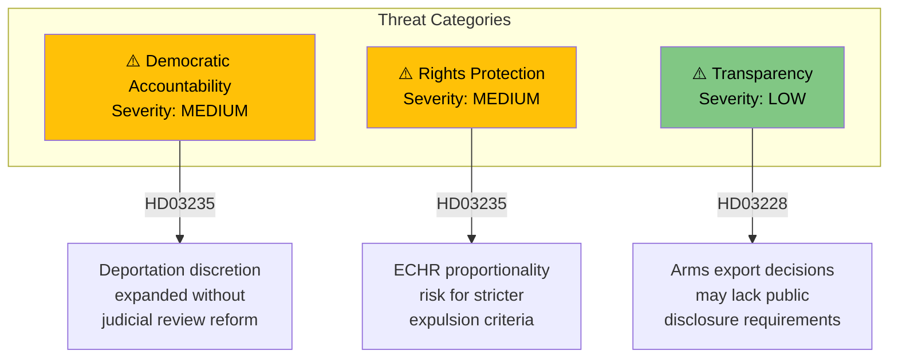

# Political Threat Analysis — 2026-04-06

**Generated**: 2026-04-06 06:10 UTC  
**Data Sources**: get_propositioner  
**Documents Analyzed**: 4  
**Confidence**: MEDIUM

## Summary

Identified **3** threat indicators across 4 propositions, primarily related to democratic accountability and rights protection.

## Detailed Analysis

### Threat 1: Expanded deportation discretion (HD03235)
- **Category**: Democratic Accountability
- **Severity**: MEDIUM
- **Evidence**: Prop. 2025/26:235 proposes stricter expulsion rules — key question is whether judicial review mechanisms are proportionally strengthened
- **Mitigation**: SfU committee review process provides parliamentary oversight

### Threat 2: ECHR compliance risk (HD03235)
- **Category**: Rights Protection
- **Severity**: MEDIUM
- **Evidence**: Tightened deportation criteria may face challenges under Article 8 (right to private and family life) of the European Convention on Human Rights
- **Mitigation**: Swedish courts required to apply ECHR proportionality test case-by-case

### Threat 3: Arms export transparency (HD03228)
- **Category**: Transparency
- **Severity**: LOW
- **Evidence**: Modernised war materiel regulations should maintain or strengthen transparency mechanisms
- **Mitigation**: UU committee traditionally scrutinises arms export oversight provisions

## Key Findings

1. **3** threat indicators identified across 2 propositions (HD03235, HD03228)
2. No threats to constitutional order or democratic fundamentals identified
3. Cybersecurity (HD03214) and healthcare (HD03216) propositions carry no identified democratic threats
4. All threats are MEDIUM or LOW severity with existing institutional mitigations

## Data Quality Notes

Analysis confidence: **MEDIUM**. Threat assessment based on proposition summaries and institutional context.
