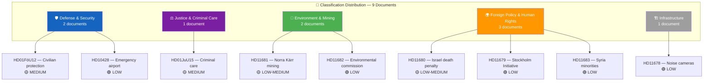

# 📊 Political Classification Results — 2026-04-06

## 📋 Assessment Context

| Field | Value |
|-------|-------|
| **Assessment ID** | CLS-2026-04-06-1029 |
| **Analysis Date** | 2026-04-06 10:44 UTC |
| **Documents Analyzed** | 9 |
| **Produced By** | news-realtime-monitor (realtime-1029) |

---

## 📊 Classification Distribution

---

## 📋 Detailed Classification Table

| dok_id | Title | Type | Committee | Policy Domain | Sensitivity | Impact | Urgency | Confidence |
|--------|-------|------|-----------|--------------|:-----------:|:------:|:-------:|:----------:|
| `HD01FöU12` | Starkare skydd för civilbefolkningen | Betänkande | FöU | Defense & Security | 🟡 Sensitive | 🟡 Medium | 🟡 Medium | HIGH (85%) |
| `HD01JuU15` | Kriminalvårdsfrågor | Betänkande | JuU | Justice & Criminal Care | 🟡 Sensitive | 🟡 Medium | 🟡 Medium | HIGH (85%) |
| `HD10428` | Beredskapsflygplats Scandinavian Mountain Airport | Interpellation | FöU | Defense & Security | 🟢 Open | 🟢 Low | 🟢 Low | MEDIUM (65%) |
| `HD11681` | Norra Kärr | Fråga | MJU | Environment & Mining | 🟢 Open | 🟡 Medium | 🟡 Medium | MEDIUM (60%) |
| `HD11680` | Israels dödsstraffslag | Fråga | UU | Foreign Policy | 🟡 Sensitive | 🟢 Low | 🟢 Low | MEDIUM (60%) |
| `HD11679` | Stockholmsinitiativet | Fråga | UU | Foreign Policy | 🟢 Open | 🟢 Low | 🟢 Low | MEDIUM (60%) |
| `HD11683` | Minoriteter i Syrien | Fråga | UU | Foreign Policy | 🟡 Sensitive | 🟢 Low | 🟢 Low | MEDIUM (60%) |
| `HD11682` | Miljömålsberedningens uppdrag | Fråga | MJU | Environment | 🟢 Open | 🟢 Low | 🟢 Low | LOW (50%) |
| `HD11678` | Bullerkameror | Fråga | TU | Infrastructure | 🟢 Open | 🟢 Low | 🟢 Low | LOW (50%) |

---

## 📋 Domain Frequency Summary

| Policy Domain | Document Count | Key Documents |
|--------------|:--------------:|---------------|
| Defense & Security | 2 | `HD01FöU12`, `HD10428` |
| Foreign Policy & Human Rights | 3 | `HD11679`, `HD11680`, `HD11683` |
| Environment & Mining | 2 | `HD11681`, `HD11682` |
| Justice & Criminal Care | 1 | `HD01JuU15` |
| Infrastructure | 1 | `HD11678` |

---

## 📂 MCP Data Files Used

| # | Data Source | Tool / Query | Retrieved |
|---|-----------|-------------|-----------|
| 1 | riksdag-regering-mcp | `search_dokument(rm="2025/26")` | 2026-04-06 10:29 UTC |
| 2 | riksdag-regering-mcp | `get_betankanden(rm="2025/26")` | 2026-04-06 10:29 UTC |