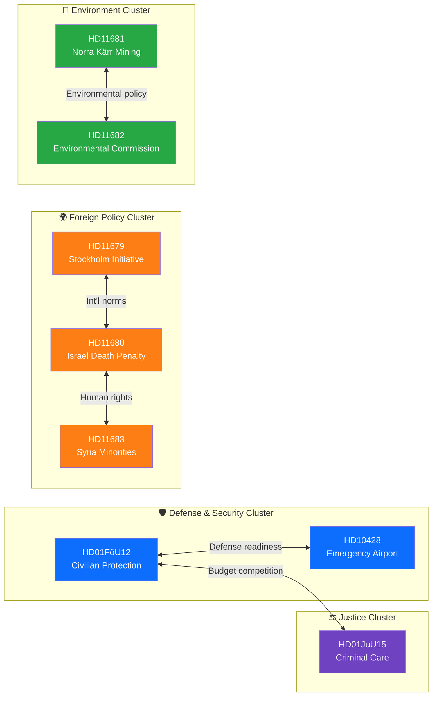

# 🗺️ Cross-Reference Map — 2026-04-06

## 📋 Assessment Context

| Field | Value |
|-------|-------|
| **Assessment ID** | XRF-2026-04-06-1029 |
| **Analysis Date** | 2026-04-06 10:44 UTC |
| **Documents Analyzed** | 9 |
| **Produced By** | news-realtime-monitor (realtime-1029) |
| **Cross-References Found** | 8 |

---

## 📊 Cross-Reference Network

---

## 📋 Cross-Reference Table

| # | Source | Target | Relationship Type | Strength | Evidence |
|---|--------|--------|-------------------|:--------:|----------|
| 1 | `HD01FöU12` | `HD10428` | **Thematic:** Both address defense readiness infrastructure (shelters vs airfields) | 🟡 Medium | Same committee (FöU); both relate to civil defense preparedness |
| 2 | `HD01FöU12` | `HD01JuU15` | **Budget competition:** Both require major infrastructure investment (shelters and prisons) competing for same fiscal space | 🟡 Medium | SEK 7.5B prison program + unfunded shelter mandate |
| 3 | `HD11680` | `HD11683` | **Thematic:** Both address human rights in Middle East (Israel + Syria) | 🟠 Strong | Same committee (UU); human rights framing |
| 4 | `HD11679` | `HD11680` | **Normative:** International norms—nuclear disarmament (NPT) and death penalty (ICCPR) share rule-of-law framing | 🟢 Weak | Both UU questions; international law angle |
| 5 | `HD11681` | `HD11682` | **Policy domain:** Both probe environmental governance (mining permits + environmental commission mandate) | 🟡 Medium | Same domain (MJU); environmental policy coherence |
| 6 | `HD01JuU15` | `HD01FöU12` | **Implementation chain:** Both committee reports expose gap between policy ambition and institutional capacity | 🟡 Medium | Prison at 98% occupancy; shelter renovation unfunded |
| 7 | `HD10428` | `HD01FöU12` | **Infrastructure:** Emergency airport + shelter network both part of total defense infrastructure | 🟡 Medium | S (Hultqvist) questions defense delivery in both domains |
| 8 | `HD11679` | `HD11683` | **Diplomatic:** Swedish engagement in international fora (NPT review + Syria crisis) | 🟢 Weak | Both involve government's international diplomacy profile |

---

## 📋 Cluster Summary

| Cluster | Documents | Narrative Thread |
|---------|-----------|-----------------|
| 🛡️ Defense & Security | `HD01FöU12`, `HD10428` | Sweden's total defense readiness after NATO accession — civilian protection infrastructure gap |
| ⚖️ Justice | `HD01JuU15` | Criminal justice system under strain — policy ambition vs institutional capacity |
| 🌍 Foreign Policy | `HD11679`, `HD11680`, `HD11683` | Swedish human rights and disarmament diplomacy in shifting geopolitical landscape |
| 🌿 Environment | `HD11681`, `HD11682` | Environmental governance tension — rare earth mining vs ecological protection |

---

## 📂 MCP Data Files Used

| # | Data Source | Tool / Query | Retrieved |
|---|-----------|-------------|-----------|
| 1 | riksdag-regering-mcp | `search_dokument(rm="2025/26")` | 2026-04-06 10:29 UTC |
| 2 | Per-file analysis documents | Cross-reference correlation | 2026-04-06 10:44 UTC |