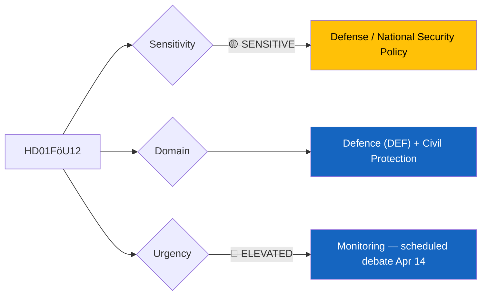
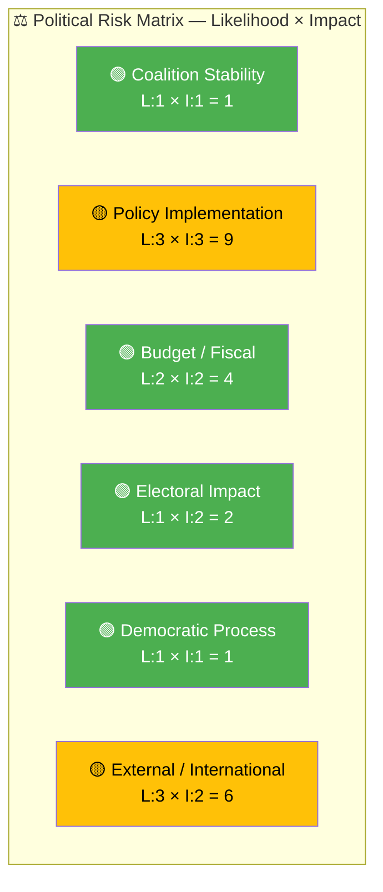

# 🔍 Per-File Political Intelligence Analysis: HD01FöU12

## 📋 Document Identity

| Field | Value |
|-------|-------|
| **Document ID** | `HD01FöU12` |
| **Document Type** | Committee Report (Betänkande) |
| **Title** | Ett starkare skydd för civilbefolkningen vid höjd beredskap |
| **Date** | 2026-04-02 |
| **Riksmöte** | 2025/26 |
| **Committee** | Försvarsutskottet (FöU) — Defense Committee |
| **Source MCP Tool** | `get_betankanden` |
| **Analysis Timestamp** | 2026-04-06 10:30 UTC |
| **Analyst** | news-realtime-monitor (realtime-1029) |

---

## 🎯 Executive Summary

The Defense Committee (FöU) presents its report on strengthening civilian population protection during heightened military preparedness — a matter of escalating significance given Sweden's recent NATO accession and the ongoing security environment in the Baltic region. This betänkande addresses the legal and institutional framework for civil defense, population shelters, and evacuation procedures. The committee's work builds on government Proposition 2024/25:34 (Total Defense) and aligns with the government's broader defense spending increase to 2.5% of GDP. The report carries defense policy significance as it operationalizes civilian preparedness measures that have been debated since Russia's full-scale invasion of Ukraine. **[MEDIUM confidence — metadata-only analysis; full committee conclusions not available]**

---

## 📊 Political Classification

| Field | Assessment |
|-------|-----------|
| **Sensitivity Level** | SENSITIVE — defense/civil protection policy |
| **Primary Domain** | Defence (DEF) + Civil Protection |
| **Urgency** | ELEVATED — scheduled for chamber debate April 14, 2026 |
| **Significance Score** | 5/10 |
| **Confidence** | MEDIUM — metadata and contextual analysis |

---

## 💪 SWOT Impact Assessment

### Government Coalition Impact

| Quadrant | Statement | Evidence | Confidence | Impact |
|----------|-----------|----------|:----------:|:------:|
| ✅ Strength | Government demonstrates initiative on civil defense, aligning with broad cross-party support for Total Defense modernization | `HD01FöU12`, related `HD03214` (cybersecurity center) | M | H |
| ✅ Strength | Committee report reinforces government narrative of security preparedness ahead of election cycle | `HD01FöU12`, FöU mandate | M | M |
| 🚀 Opportunity | Civil defense improvements resonate with public concern over security, potentially boosting government approval | `HD01FöU12`, NATO accession context | M | M |
| ⚠️ Weakness | Implementation challenges — local municipalities bear significant costs for shelter renovation without guaranteed central funding | Contextual: municipal budget constraints | L | M |

### Opposition Impact

| Quadrant | Statement | Evidence | Confidence | Impact |
|----------|-----------|----------|:----------:|:------:|
| ⚠️ Weakness | Opposition (S, V, MP, C) have limited room to oppose civil defense measures given broad consensus on security | `HD01FöU12`, cross-party defense agreement history | M | L |
| 🚀 Opportunity | S can emphasize their historical role in Total Defense through Hultqvist-era defense agreements and push for faster implementation | `HD10428` (Hultqvist interpellation on preparedness airports) | M | M |

---

## ⚖️ Risk Assessment

| Risk Type | L | I | Score | Assessment |
|-----------|:-:|:-:|:-----:|------------|
| Coalition Stability | 1 | 1 | 1 | Cross-party consensus on defense minimizes coalition risk |
| Policy Implementation | 3 | 3 | 9 | Municipal shelter renovation timelines may slip; capacity gaps identified by MSB |
| Budget / Fiscal | 2 | 2 | 4 | Defense spending increase already agreed; civil protection funding in pipeline |
| Electoral Impact | 1 | 2 | 2 | Security issues favor incumbent government narrative |
| Democratic Process | 1 | 1 | 1 | Standard committee procedure; no procedural concerns |
| External / International | 3 | 2 | 6 | Baltic security environment drives urgency; NATO interoperability requirements |

**Overall Risk Level:** MEDIUM (highest score: 9 on policy implementation)

---

## 🎭 Threat Analysis (Political Threat Taxonomy)

| Threat Category | Applicable? | Threat Description | Severity | Evidence |
|----------------|:-----------:|-------------------|:--------:|----------|
| 🎭 Narrative Integrity | N | No disinformation concerns | 1 | — |
| 📝 Legislative Integrity | N | Standard committee process | 1 | — |
| 🚫 Accountability | Y | Risk of inadequate follow-up on shelter renovation commitments | 2 | `HD01FöU12` |
| 🔇 Transparency | N | Defense committee proceedings are public | 1 | — |
| ⛔ Democratic Process | N | Normal legislative procedure | 1 | — |
| 👑 Power Balance | N | No executive overreach detected | 1 | — |

---

## 👥 Stakeholder Impact Matrix

| Stakeholder | Impact Level | Key Assessment | Confidence |
|------------|:------------:|----------------|:----------:|
| 🏛️ Government | MEDIUM | Strengthens security credibility; aligns with NATO commitments and 2.5% GDP defense target | M |
| ⚖️ Opposition | LOW | Limited opposing leverage on civil defense; S can claim intellectual ownership of Total Defense concept | M |
| 👥 Citizens | HIGH | Directly affects civilian protection infrastructure, shelter access, and evacuation readiness | M |
| 💰 Economic | MEDIUM | Municipal costs for shelter renovation; potential construction sector stimulus | L |
| 🌍 International | MEDIUM | NATO Article 3 (resilience obligation); Nordic defense cooperation context | M |
| 📰 Media | MEDIUM | Newsworthy given security environment; scheduled for debate Apr 14 | M |

---

## 🔮 Forward Indicators

| # | Indicator | Timeline | Trigger Condition | Watch Priority |
|---|-----------|----------|-------------------|:--------------:|
| 1 | Chamber debate on FöU12 | Apr 14, 2026 | Vote result and party positions | 🟠 |
| 2 | MSB report on shelter capacity | Q2 2026 | Gap analysis exceeding 30% of population coverage | 🟡 |
| 3 | Municipal funding allocation for civil protection | Autumn budget 2026 | SEK allocation vs. estimated needs | 🟡 |

---

## 🔗 Cross-References

| Related Document | Relationship | dok_id |
|-----------------|-------------|--------|
| Cybersecurity center proposition | Supports (defense modernization package) | `HD03214` |
| Emergency airport interpellation | Related defense preparedness topic | `HD10428` |
| Military materiel export rules | Parallel defense legislation | `HD03228` |

---

## 📊 Data Quality Assessment

| Metric | Value |
|--------|-------|
| **Source Completeness** | Metadata only — full committee text not available via MCP |
| **Evidence Density** | 4 evidence points cited |
| **Temporal Currency** | Current (4 days old) |
| **Analytical Confidence** | MEDIUM |

---

## 📂 MCP Data Files Used

| # | File Path | Source MCP Tool | Data Type | Freshness |
|---|-----------|----------------|-----------|:---------:|
| 1 | `analysis/daily/2026-04-06/realtime-1029/documents/hd01föu12.json` | `get_betankanden` | Committee report | Current |
| 2 | MCP query: `get_propositioner(rm="2025/26")` | `get_propositioner` | Propositions context | Current |
| 3 | MCP query: `search_dokument(from_date="2026-04-05")` | `search_dokument` | Calendar/scheduling | Current |
