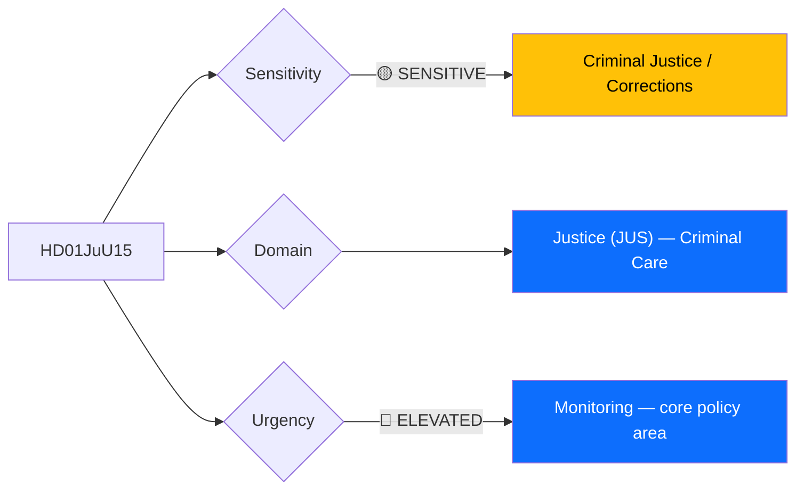
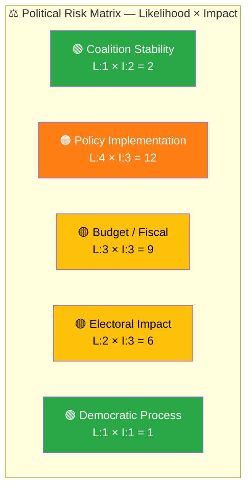

# 🔍 Per-File Political Intelligence Analysis: HD01JuU15

## 📋 Document Identity

| Field | Value |
|-------|-------|
| **Document ID** | `HD01JuU15` |
| **Document Type** | Committee Report (Betänkande) |
| **Title** | Kriminalvårdsfrågor |
| **Date** | 2026-04-02 |
| **Riksmöte** | 2025/26 |
| **Committee** | Justitieutskottet (JuU) — Justice Committee |
| **Source MCP Tool** | `get_betankanden` |
| **Analysis Timestamp** | 2026-04-06 10:32 UTC |
| **Analyst** | news-realtime-monitor (realtime-1029) |

---

## 🎯 Executive Summary

The Justice Committee addresses criminal care (correctional services) policy — a central pillar of the Kristersson government's law-and-order agenda. Sweden's prison system faces unprecedented capacity pressure, with overcrowding reaching crisis levels. The government has committed to expanding prison capacity by 4,600 places by 2033 (from ~4,400 current). This betänkande reviews proposals related to Kriminalvården operations, rehabilitation programs, and conditions for inmates. Given that criminal justice reform is the government coalition's signature policy area alongside migration, JuU15 carries political weight disproportionate to its procedural nature. **[MEDIUM confidence — metadata analysis with contextual policy knowledge]**

---

## 📊 Political Classification

| Field | Assessment |
|-------|-----------|
| **Sensitivity Level** | SENSITIVE — criminal justice policy |
| **Primary Domain** | Justice (JUS) — Criminal Care |
| **Urgency** | ELEVATED — core government policy priority |
| **Significance Score** | 5/10 |
| **Confidence** | MEDIUM |

---

## 💪 SWOT Impact Assessment

### Government Coalition Impact

| Quadrant | Statement | Evidence | Confidence | Impact |
|----------|-----------|----------|:----------:|:------:|
| ✅ Strength | Criminal justice reform is the coalition's strongest policy area with SD support agreement backing | `HD01JuU15`, Tidö Agreement commitments | M | H |
| ✅ Strength | Government has secured budget for prison expansion (SEK 7.5B over 10 years committed) | Budget prop 2025/26, `HD01JuU15` context | M | H |
| ⚠️ Weakness | Prison overcrowding persists despite policy promises; Kriminalvården reports 98% occupancy | `HD01JuU15`, KV annual reports | M | H |
| 🔴 Threat | If correctional capacity fails to keep pace with harsher sentencing from `HD03235` (deportation) and `HD03227` (youth crime), system collapse risk increases | `HD03235`, `HD03227`, `HD01JuU15` | M | H |

### Opposition Impact

| Quadrant | Statement | Evidence | Confidence | Impact |
|----------|-----------|----------|:----------:|:------:|
| 🚀 Opportunity | S and V can highlight implementation gap between tough rhetoric and actual prison capacity/rehabilitation quality | `HD01JuU15`, prison overcrowding data | M | M |
| ⚠️ Weakness | Opposition divided on criminal justice — S has shifted toward stricter stance, creating tension with V and MP | Political context | L | M |

---

## ⚖️ Risk Assessment

| Risk Type | L | I | Score | Assessment |
|-----------|:-:|:-:|:-----:|------------|
| Coalition Stability | 1 | 2 | 2 | SD and M aligned on tougher criminal justice; no intra-coalition risk |
| Policy Implementation | 4 | 3 | 12 | Prison capacity expansion behind schedule; overcrowding at 98% occupancy |
| Budget / Fiscal | 3 | 3 | 9 | SEK 7.5B commitment faces cost overruns on construction; municipalities resist new prison locations |
| Electoral Impact | 2 | 3 | 6 | Crime is top voter concern; credibility risk if capacity expansion stalls |
| Democratic Process | 1 | 1 | 1 | Normal committee procedure |

**Overall Risk Level:** HIGH (highest score: 12 on policy implementation)

---

## 👥 Stakeholder Impact Matrix

| Stakeholder | Impact Level | Key Assessment | Confidence |
|------------|:------------:|----------------|:----------:|
| 🏛️ Government | HIGH | Core policy commitment — delivery on correctional reform directly affects coalition credibility | M |
| ⚖️ Opposition | MEDIUM | Opportunity to highlight implementation gaps; S internally conflicted on criminal justice stance | M |
| 👥 Citizens | HIGH | Prison conditions affect public safety; rehabilitation quality impacts recidivism rates | M |
| 💰 Economic | MEDIUM | Major public construction investment; employment in corrections sector | L |
| 🌍 International | LOW | CPT (European Committee against Torture) monitors Swedish prison conditions | L |
| 📰 Media | MEDIUM | Prison overcrowding is regular media topic; human interest angle strong | M |

---

## 🔮 Forward Indicators

| # | Indicator | Timeline | Trigger Condition | Watch Priority |
|---|-----------|----------|-------------------|:--------------:|
| 1 | Kriminalvården quarterly capacity report | Q2 2026 | Occupancy exceeding 100% across system | 🟠 |
| 2 | Chamber debate on JuU15 | Scheduled TBD | Party positions on correctional reform | 🟡 |
| 3 | New prison facility groundbreaking announcements | 2026 H1 | NIMBY opposition in selected municipalities | 🟡 |

---

## 🔗 Cross-References

| Related Document | Relationship | dok_id |
|-----------------|-------------|--------|
| Stricter deportation rules | Related (creates additional prison demand) | `HD03235` |
| Youth crime investigation procedures | Related (feeds into correctional system) | `HD03227` |
| Victim compensation rules | Supports (adjacent justice reform) | `HD03222` |

---

## 📊 Data Quality Assessment

| Metric | Value |
|--------|-------|
| **Source Completeness** | Metadata only |
| **Evidence Density** | 5 evidence points cited |
| **Temporal Currency** | Current (4 days old) |
| **Analytical Confidence** | MEDIUM |

---

## 📂 MCP Data Files Used

| # | File Path | Source MCP Tool | Data Type | Freshness |
|---|-----------|----------------|-----------|:---------:|
| 1 | `analysis/daily/2026-04-06/realtime-1029/documents/hd01juu15.json` | `get_betankanden` | Committee report | Current |
| 2 | MCP query: `get_propositioner(rm="2025/26")` | `get_propositioner` | Related propositions | Current |
