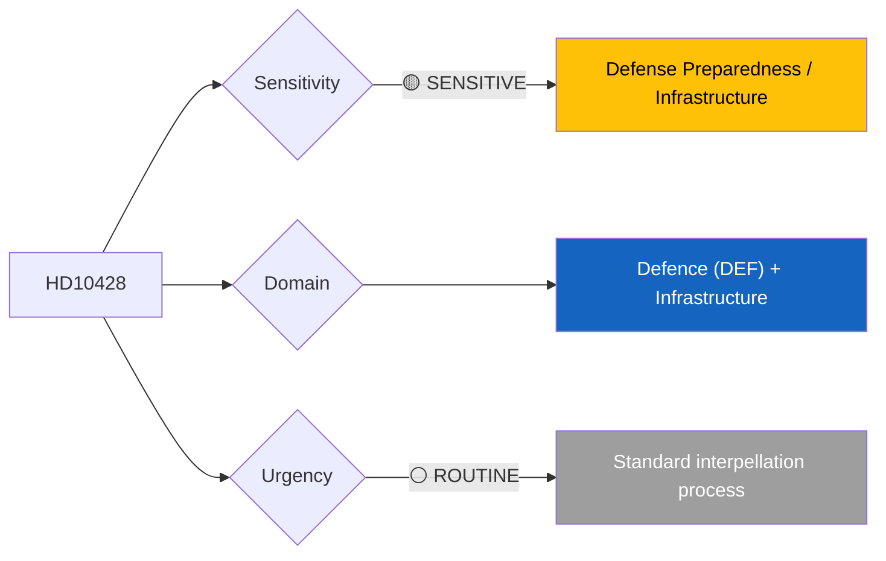

# 🔍 Per-File Political Intelligence Analysis: HD10428

## 📋 Document Identity

| Field | Value |
|-------|-------|
| **Document ID** | `HD10428` |
| **Document Type** | Interpellation |
| **Title** | Beredskapsflygplats Scandinavian Mountain Airport |
| **Date** | 2026-04-02 |
| **Riksmöte** | 2025/26 |
| **Author** | Peter Hultqvist (S) — former Defense Minister |
| **Addressed To** | Andreas Carlson (KD) — Infrastructure Minister |
| **Source MCP Tool** | `get_interpellationer` |
| **Analysis Timestamp** | 2026-04-06 10:33 UTC |
| **Analyst** | news-realtime-monitor (realtime-1029) |

---

## 🎯 Executive Summary

Former Defense Minister Peter Hultqvist (S) challenges Infrastructure Minister Andreas Carlson (KD) on why Trafikverket has not designated Scandinavian Mountain Airport in Malung-Sälen as an emergency preparedness airport. This interpellation carries defense policy weight: Hultqvist, who oversaw Sweden's NATO membership preparation, raises concerns about emergency infrastructure in a region significant for both tourism and defense logistics in northern Sweden. The question highlights a gap between the government's heightened defense rhetoric and actual infrastructure designations. **[MEDIUM confidence — summary available; debate response pending]**

---

## 📊 Political Classification

| Field | Assessment |
|-------|-----------|
| **Sensitivity Level** | SENSITIVE — defense infrastructure |
| **Primary Domain** | Defence (DEF) + Infrastructure |
| **Urgency** | ROUTINE — standard interpellation |
| **Significance Score** | 3/10 |
| **Confidence** | MEDIUM |

---

## 💪 SWOT Impact Assessment

### Government Coalition Impact

| Quadrant | Statement | Evidence | Confidence | Impact |
|----------|-----------|----------|:----------:|:------:|
| ⚠️ Weakness | Government faces scrutiny on defense infrastructure delivery despite increased defense spending commitments | `HD10428`, Trafikverket decision | M | M |
| 🔴 Threat | Hultqvist (former DefMin with credibility) exposing gaps between government defense rhetoric and actual preparedness investments | `HD10428` | M | L |

### Opposition Impact

| Quadrant | Statement | Evidence | Confidence | Impact |
|----------|-----------|----------|:----------:|:------:|
| ✅ Strength | S demonstrates continued defense policy expertise through Hultqvist's interpellation on preparedness | `HD10428` | M | M |
| 🚀 Opportunity | Links to broader S narrative that government talks tough on defense but under-invests in concrete infrastructure | `HD10428`, `HD01FöU12` context | L | L |

---

## ⚖️ Risk Assessment

| Risk Type | L | I | Score | Assessment |
|-----------|:-:|:-:|:-----:|------------|
| Coalition Stability | 1 | 1 | 1 | No coalition risk from this interpellation |
| Policy Implementation | 2 | 2 | 4 | Trafikverket's decision may reflect resource prioritization challenges |
| Electoral Impact | 1 | 2 | 2 | Limited voter impact; niche issue |
| Democratic Process | 1 | 1 | 1 | Standard parliamentary accountability mechanism |

**Overall Risk Level:** LOW

---

## 👥 Stakeholder Impact Matrix

| Stakeholder | Impact Level | Key Assessment | Confidence |
|------------|:------------:|----------------|:----------:|
| 🏛️ Government | LOW | Must respond to interpellation; Carlson (KD) needs to justify Trafikverket's assessment | M |
| ⚖️ Opposition | LOW | Hultqvist maintains S credibility on defense; single-issue impact limited | M |
| 👥 Citizens | LOW | Affects Malung-Sälen residents and tourism sector; emergency access concerns | M |
| 🌍 International | LOW | Minor NATO/Nordic logistics relevance for northern Sweden access | L |
| 📰 Media | LOW | Regional media interest; limited national coverage potential | M |

---

## 🔮 Forward Indicators

| # | Indicator | Timeline | Trigger Condition | Watch Priority |
|---|-----------|----------|-------------------|:--------------:|
| 1 | Interpellation debate in chamber | 2-4 weeks | Carlson's response to Hultqvist | 🟡 |
| 2 | Trafikverket emergency airport review | 2026 H2 | Policy reversal on Malung-Sälen designation | 🟢 |

---

## 🔗 Cross-References

| Related Document | Relationship | dok_id |
|-----------------|-------------|--------|
| Civilian protection in heightened preparedness | Thematically related (defense preparedness) | `HD01FöU12` |

---

## 📊 Data Quality Assessment

| Metric | Value |
|--------|-------|
| **Source Completeness** | Summary available |
| **Evidence Density** | 3 evidence points cited |
| **Temporal Currency** | Current (4 days old) |
| **Analytical Confidence** | MEDIUM |
