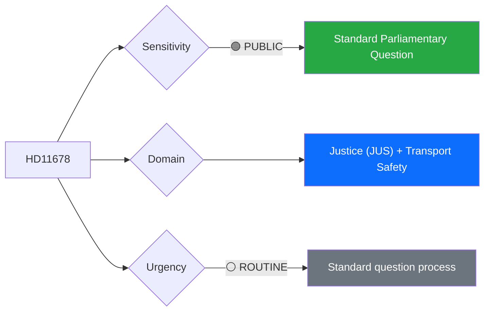

# 🔍 Per-File Political Intelligence Analysis: HD11678

## 📋 Document Identity

| Field | Value |
|-------|-------|
| **Document ID** | `HD11678` |
| **Document Type** | Skriftlig fråga (Written Question) |
| **Title** | Behov av lagändringar för användande av bullerkameror |
| **Date** | 2026-04-02 |
| **Riksmöte** | 2025/26 |
| **Author** | Malte Tängmark Roos (MP) |
| **Addressed To** | Justitieminister Gunnar Strömmer (M) |
| **Source MCP Tool** | `get_fragor` |
| **Analysis Timestamp** | 2026-04-06 10:34 UTC |
| **Analyst** | news-realtime-monitor (realtime-1029) |

---

## 🎯 Executive Summary

MP's Malte Tängmark Roos questions Justice Minister Strömmer (M) on legislative changes needed for noise cameras to combat reckless driving ("vansinneskörningar") in cities like Malmö. The question follows a prior interpellation debate on November 4. This reflects the growing cross-party concern about urban traffic safety and the legal framework gap around automated enforcement technology. While procedurally routine, it signals MP's positioning on public safety issues — traditionally not their strongest area — seeking to build credibility on quality-of-life urban concerns. **[MEDIUM confidence — summary analysis]**

---

## 📊 Political Classification

| Field | Assessment |
|-------|-----------|
| **Sensitivity Level** | PUBLIC |
| **Primary Domain** | Justice (JUS) + Transport |
| **Urgency** | ROUTINE |
| **Significance Score** | 2/10 |
| **Confidence** | MEDIUM |

---

## 💪 SWOT Impact Assessment

| Quadrant | Statement | Evidence | Confidence | Impact |
|----------|-----------|----------|:----------:|:------:|
| 🚀 Opportunity (Gov) | Government can showcase technology-forward approach to public safety if Strömmer supports noise camera legislation | `HD11678` | L | L |
| ✅ Strength (Opp) | MP broadens its policy profile beyond environment into urban quality-of-life and safety | `HD11678` | L | L |

---

## ⚖️ Risk Assessment

| Risk Type | L | I | Score | Assessment |
|-----------|:-:|:-:|:-----:|------------|
| Policy Implementation | 2 | 1 | 2 | Minor legal framework adjustment needed; low political risk |
| Electoral Impact | 1 | 1 | 1 | Niche issue; limited voter impact |

**Overall Risk Level:** LOW

---

## 👥 Stakeholder Impact Matrix

| Stakeholder | Impact Level | Key Assessment | Confidence |
|------------|:------------:|----------------|:----------:|
| 🏛️ Government | LOW | Strömmer must signal position on automated enforcement technology | M |
| 👥 Citizens | MEDIUM | Directly affects urban noise and traffic safety in major cities | M |
| 📰 Media | LOW | Local media interest in Malmö; limited national scope | M |

---

## 🔮 Forward Indicators

| # | Indicator | Timeline | Trigger Condition | Watch Priority |
|---|-----------|----------|-------------------|:--------------:|
| 1 | Minister's written response | 1-2 weeks | Legislative commitment on noise cameras | 🟢 |

---

## 📊 Data Quality Assessment

| Metric | Value |
|--------|-------|
| **Source Completeness** | Summary available |
| **Evidence Density** | 2 evidence points |
| **Temporal Currency** | Current |
| **Analytical Confidence** | MEDIUM |

