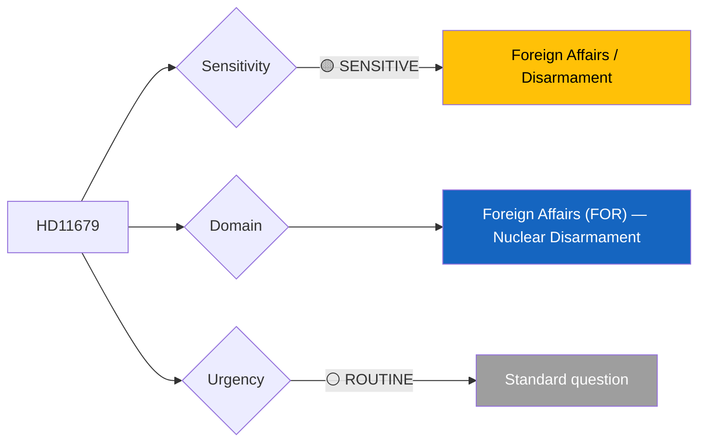

# 🔍 Per-File Political Intelligence Analysis: HD11679

## 📋 Document Identity

| Field | Value |
|-------|-------|
| **Document ID** | `HD11679` |
| **Document Type** | Skriftlig fråga (Written Question) |
| **Title** | Arbetet med Stockholmsinitiativet |
| **Date** | 2026-04-02 |
| **Riksmöte** | 2025/26 |
| **Author** | Laila Naraghi (S) |
| **Addressed To** | Utrikesminister Maria Malmer Stenergard (M) |
| **Source MCP Tool** | `get_fragor` |
| **Analysis Timestamp** | 2026-04-06 10:35 UTC |
| **Analyst** | news-realtime-monitor (realtime-1029) |

---

## 🎯 Executive Summary

S MP Laila Naraghi questions Foreign Minister Malmer Stenergard (M) about Sweden's continued engagement with the Stockholm Initiative on Nuclear Disarmament, a 16-nation diplomatic initiative launched in February 2020. This question probes whether the current government has deprioritized nuclear disarmament diplomacy since NATO membership shifted Sweden's security posture. The Stockholm Initiative was a flagship foreign policy achievement of the previous S-led government — this question tests whether the M-led government maintains Sweden's disarmament leadership or has quietly abandoned it. **[MEDIUM confidence — summary analysis with diplomatic context]**

---

## 📊 Political Classification

| Field | Assessment |
|-------|-----------|
| **Sensitivity Level** | SENSITIVE — foreign policy/disarmament |
| **Primary Domain** | Foreign Affairs (FOR) |
| **Urgency** | ROUTINE |
| **Significance Score** | 3/10 |
| **Confidence** | MEDIUM |

---

## 💪 SWOT Impact Assessment

| Quadrant | Statement | Evidence | Confidence | Impact |
|----------|-----------|----------|:----------:|:------:|
| ⚠️ Weakness (Gov) | Government may face criticism for deprioritizing Sweden's traditional disarmament diplomacy after NATO accession | `HD11679` | L | M |
| ✅ Strength (Opp) | S highlights its diplomatic legacy and tests government commitment to multilateral disarmament | `HD11679` | M | L |
| 🔴 Threat (Gov) | If government admits abandoning Stockholm Initiative, it signals shift in Sweden's international identity | `HD11679` | L | M |

---

## ⚖️ Risk Assessment

| Risk Type | L | I | Score | Assessment |
|-----------|:-:|:-:|:-----:|------------|
| External / International | 2 | 2 | 4 | Minor diplomatic positioning risk; NPT review context |
| Electoral Impact | 1 | 1 | 1 | Nuclear disarmament not a top voter concern |

**Overall Risk Level:** LOW

---

## 👥 Stakeholder Impact Matrix

| Stakeholder | Impact Level | Key Assessment | Confidence |
|------------|:------------:|----------------|:----------:|
| 🏛️ Government | LOW | Must articulate NATO-compatible disarmament policy position | M |
| 🌍 International | MEDIUM | Sweden's credibility in 16-nation Stockholm Initiative at stake | M |
| 📰 Media | LOW | Specialist foreign policy media interest | L |

---

## 🔮 Forward Indicators

| # | Indicator | Timeline | Trigger Condition | Watch Priority |
|---|-----------|----------|-------------------|:--------------:|
| 1 | Foreign Minister's response | 1-2 weeks | Policy commitment on Stockholm Initiative | 🟢 |
| 2 | NPT Review Conference preparations | 2026 | Sweden's position statement | 🟡 |

---

## 📊 Data Quality Assessment

| Metric | Value |
|--------|-------|
| **Source Completeness** | Summary available |
| **Evidence Density** | 3 evidence points |
| **Temporal Currency** | Current |
| **Analytical Confidence** | MEDIUM |

