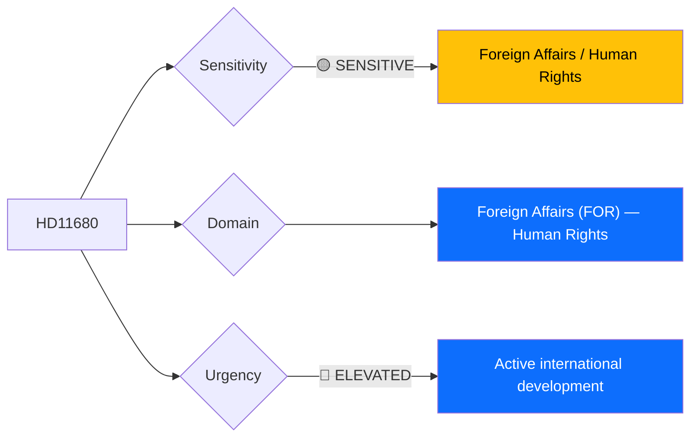

# 🔍 Per-File Political Intelligence Analysis: HD11680

## 📋 Document Identity

| Field | Value |
|-------|-------|
| **Document ID** | `HD11680` |
| **Document Type** | Skriftlig fråga (Written Question) |
| **Title** | Israels nya dödsstraffslag och rättsstatens principer |
| **Date** | 2026-04-02 |
| **Riksmöte** | 2025/26 |
| **Author** | Jamal El-Haj (party unknown) |
| **Addressed To** | Utrikesminister Maria Malmer Stenergard (M) |
| **Source MCP Tool** | `get_fragor` |
| **Analysis Timestamp** | 2026-04-06 10:36 UTC |
| **Analyst** | news-realtime-monitor (realtime-1029) |

---

## 🎯 Executive Summary

A parliamentary question addresses Israel's Knesset vote to expand death penalty provisions — a development raising serious rule-of-law and human rights concerns in a key Middle East ally. The question puts Foreign Minister Malmer Stenergard (M) on the spot regarding Sweden's position on capital punishment abroad, particularly given Sweden's traditional human rights leadership and the highly charged domestic debate around Israel-Palestine. This is politically sensitive as it intersects with Sweden's foreign policy identity, coalition dynamics (SD and KD have different Israel/Palestine positions than S and V), and diaspora community concerns. **[MEDIUM confidence — summary analysis with geopolitical context]**

---

## 📊 Political Classification

| Field | Assessment |
|-------|-----------|
| **Sensitivity Level** | SENSITIVE — foreign policy, human rights |
| **Primary Domain** | Foreign Affairs (FOR) |
| **Urgency** | ELEVATED — active international development |
| **Significance Score** | 4/10 |
| **Confidence** | MEDIUM |

---

## 💪 SWOT Impact Assessment

| Quadrant | Statement | Evidence | Confidence | Impact |
|----------|-----------|----------|:----------:|:------:|
| ⚠️ Weakness (Gov) | Coalition parties have divergent positions on Israel; KD traditionally pro-Israel, V/S/MP critical — creates awkward messaging | `HD11680`, coalition composition | M | M |
| 🔴 Threat (Gov) | Strong Foreign Minister statement risks alienating either pro-Israel or pro-Palestine voters in election year proximity | `HD11680` | L | M |
| ✅ Strength (Opp) | Question allows opposition to test government's human rights consistency | `HD11680` | M | L |

---

## ⚖️ Risk Assessment

| Risk Type | L | I | Score | Assessment |
|-----------|:-:|:-:|:-----:|------------|
| Coalition Stability | 2 | 2 | 4 | Divergent coalition views on Israel manageable but sensitive |
| External / International | 2 | 3 | 6 | Sweden's human rights reputation; bilateral Israel relations |
| Electoral Impact | 2 | 2 | 4 | Diaspora voter sensitivity in urban constituencies |

**Overall Risk Level:** MEDIUM (highest: 6)

---

## 👥 Stakeholder Impact Matrix

| Stakeholder | Impact Level | Key Assessment | Confidence |
|------------|:------------:|----------------|:----------:|
| 🏛️ Government | MEDIUM | Must navigate between human rights stance and coalition partner sensitivities | M |
| 👥 Citizens | LOW | Diaspora communities most directly affected | L |
| 🌍 International | MEDIUM | Sweden's human rights credibility; EU coordination on Israel | M |
| 📰 Media | MEDIUM | High media interest given Israel-Palestine dynamics | M |

---

## 🔮 Forward Indicators

| # | Indicator | Timeline | Trigger Condition | Watch Priority |
|---|-----------|----------|-------------------|:--------------:|
| 1 | Foreign Minister's response | 1-2 weeks | Strength of condemnation language | 🟡 |
| 2 | EU Council position on Israel death penalty | Weeks | Coordinated EU statement | 🟡 |

---

## 📊 Data Quality Assessment

| Metric | Value |
|--------|-------|
| **Source Completeness** | Summary available |
| **Evidence Density** | 3 evidence points |
| **Temporal Currency** | Current |
| **Analytical Confidence** | MEDIUM |

