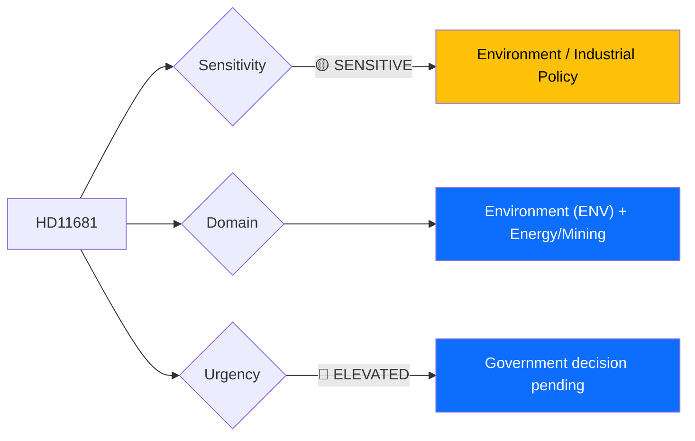

# 🔍 Per-File Political Intelligence Analysis: HD11681

## 📋 Document Identity

| Field | Value |
|-------|-------|
| **Document ID** | `HD11681` |
| **Document Type** | Skriftlig fråga (Written Question) |
| **Title** | Norra Kärr |
| **Date** | 2026-04-02 |
| **Riksmöte** | 2025/26 |
| **Author** | Rebecka Le Moine (MP) |
| **Addressed To** | Energi- och näringsminister Ebba Busch (KD) |
| **Source MCP Tool** | `get_fragor` |
| **Analysis Timestamp** | 2026-04-06 10:37 UTC |
| **Analyst** | news-realtime-monitor (realtime-1029) |

---

## 🎯 Executive Summary

MP's Rebecka Le Moine questions Energy Minister Ebba Busch (KD) about the Norra Kärr rare earth mining concession, located within the Östra Vätterbranterna biosphere reserve adjacent to Lake Vättern — Sweden's second-largest lake and a critical drinking water source for 250,000 people. The case has been escalated to the government after Bergsstaten and environmental authorities disagreed. This question crystallizes the tension between Sweden's ambition to become a strategic minerals hub (critical for EU battery and defense supply chains) and environmental protection commitments. Busch's handling of this case is watched as a precedent for future mining permits in sensitive areas. **[MEDIUM confidence — summary with environmental policy context]**

---

## 📊 Political Classification

| Field | Assessment |
|-------|-----------|
| **Sensitivity Level** | SENSITIVE — environment vs. mining |
| **Primary Domain** | Environment (ENV) + Energy |
| **Urgency** | ELEVATED — government decision pending |
| **Significance Score** | 4/10 |
| **Confidence** | MEDIUM |

---

## 💪 SWOT Impact Assessment

| Quadrant | Statement | Evidence | Confidence | Impact |
|----------|-----------|----------|:----------:|:------:|
| ⚠️ Weakness (Gov) | Busch faces no-win decision: approving mine alienates environmentalists; blocking it undermines EU critical minerals strategy | `HD11681` | M | M |
| 🔴 Threat (Gov) | Norra Kärr decision becomes precedent for all Swedish mining in environmentally sensitive areas | `HD11681`, Bergsstaten referral | M | H |
| ✅ Strength (Opp) | MP positions as defender of biosphere reserves and drinking water sources | `HD11681` | M | M |
| 🚀 Opportunity (Gov) | If government denies permit, it demonstrates environmental commitment; if grants, it shows strategic minerals leadership | `HD11681` | L | M |

---

## ⚖️ Risk Assessment

| Risk Type | L | I | Score | Assessment |
|-----------|:-:|:-:|:-----:|------------|
| Policy Implementation | 3 | 3 | 9 | Government must resolve agency disagreement on mining permit |
| Electoral Impact | 2 | 2 | 4 | Environmental voters in Jönköping county; green voters nationally |
| External / International | 2 | 2 | 4 | EU Critical Raw Materials Act implications |

**Overall Risk Level:** MEDIUM (highest: 9)

---

## 👥 Stakeholder Impact Matrix

| Stakeholder | Impact Level | Key Assessment | Confidence |
|------------|:------------:|----------------|:----------:|
| 🏛️ Government | HIGH | Busch personally must decide; precedent-setting for mining policy | M |
| 👥 Citizens | HIGH | 250,000 people depend on Vättern as drinking water source | M |
| 💰 Economic | HIGH | Rare earth mining investment vs. tourism and water supply | M |
| 🌍 International | MEDIUM | EU Critical Raw Materials Act; strategic mineral supply chains | M |
| 📰 Media | MEDIUM | Strong environmental narrative; local and national interest | M |

---

## 🔮 Forward Indicators

| # | Indicator | Timeline | Trigger Condition | Watch Priority |
|---|-----------|----------|-------------------|:--------------:|
| 1 | Government decision on Norra Kärr concession | Q2-Q3 2026 | Approval or rejection of mining permit | 🟠 |
| 2 | EU Critical Raw Materials Act implementation | 2026 | Swedish compliance timeline | 🟡 |

---

## 📊 Data Quality Assessment

| Metric | Value |
|--------|-------|
| **Source Completeness** | Summary available |
| **Evidence Density** | 3 evidence points |
| **Temporal Currency** | Current |
| **Analytical Confidence** | MEDIUM |

