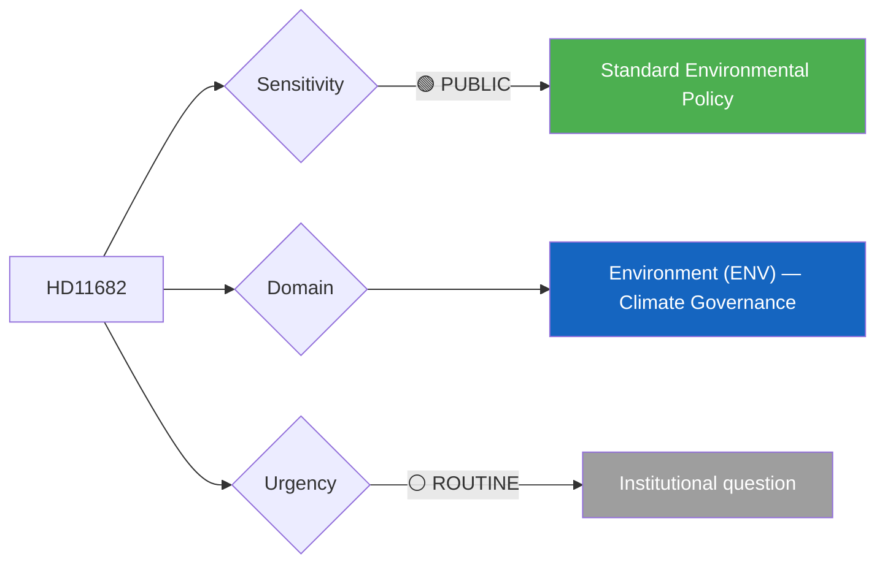

# 🔍 Per-File Political Intelligence Analysis: HD11682

## 📋 Document Identity

| Field | Value |
|-------|-------|
| **Document ID** | `HD11682` |
| **Document Type** | Skriftlig fråga (Written Question) |
| **Title** | Miljömålsberedningens nästa uppdrag |
| **Date** | 2026-04-02 |
| **Riksmöte** | 2025/26 |
| **Author** | Rickard Nordin (C) |
| **Addressed To** | Arbetsmarknadsminister/vikarierande klimat- och miljöminister Johan Britz (L) |
| **Source MCP Tool** | `get_fragor` |
| **Analysis Timestamp** | 2026-04-06 10:38 UTC |
| **Analyst** | news-realtime-monitor (realtime-1029) |

---

## 🎯 Executive Summary

C's Rickard Nordin questions the acting Climate and Environment Minister Johan Britz (L) about the future mandate of Miljömålsberedningen (Environmental Objectives Commission) — a cross-party body that has historically been central to building consensus on Swedish environmental policy. The question is strategically significant because it tests whether the government intends to renew and strengthen this commission's mandate, or effectively sideline it. The fact that the Climate Minister is "acting" (vikarierande) reflects a recent ministerial reshuffle, adding uncertainty to environmental policy direction. C's engagement signals continued centrist environmental concern and an attempt to maintain cross-party cooperation on climate. **[MEDIUM confidence — summary analysis]**

---

## 📊 Political Classification

| Field | Assessment |
|-------|-----------|
| **Sensitivity Level** | PUBLIC |
| **Primary Domain** | Environment (ENV) |
| **Urgency** | ROUTINE |
| **Significance Score** | 2/10 |
| **Confidence** | MEDIUM |

---

## 💪 SWOT Impact Assessment

| Quadrant | Statement | Evidence | Confidence | Impact |
|----------|-----------|----------|:----------:|:------:|
| ⚠️ Weakness (Gov) | Acting minister signals instability in environmental portfolio; uncertainty about commitment to cross-party climate cooperation | `HD11682` | L | M |
| ✅ Strength (Opp) | C demonstrates continued environmental policy leadership from the center; positions for future coalition building | `HD11682` | M | L |

---

## ⚖️ Risk Assessment

| Risk Type | L | I | Score | Assessment |
|-----------|:-:|:-:|:-----:|------------|
| Policy Implementation | 2 | 2 | 4 | Environmental governance framework depends on commission's mandate renewal |
| Electoral Impact | 1 | 1 | 1 | Limited voter salience |

**Overall Risk Level:** LOW

---

## 👥 Stakeholder Impact Matrix

| Stakeholder | Impact Level | Key Assessment | Confidence |
|------------|:------------:|----------------|:----------:|
| 🏛️ Government | LOW | Britz (L) must signal environmental policy commitment | M |
| 🌍 International | LOW | Sweden's environmental governance credibility; EU Green Deal alignment | L |
| 📰 Media | LOW | Institutional question with limited news value | L |

---

## 🔮 Forward Indicators

| # | Indicator | Timeline | Trigger Condition | Watch Priority |
|---|-----------|----------|-------------------|:--------------:|
| 1 | Miljömålsberedningen mandate renewal decision | Q2-Q3 2026 | New terms of reference published | 🟡 |

---

## 📊 Data Quality Assessment

| Metric | Value |
|--------|-------|
| **Source Completeness** | Summary available |
| **Evidence Density** | 2 evidence points |
| **Temporal Currency** | Current |
| **Analytical Confidence** | MEDIUM |

