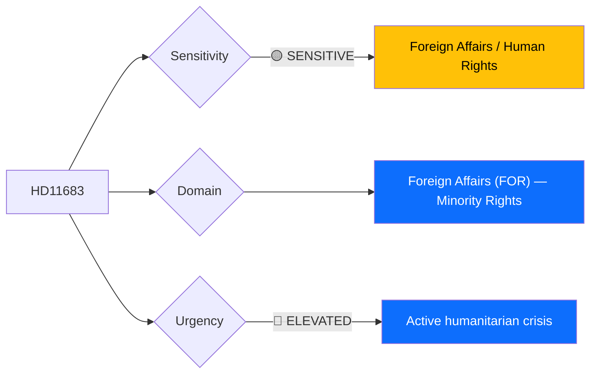

# 🔍 Per-File Political Intelligence Analysis: HD11683

## 📋 Document Identity

| Field | Value |
|-------|-------|
| **Document ID** | `HD11683` |
| **Document Type** | Skriftlig fråga (Written Question) |
| **Title** | Förföljelse av kristna och andra minoriteter i Syrien |
| **Date** | 2026-04-02 |
| **Riksmöte** | 2025/26 |
| **Author** | Linnéa Wickman (S) |
| **Addressed To** | Utrikesminister Maria Malmer Stenergard (M) |
| **Source MCP Tool** | `get_fragor` |
| **Analysis Timestamp** | 2026-04-06 10:39 UTC |
| **Analyst** | news-realtime-monitor (realtime-1029) |

---

## 🎯 Executive Summary

S MP Linnéa Wickman raises alarm about new attacks on the Christian town of al-Suqaylabiyah in Hama region, Syria, where armed groups have assaulted civilians. The question demands the Foreign Minister articulate Sweden's position on religious minority protection in Syria's ongoing instability. This combines humanitarian concern with geopolitical positioning — Sweden has a large Syrian diaspora (~200,000 people), and minority protection is a cross-party consensus issue. The timing is significant given the continued fragmentation of post-Assad Syria and EU discussions on refugee return policies. **[MEDIUM confidence — summary analysis with geopolitical context]**

---

## 📊 Political Classification

| Field | Assessment |
|-------|-----------|
| **Sensitivity Level** | SENSITIVE — human rights crisis |
| **Primary Domain** | Foreign Affairs (FOR) |
| **Urgency** | ELEVATED — active attacks on civilians |
| **Significance Score** | 3/10 |
| **Confidence** | MEDIUM |

---

## 💪 SWOT Impact Assessment

| Quadrant | Statement | Evidence | Confidence | Impact |
|----------|-----------|----------|:----------:|:------:|
| ✅ Strength (Gov) | Government can demonstrate humanitarian commitment on religious minority protection — cross-party consensus area | `HD11683` | M | L |
| 🚀 Opportunity (Gov) | Strong statement on Syria minorities aligns with KD's traditional Christian community protection profile | `HD11683`, KD party identity | L | L |
| ⚠️ Weakness (Gov) | If response is weak, contradicts government's stated commitment to religious freedom globally | `HD11683` | L | M |

---

## ⚖️ Risk Assessment

| Risk Type | L | I | Score | Assessment |
|-----------|:-:|:-:|:-----:|------------|
| External / International | 3 | 2 | 6 | Syria instability; EU refugee return discussions; Sweden's humanitarian reputation |
| Electoral Impact | 1 | 2 | 2 | Syrian diaspora communities; limited broader electoral impact |

**Overall Risk Level:** LOW-MEDIUM (highest: 6)

---

## 👥 Stakeholder Impact Matrix

| Stakeholder | Impact Level | Key Assessment | Confidence |
|------------|:------------:|----------------|:----------:|
| 🏛️ Government | LOW | Foreign Minister must articulate position; aligns with existing policy | M |
| 👥 Citizens | MEDIUM | ~200,000 Syrian diaspora in Sweden; direct community concern | M |
| 🌍 International | MEDIUM | EU Syria policy coordination; UNHCR protection mandates | M |
| 📰 Media | MEDIUM | Humanitarian crisis angle; diaspora community interest | M |

---

## 🔮 Forward Indicators

| # | Indicator | Timeline | Trigger Condition | Watch Priority |
|---|-----------|----------|-------------------|:--------------:|
| 1 | Foreign Minister response on Syria | 1-2 weeks | Policy commitment on minority protection | 🟡 |
| 2 | EU Syria policy update | Q2 2026 | Coordinated statement on refugee returns | 🟡 |

---

## 📊 Data Quality Assessment

| Metric | Value |
|--------|-------|
| **Source Completeness** | Summary available |
| **Evidence Density** | 3 evidence points |
| **Temporal Currency** | Current |
| **Analytical Confidence** | MEDIUM |

