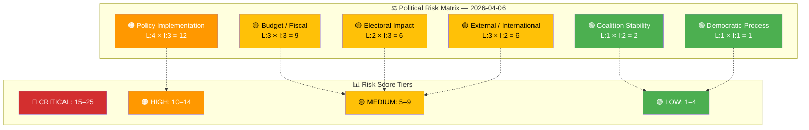
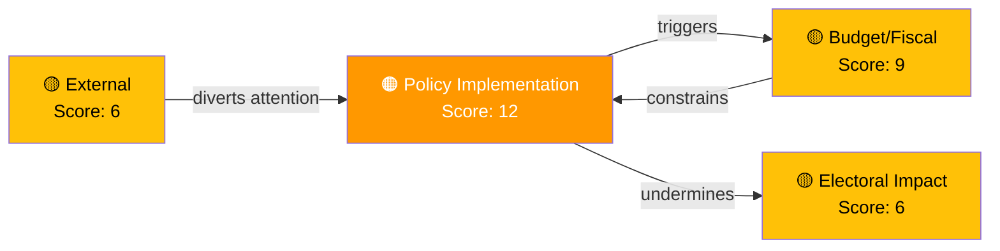

# ⚠️ Political Risk Assessment — 2026-04-06

## 📋 Assessment Context

| Field | Value |
|-------|-------|
| **Assessment ID** | RSK-2026-04-06-1029 |
| **Analysis Date** | 2026-04-06 10:42 UTC |
| **Documents Analyzed** | 9 |
| **Produced By** | news-realtime-monitor (realtime-1029) |
| **Overall Risk Level** | MEDIUM |

---

## 📊 Risk Matrix Overview

---

## 📋 Detailed Risk Scoring

| Risk Type | Likelihood (1–5) | Impact (1–5) | Score | Assessment |
|-----------|:-----------------:|:------------:|:-----:|------------|
| Coalition Stability | 1 | 2 | 2 | Coalition agreement holds; SD support steady on defense and justice priorities. Minor divergence on Israel (HD11680) manageable. |
| Policy Implementation | 4 | 3 | **12** | **HIGHEST RISK.** Prison system at 98% occupancy while government introduces harsher sentencing (HD03235 deportation, HD03227 youth crime). FöU12 civil defense also faces municipal implementation challenges. |
| Budget / Fiscal | 3 | 3 | 9 | SEK 7.5B prison expansion commitment under cost overrun pressure. Civil defense shelter renovation adds unfunded mandate for municipalities. |
| Electoral Impact | 2 | 3 | 6 | Crime and defense are top voter concerns — government benefits from agenda ownership but risks credibility gap if implementation stalls. |
| Democratic Process | 1 | 1 | 1 | Standard parliamentary procedures; no concerns. Easter recess provides natural legislative pause. |
| External / International | 3 | 2 | 6 | Syria minority crisis (HD11683), Israel death penalty (HD11680), and nuclear disarmament questions (HD11679) create moderate foreign policy positioning risk. |

---

## 🔍 Risk Interconnection Map

**Key Risk Chain:** Prison overcrowding (policy implementation) → cost overruns on new facilities (budget) → credibility gap on crime policy (electoral). This cascading chain represents the most significant risk pathway.

---

## 🚨 Anomaly Flags

| Priority | Flag | Description | Evidence |
|:--------:|------|-------------|----------|
| 🟠 | Implementation gap | Harsher sentencing pipeline (3+ propositions) vs. prison capacity at 98% | `HD01JuU15`, `HD03235`, `HD03227` |
| 🟡 | Agency disagreement | Bergsstaten and environmental authorities split on Norra Kärr mining — escalated to minister | `HD11681` |
| 🟡 | Acting minister | Climate/environment portfolio held by acting minister (Britz) — governance uncertainty | `HD11682` |

---

## 📂 MCP Data Files Used

| # | Data Source | Tool / Query | Retrieved |
|---|-----------|-------------|-----------|
| 1 | riksdag-regering-mcp | `get_betankanden(rm="2025/26")` | 2026-04-06 10:29 UTC |
| 2 | riksdag-regering-mcp | `get_propositioner(rm="2025/26")` | 2026-04-06 10:29 UTC |
| 3 | riksdag-regering-mcp | `search_voteringar(rm="2025/26")` | 2026-04-06 10:29 UTC |
| 4 | CIA export data | Coalition metrics (stability 83/100, denial rate 96%) | Cached |