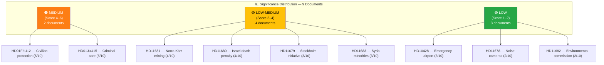

# 📊 Document Significance Scoring — 2026-04-06

## 📋 Assessment Context

| Field | Value |
|-------|-------|
| **Assessment ID** | SIG-2026-04-06-1029 |
| **Analysis Date** | 2026-04-06 10:44 UTC |
| **Documents Analyzed** | 9 |
| **Produced By** | news-realtime-monitor (realtime-1029) |

---

## 📊 Significance Distribution

---

## 📋 Scoring Methodology

Each document is scored across **6 dimensions** (max 10 total):

| Dimension | Weight | Description |
|-----------|:------:|-------------|
| Document Type Tier | 2 | Betänkande (2) > Interpellation (1.5) > Fråga (1) |
| Committee Tier | 1.5 | Tier-1 committees (FiU, FöU, JuU) score higher |
| Policy Domain Breadth | 1 | Cross-domain documents score higher |
| Coalition Relevance | 2 | Direct impact on Tidö coalition dynamics |
| Public Impact | 2 | Breadth and depth of citizen effect |
| Timeliness | 1.5 | Breaking vs routine; holiday activity premium |

---

## 📋 Detailed Scoring Table

| dok_id | Title | Type | Doc Tier | Committee | Domain | Coalition | Public | Timeliness | **Total** |
|--------|-------|------|:--------:|:---------:|:------:|:---------:|:------:|:----------:|:---------:|
| `HD01FöU12` | Civilbefolkningsskydd | Bet | 2.0 | 1.5 | 0.5 | 0.5 | 1.5 | 0 | **5/10** |
| `HD01JuU15` | Kriminalvårdsfrågor | Bet | 2.0 | 1.5 | 0.5 | 0.5 | 1.5 | 0 | **5/10** |
| `HD11681` | Norra Kärr | Fråga | 1.0 | 0.5 | 1.0 | 0.5 | 1.5 | 0 | **4/10** |
| `HD11680` | Israels dödsstraffslag | Fråga | 1.0 | 0.5 | 0.5 | 1.0 | 0.5 | 0.5 | **4/10** |
| `HD11679` | Stockholmsinitiativet | Fråga | 1.0 | 0.5 | 0.5 | 0.5 | 0.5 | 0 | **3/10** |
| `HD11683` | Minoriteter i Syrien | Fråga | 1.0 | 0.5 | 0.5 | 0 | 1.0 | 0 | **3/10** |
| `HD10428` | Beredskapsflygplats | IP | 1.5 | 0.5 | 0 | 0.5 | 0.5 | 0 | **3/10** |
| `HD11678` | Bullerkameror | Fråga | 1.0 | 0 | 0 | 0 | 0.5 | 0.5 | **2/10** |
| `HD11682` | Miljömålsberedningen | Fråga | 1.0 | 0.5 | 0 | 0 | 0.5 | 0 | **2/10** |

---

## 📋 Key Findings

1. **0** documents rated Critical (score ≥ 8) — no breaking news threshold met
2. **0** documents rated High (score 6–7) — no article generation triggered
3. **2** documents rated Medium (score 4–6) — `HD01FöU12` and `HD01JuU15` are both committee reports already covered by other workflows
4. **Dominant themes:** Defense/security and justice/criminal care are highest priority; foreign policy questions form the largest cluster but individually score low

---

## 📂 MCP Data Files Used

| # | Data Source | Tool / Query | Retrieved |
|---|-----------|-------------|-----------|
| 1 | riksdag-regering-mcp | `search_dokument(rm="2025/26")` | 2026-04-06 10:29 UTC |
| 2 | riksdag-regering-mcp | `get_betankanden(rm="2025/26")` | 2026-04-06 10:29 UTC |