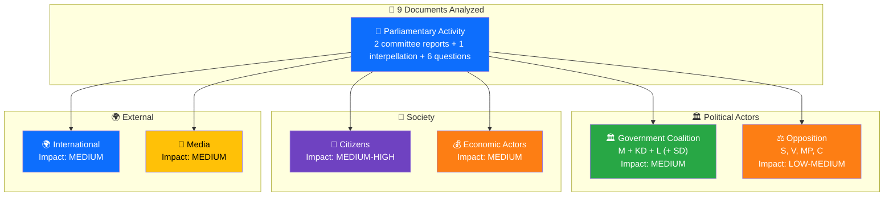

# 👥 Stakeholder Impact Analysis — 2026-04-06

## 📋 Assessment Context

| Field | Value |
|-------|-------|
| **Assessment ID** | STK-2026-04-06-1029 |
| **Analysis Date** | 2026-04-06 10:43 UTC |
| **Documents Analyzed** | 9 |
| **Produced By** | news-realtime-monitor (realtime-1029) |

---

## 📊 Stakeholder Impact Dashboard

---

## 📋 Detailed Stakeholder Assessment

### 🏛️ Government Coalition (M + KD + L + SD support)

**Impact Level:** MEDIUM | **Direction:** Mixed

| Document | Impact | Assessment |
|----------|:------:|------------|
| `HD01FöU12` | Positive | Civilian protection reform reinforces defense credibility |
| `HD01JuU15` | Mixed | Criminal care review highlights implementation challenges alongside policy delivery |
| `HD11681` | Negative | Norra Kärr mining decision creates political risk for Busch (KD) |
| `HD11680` | Negative | Israel death penalty question exposes coalition divergence on Middle East |

### ⚖️ Opposition (S, V, MP, C)

**Impact Level:** LOW-MEDIUM | **Direction:** Positive

| Document | Impact | Assessment |
|----------|:------:|------------|
| `HD10428` | Positive | Hultqvist (S) probes defense delivery gaps; builds credibility narrative |
| `HD11681` | Positive | Le Moine (MP) positions environmental protection against mining |
| `HD11682` | Positive | Nordin (C) tests government environmental governance commitment |
| `HD11679` | Positive | Naraghi (S) highlights deprioritization of disarmament diplomacy |

### 👥 Citizens

**Impact Level:** MEDIUM-HIGH | **Direction:** Positive overall

- **Civil defense (HD01FöU12):** Directly affects shelter access and evacuation readiness
- **Criminal care (HD01JuU15):** Prison capacity affects public safety; rehabilitation quality impacts recidivism
- **Water supply (HD11681):** Norra Kärr mining threatens drinking water for 250,000 people near Vättern
- **Syria diaspora (HD11683):** ~200,000 Swedish residents of Syrian origin concerned about minority persecution

### 💰 Economic Actors

**Impact Level:** MEDIUM | **Direction:** Mixed

- **Construction sector:** Prison expansion (SEK 7.5B) and shelter renovation create major public investment
- **Mining industry:** Norra Kärr concession decision sets precedent for rare earth mining
- **EU supply chains:** Critical Raw Materials Act compliance affected by mining policy

### 🌍 International

**Impact Level:** MEDIUM | **Direction:** Neutral

- **NATO (HD01FöU12):** Article 3 resilience obligations require civilian protection capacity
- **Israel/Palestine (HD11680):** Sweden's human rights credibility tested on death penalty expansion
- **NPT (HD11679):** Stockholm Initiative engagement signals nuclear disarmament commitment
- **Syria (HD11683):** EU coordination on minority protection and refugee return policy

### 📰 Media

**Impact Level:** MEDIUM | **Direction:** Mixed

- **High newsworthiness:** Prison overcrowding (human interest + policy accountability)
- **Medium:** Norra Kärr mining (environment vs economy); Israel death penalty
- **Low:** Noise cameras, environmental commission mandate

---

## 📂 MCP Data Files Used

| # | Data Source | Tool / Query | Retrieved |
|---|-----------|-------------|-----------|
| 1 | riksdag-regering-mcp | `get_betankanden(rm="2025/26")` | 2026-04-06 10:29 UTC |
| 2 | riksdag-regering-mcp | `get_fragor(rm="2025/26")` | 2026-04-06 10:29 UTC |
| 3 | riksdag-regering-mcp | `get_interpellationer(rm="2025/26")` | 2026-04-06 10:29 UTC |