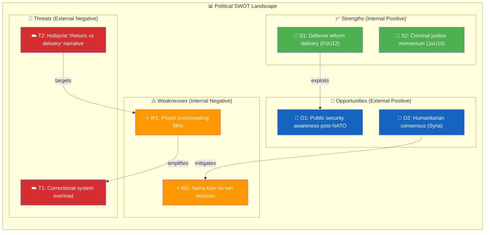

# 💼 Political SWOT Analysis — 2026-04-06

## 📋 SWOT Context

| Field | Value |
|-------|-------|
| **SWOT ID** | SWT-2026-04-06-1029 |
| **Analysis Date** | 2026-04-06 10:41 UTC |
| **Analysis Scope** | Government coalition + Opposition assessment |
| **Reference Period** | 2026-W14 (Easter recess, documents from 2026-04-02) |
| **Produced By** | news-realtime-monitor (realtime-1029) |
| **Primary MCP Sources** | `get_betankanden`, `get_propositioner`, `get_fragor`, `get_interpellationer`, `search_voteringar` |
| **Validity Window** | Entries valid until 2026-05-06 |

---

## 🏛️ Section 1: Government Coalition SWOT

### ✅ Strengths — Government Coalition

| # | Strength Statement | Evidence (dok_id) | Confidence | Impact | Entry Date |
|---|-------------------|-------------------|:----------:|:------:|:----------:|
| S1 | Defense Committee delivers civilian protection reform with cross-party support, reinforcing government security narrative ahead of FöU12 debate Apr 14 | `HD01FöU12` | M | H | 2026-04-02 |
| S2 | Criminal justice reform agenda maintains momentum with JuU15 on correctional services — core coalition priority with SD support agreement backing | `HD01JuU15` | M | H | 2026-04-02 |
| S3 | Government controls legislative agenda across defense, justice, and migration domains simultaneously — no single-issue vulnerability | `HD01FöU12`, `HD01JuU15`, `HD03235` | M | M | 2026-04-02 |

**Coalition Strength Summary:** Government maintains legislative initiative on its two signature policy areas (defense and criminal justice) with sustained coalition partner alignment.

---

### ⚠️ Weaknesses — Government Coalition

| # | Weakness Statement | Evidence (dok_id) | Confidence | Impact | Entry Date |
|---|-------------------|-------------------|:----------:|:------:|:----------:|
| W1 | Prison system at 98% capacity — correctional infrastructure fails to keep pace with harsher sentencing from propositions HD03235 (deportation) and HD03227 (youth crime) | `HD01JuU15`, `HD03235`, `HD03227` | M | H | 2026-04-02 |
| W2 | Norra Kärr mining decision creates no-win scenario for Energy Minister Busch (KD): approve mine and alienate environmentalists, or block it and undermine EU critical minerals strategy | `HD11681` | M | M | 2026-04-02 |
| W3 | Coalition divergence on Israel (KD pro-Israel, government must navigate death penalty criticism) creates foreign policy messaging risk | `HD11680` | L | M | 2026-04-02 |

**Coalition Weakness Summary:** Implementation gaps on criminal justice delivery and difficult environmental/mining trade-offs expose the coalition to opposition attack lines.

---

### 🚀 Opportunities — Government Coalition

| # | Opportunity Statement | Evidence (dok_id) | Confidence | Impact | Entry Date |
|---|----------------------|-------------------|:----------:|:------:|:----------:|
| O1 | Civil defense modernization (FöU12) resonates with heightened public security awareness post-NATO accession — broad popular support for preparedness investment | `HD01FöU12` | M | M | 2026-04-02 |
| O2 | Cross-party consensus on religious minority protection (Syria question HD11683) allows government to demonstrate humanitarian leadership without coalition stress | `HD11683` | L | L | 2026-04-02 |

**Coalition Opportunity Summary:** Defense and humanitarian policy areas offer low-risk opportunities to build public support.

---

### 🔴 Threats — Government Coalition

| # | Threat Statement | Evidence (dok_id) | Confidence | Impact | Entry Date |
|---|-----------------|-------------------|:----------:|:------:|:----------:|
| T1 | Correctional system overload risk: harsher sentencing without matching capacity expansion threatens government credibility on its signature crime policy | `HD01JuU15`, `HD03235` | M | H | 2026-04-02 |
| T2 | Former DefMin Hultqvist (S) probes defense infrastructure gaps with preparedness airport interpellation — establishes opposition narrative of "rhetoric vs. delivery" | `HD10428`, `HD01FöU12` | M | M | 2026-04-02 |

**Coalition Threat Summary:** The most significant threat is the growing gap between government's tough-on-crime promises and correctional system capacity.

---

## 🏛️ Section 2: Main Opposition SWOT

**Opposition Subject:** Social Democrats (S) + V + MP + C

### ✅ Strengths — Opposition

| # | Strength Statement | Evidence (dok_id) | Confidence | Impact | Entry Date |
|---|-------------------|-------------------|:----------:|:------:|:----------:|
| S1 | Hultqvist (S) maintains defense policy credibility through targeted interpellation on preparedness airport, demonstrating continued expertise | `HD10428` | M | M | 2026-04-02 |
| S2 | Opposition parties (S, MP, C) each demonstrating policy breadth: S on defense/foreign affairs, MP on environment/urban safety, C on climate governance | `HD10428`, `HD11681`, `HD11682` | M | L | 2026-04-02 |

### ⚠️ Weaknesses — Opposition

| # | Weakness Statement | Evidence (dok_id) | Confidence | Impact | Entry Date |
|---|-------------------|-------------------|:----------:|:------:|:----------:|
| W1 | Opposition questions in this batch are individual written questions, not coordinated attacks — suggests fragmented scrutiny rather than unified pressure | `HD11678`-`HD11683` | L | M | 2026-04-02 |

### 🚀 Opportunities — Opposition

| # | Opportunity Statement | Evidence (dok_id) | Confidence | Impact | Entry Date |
|---|----------------------|-------------------|:----------:|:------:|:----------:|
| O1 | Prison overcrowding and Norra Kärr mining are exploitable government vulnerabilities with concrete evidence base | `HD01JuU15`, `HD11681` | M | M | 2026-04-02 |

### 🔴 Threats — Opposition

| # | Threat Statement | Evidence (dok_id) | Confidence | Impact | Entry Date |
|---|-----------------|-------------------|:----------:|:------:|:----------:|
| T1 | Government's broad legislative activity makes it difficult for opposition to dominate any single policy narrative | `HD01FöU12`, `HD01JuU15`, proposition pipeline | L | M | 2026-04-02 |

---

## 📊 SWOT Quadrant Mapping

---

## 🔑 Strategic Implications

The government coalition enters Easter recess with strong legislative output on defense (FöU12) and criminal justice (JuU15) but faces growing implementation risk. Prison overcrowding (W1) directly undermines the coalition's signature tough-on-crime agenda, and the introduction of harsher deportation rules (HD03235) and expanded youth crime investigation (HD03227) will compound demand on an already strained correctional system. The S opposition is strategically probing defense delivery gaps through Hultqvist's interpellations while MP and C diversify into environment, urban safety, and climate governance.

**Key Watch Items:**
1. FöU12 chamber debate on April 14 — cross-party positions on civilian protection funding
2. Kriminalvården Q2 capacity report — system occupancy trajectory
3. Busch's Norra Kärr decision — mining vs. environment precedent

---

## 🔄 Section 5: Cross-SWOT Interference Analysis

| Gov/Opp SWOT Element | Interfering Element | Effect | Net Political Impact |
|:--------------------:|:------------------:|:------:|---------------------|
| Gov W1: Prison overcrowding | Opp O1: Exploit delivery gap | Amplifies vulnerability | S can use JuU15 debate to highlight capacity crisis vs. harsher sentencing rhetoric |
| Gov S1: Defense reform delivery | Opp S1: Hultqvist defense expertise | Competitive dynamic | Both sides claim defense credibility — net benefit to parliament as institution |

---

## 📊 Section 6: TOWS Strategic Options

| TOWS Cell | Strategy | Specific Action | Evidence |
|:---------:|---------|-----------------|---------|
| **SO** (Defense strength × Public awareness) | Leverage civilian protection debate to reinforce security narrative | Highlight FöU12 in government communications before Apr 14 debate | `HD01FöU12` |
| **WO** (Prison weakness × Humanitarian consensus) | Use cross-party Syria consensus to rebuild cooperative atmosphere | Joint statement on minority protection could ease opposition scrutiny | `HD11683` |
| **ST** (Legislative control × Hultqvist probe) | Pre-empt defense delivery criticism with concrete preparedness milestones | Announce infrastructure designations before Hultqvist debate | `HD10428` |
| **WT** (Prison crisis × Correctional overload) | Urgent capacity acceleration to prevent credibility collapse | Fast-track modular prison construction; temporary capacity measures | `HD01JuU15` |

---

## 🔮 Section 7: Forward Indicators & Scenario Outlook

| Scenario | Probability | Key Trigger | SWOT Elements |
|----------|:----------:|------------|---------------|
| Stable legislative progress through Easter recess | 70% | No new crises; scheduled debates proceed normally | S1+O1 |
| Prison capacity crisis escalation | 20% | Kriminalvården issues formal overcrowding warning | W1+T1 |
| Opposition defense credibility challenge | 10% | Hultqvist debate generates media traction on delivery gap | S1+T2 |

---

## 📂 MCP Data Files Used

| # | Data Source | File / Tool Path | Data Type | Retrieved |
|:-:|-----------|-----------------|-----------|-----------|
| 1 | riksdag-regering-mcp | `get_betankanden(rm="2025/26")` | Committee reports | 2026-04-06 10:29 UTC |
| 2 | riksdag-regering-mcp | `get_propositioner(rm="2025/26")` | Propositions | 2026-04-06 10:29 UTC |
| 3 | riksdag-regering-mcp | `search_voteringar(rm="2025/26")` | Voting records | 2026-04-06 10:29 UTC |
| 4 | riksdag-regering-mcp | `search_anforanden(rm="2025/26")` | Speeches | 2026-04-06 10:29 UTC |

### SWOT Quadrant Data Provenance

| SWOT Quadrant | Primary MCP Tools | Evidence Items | Confidence |
|:-------------:|------------------|:--------------:|:----------:|
| **Strengths** | `get_betankanden`, `get_propositioner` | 3 | M |
| **Weaknesses** | `get_betankanden`, `get_fragor` | 3 | M |
| **Opportunities** | `get_betankanden`, `get_fragor` | 2 | L-M |
| **Threats** | `get_interpellationer`, `get_propositioner` | 2 | M |