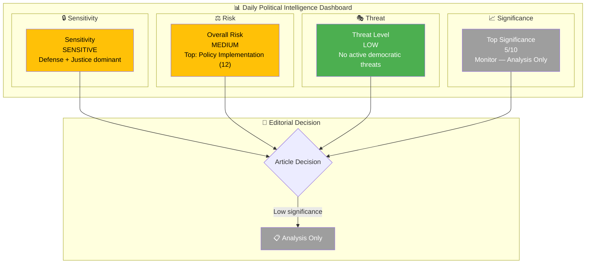
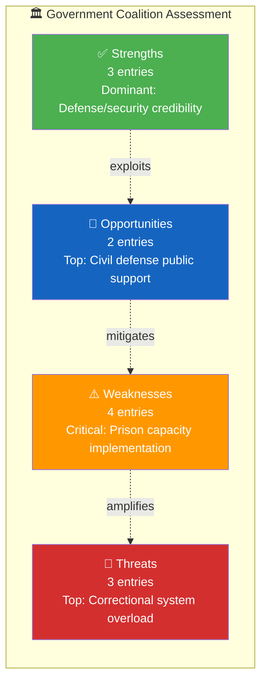

# 🧩 Political Intelligence Synthesis Summary — 2026-04-06

## 📋 Synthesis Context

| Field | Value |
|-------|-------|
| **Synthesis ID** | SYN-2026-04-06-1029 |
| **Analysis Date** | 2026-04-06 10:40 UTC |
| **Documents Analyzed** | 9 |
| **Analysis Period** | 2026-04-02 (lookback from 2026-04-06 Easter Monday) |
| **Produced By** | news-realtime-monitor (realtime-1029) |
| **Overall Confidence** | MEDIUM |

---

## 📊 Intelligence Dashboard

---

## 🏆 Top Findings by Significance

| Rank | dok_id | Title | Significance | Risk Tier | SWOT Impact | Recommendation |
|:----:|--------|-------|:-----------:|:---------:|:-----------:|----------------|
| 1 | `HD01FöU12` | Civilian protection in heightened preparedness | 5/10 | 🟡 | Gov Strength (defense credibility) | Monitor |
| 2 | `HD01JuU15` | Criminal care issues | 5/10 | 🟠 | Gov Threat (implementation gap) | Monitor |
| 3 | `HD11681` | Norra Kärr mining concession | 4/10 | 🟡 | Gov Weakness (mining vs environment) | Monitor |
| 4 | `HD11680` | Israel death penalty law | 4/10 | 🟡 | Gov Weakness (coalition divergence) | Monitor |
| 5 | `HD10428` | Emergency airport interpellation | 3/10 | 🟢 | Opp Strength (defense expertise) | Monitor |
| 6 | `HD11679` | Stockholm Initiative (nuclear disarmament) | 3/10 | 🟢 | Opp Strength (diplomatic legacy) | Monitor |
| 7 | `HD11683` | Christian persecution in Syria | 3/10 | 🟡 | Cross-party consensus | Monitor |
| 8 | `HD11682` | Environmental objectives commission | 2/10 | 🟢 | Gov Weakness (acting minister) | Monitor |
| 9 | `HD11678` | Noise cameras legislation | 2/10 | 🟢 | Gov Opportunity (tech safety) | Monitor |

---

## 💪 Aggregated SWOT Summary

| Quadrant | Count | Highest-Impact Entry | Evidence |
|----------|:-----:|---------------------|----------|
| ✅ Strengths | 3 | Government demonstrates defense and criminal justice initiative with cross-party support | `HD01FöU12`, `HD01JuU15` |
| ⚠️ Weaknesses | 4 | Prison overcrowding at 98% undermines tough-on-crime narrative; mining permit creates no-win decision | `HD01JuU15`, `HD11681` |
| 🚀 Opportunities | 2 | Civil defense modernization resonates with public security concerns; cross-party defense consensus | `HD01FöU12` |
| 🔴 Threats | 3 | Harsher sentencing from Prop 235 and Prop 227 will further strain already overstretched correctional capacity | `HD01JuU15`, `HD03235`, `HD03227` |

**SWOT Balance Assessment:** Government maintains initiative on defense and security policy with broad parliamentary support, but faces growing implementation risk on criminal justice as prison overcrowding nears system capacity. The gap between tough-on-crime rhetoric and correctional infrastructure creates a medium-term electoral vulnerability.

---

## ⚖️ Risk Landscape Summary

| Risk Category | Score Range | Highest Risk | Trend vs. Previous |
|--------------|:----------:|-------------|:------------------:|
| Coalition Stability | 1–4 | Israel foreign policy divergence (score 4) | → |
| Policy Implementation | 2–12 | Prison capacity expansion (score 12) | ↑ |
| Budget / Fiscal | 4–9 | Correctional facility construction costs (score 9) | → |
| Electoral | 1–6 | Criminal justice credibility gap (score 6) | → |
| Democratic Process | 1 | No concerns identified | → |
| External / International | 4–6 | Syria minority crisis; Israel HR concerns (score 6) | → |

**Overall Risk Level:** MEDIUM

---

## 🎭 Threat Summary

| Threat Category | Threat Level | Key Finding |
|----------------|:------------:|-------------|
| 🎭 Narrative Integrity | LOW | No disinformation concerns across analyzed documents |
| 📝 Legislative Integrity | LOW | Standard committee and question procedures observed |
| 🚫 Accountability | MOD | Risk of inadequate follow-up on shelter renovation and prison expansion commitments |
| 🔇 Transparency | LOW | No transparency suppression detected |
| ⛔ Democratic Process | LOW | Normal parliamentary operations |
| 👑 Power Balance | LOW | No executive overreach detected |

**Overall Threat Level:** LOW

---

## 👥 Stakeholder Impact Overview

| Stakeholder | Impact | Direction | Key Driver |
|------------|:------:|:---------:|------------|
| 🏘️ Citizens | M | positive | Civil defense improvements and prison capacity affect public safety |
| 🏛️ Government | M | mixed | Strong on defense policy; implementation risks on corrections |
| 🗳️ Opposition | L | positive | S demonstrates defense expertise and foreign policy legacy |
| 🏭 Business | L | neutral | Mining concession (Norra Kärr) and construction investment |
| 🤝 Civil Society | L | neutral | Environmental protection vs. mining in biosphere reserves |
| 🌍 International | M | neutral | NATO obligations, Syria crisis, Israel HR concerns, disarmament |

---

## 🎯 Narrative Direction

The analysis reveals a government that is legislatively active on its core defense and criminal justice priorities but faces growing implementation challenges. The Defense Committee's civilian protection report (HD01FöU12) and the Justice Committee's correctional services review (HD01JuU15) both show policy ambition, while the supporting questions from opposition MPs probe specific delivery gaps: emergency airports not designated (Hultqvist), prison overcrowding (implicit), and environmental vs. economic trade-offs (Norra Kärr). Easter Monday holiday means no new parliamentary activity — this analysis covers the pre-recess activity.

**Primary Narrative Angle:** Government delivers on defense and justice legislation while implementation risks on prison capacity and environmental permitting create medium-term vulnerabilities.  
**Secondary Angles:** Foreign policy questions on Israel, Syria, and nuclear disarmament test government's international positioning.  
**Confidence:** MEDIUM

---

## 🔮 Forward Indicators

| # | Indicator | Timeline | Source | Watch Priority |
|---|-----------|----------|--------|:--------------:|
| 1 | FöU12 chamber debate on civilian protection | Apr 14, 2026 | Riksdag calendar | 🟠 |
| 2 | Kriminalvården Q2 capacity report | Q2 2026 | Government agency | 🟠 |
| 3 | Norra Kärr mining decision by Busch | Q2-Q3 2026 | Government decision | 🟡 |
| 4 | Foreign Minister responses to 3 foreign policy questions | 1-2 weeks | Written responses | 🟡 |

---

## 📋 Analysis Artifacts Inventory

| File | Status | Key Output |
|------|:------:|-----------|
| `classification-results.md` | ✅ | 2 SENSITIVE (defense, justice), 7 PUBLIC |
| `risk-assessment.md` | ✅ | Overall: MEDIUM; highest score 12 (policy implementation) |
| `swot-analysis.md` | ✅ | Gov strengths on defense; weakness on corrections capacity |
| `threat-analysis.md` | ✅ | Overall: LOW; accountability monitoring needed |
| `stakeholder-perspectives.md` | ✅ | Citizens highest impact (defense + corrections) |
| `significance-scoring.md` | ✅ | Top score 5/10; analysis-only recommendation |
| Per-file analysis files | 9 created | All 9 documents analyzed with evidence-based content |

---

## 📂 MCP Data Files Used

| # | Data Source | File / Tool Path | Retrieved |
|---|-----------|-----------------|-----------|
| 1 | riksdag-regering-mcp | `get_betankanden(rm="2025/26", limit=10)` | 2026-04-06 10:29 UTC |
| 2 | riksdag-regering-mcp | `get_propositioner(rm="2025/26", limit=10)` | 2026-04-06 10:29 UTC |
| 3 | riksdag-regering-mcp | `search_dokument(from_date="2026-04-05", to_date="2026-04-06")` | 2026-04-06 10:29 UTC |
| 4 | riksdag-regering-mcp | `search_voteringar(rm="2025/26", limit=20)` | 2026-04-06 10:29 UTC |
| 5 | riksdag-regering-mcp | `search_anforanden(rm="2025/26", limit=20)` | 2026-04-06 10:29 UTC |
| 6 | riksdag-regering-mcp | `search_regering(dateFrom="2026-04-05", dateTo="2026-04-06")` | 2026-04-06 10:29 UTC |