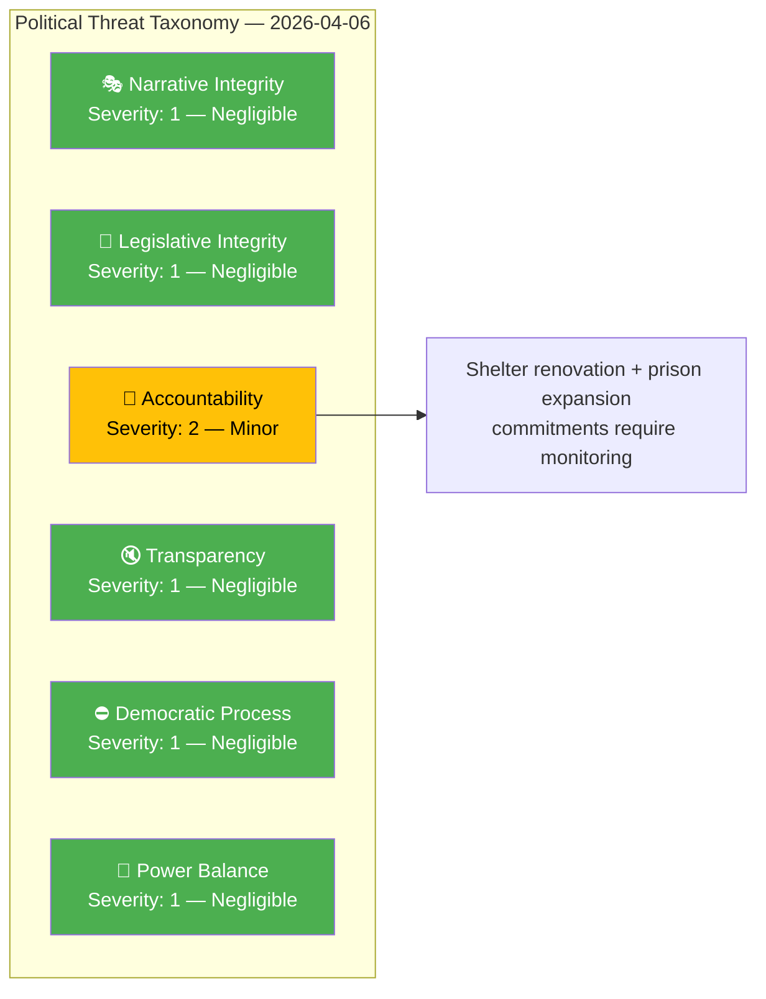

# 🔴 Political Threat Analysis — 2026-04-06

## 📋 Assessment Context

| Field | Value |
|-------|-------|
| **Assessment ID** | THR-2026-04-06-1029 |
| **Analysis Date** | 2026-04-06 10:43 UTC |
| **Documents Analyzed** | 9 |
| **Produced By** | news-realtime-monitor (realtime-1029) |
| **Overall Threat Level** | LOW |

---

## 📊 Political Threat Taxonomy

---

## 📋 Threat Assessment Table

| Threat Category | Applicable? | Threat Description | Severity (1–5) | Evidence |
|----------------|:-----------:|-------------------|:--------------:|----------|
| 🎭 Narrative Integrity | N | No disinformation or misleading framing detected in analyzed documents | 1 | — |
| 📝 Legislative Integrity | N | Standard committee procedure; no evidence of undisclosed lobbying | 1 | — |
| 🚫 Accountability | Y | Government commitments on shelter renovation (FöU12) and prison expansion (JuU15) require systematic follow-up; risk of inadequate reporting on capacity milestones | 2 | `HD01FöU12`, `HD01JuU15` |
| 🔇 Transparency | N | All analyzed documents are public parliamentary records | 1 | — |
| ⛔ Democratic Process | N | Normal parliamentary operations; Easter recess is scheduled | 1 | — |
| 👑 Power Balance | N | Mining permit escalation to minister (HD11681) is standard procedure, not overreach | 1 | `HD11681` |

---

## 🔮 Forward Watch

| # | Indicator | Timeline | Trigger | Priority |
|---|-----------|----------|---------|:--------:|
| 1 | KV capacity reporting transparency | Q2 2026 | Inadequate data disclosure on overcrowding | 🟡 |
| 2 | Municipal shelter renovation audit | Q3 2026 | MSB compliance check findings | 🟢 |

---

## 📂 MCP Data Files Used

| # | Data Source | Tool / Query | Retrieved |
|---|-----------|-------------|-----------|
| 1 | riksdag-regering-mcp | `get_betankanden(rm="2025/26")` | 2026-04-06 10:29 UTC |
| 2 | riksdag-regering-mcp | `search_dokument(from_date="2026-04-05")` | 2026-04-06 10:29 UTC |