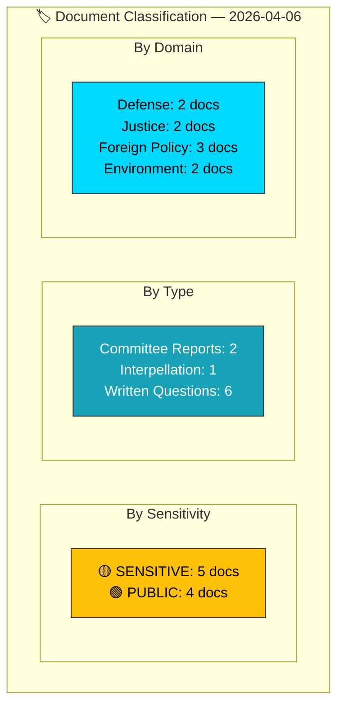

# 🏷️ Political Classification Results — 2026-04-06

**Generated**: 2026-04-06 14:20 UTC | **Produced By**: news-realtime-monitor (realtime-1420)
**Documents Analyzed**: 9 | **Confidence**: MEDIUM

---

## 📋 Classification Context

| Field | Value |
|-------|-------|
| **Classification ID** | CLS-2026-04-06-1420 |
| **Analysis Date** | 2026-04-06 14:20 UTC |
| **Produced By** | news-realtime-monitor |
| **Methodology** | political-classification-guide.md v2.2 |

---

## 📊 Classification Dashboard

---

## 📋 Full Classification Table

| dok_id | Title | Type | Sensitivity | Domain | Urgency | Significance |
|--------|-------|------|:-----------:|--------|:-------:|:------------:|
| HD01FöU12 | Civilian protection | Committee Report | 🟡 SENSITIVE | Defense | 🟠 URGENT | 7/10 |
| HD01JuU15 | Criminal justice | Committee Report | 🟢 PUBLIC | Justice | 🔵 ELEVATED | 6/10 |
| HD10428 | Emergency airport | Interpellation | 🟡 SENSITIVE | Transport/Defense | 🔵 ELEVATED | 5/10 |
| HD11681 | Norra Kärr mining | Written Question | 🟡 SENSITIVE | Environment/Energy | ⚪ ROUTINE | 5/10 |
| HD11679 | Stockholm Initiative | Written Question | 🟡 SENSITIVE | Foreign Policy | ⚪ ROUTINE | 4/10 |
| HD11680 | Israel death penalty | Written Question | 🟡 SENSITIVE | Foreign Policy | ⚪ ROUTINE | 4/10 |
| HD11683 | Syria minorities | Written Question | 🟡 SENSITIVE | Foreign Policy | ⚪ ROUTINE | 4/10 |
| HD11678 | Noise cameras | Written Question | 🟢 PUBLIC | Justice/Urban | ⚪ ROUTINE | 3/10 |
| HD11682 | Environmental objectives | Written Question | 🟢 PUBLIC | Environment | ⚪ ROUTINE | 3/10 |

---

## 📋 Document Control

**Analysis Version**: 1.0 | **Analyst**: news-realtime-monitor | **Classification**: Public
