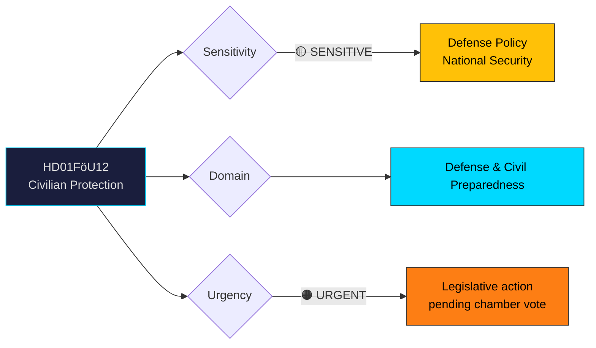

# Document Analysis: Ett starkare skydd för civilbefolkningen vid höjd beredskap

**Generated**: 2026-04-06 14:20 UTC
**dok_id**: HD01FöU12
**Document Type**: Committee Report (betänkande)
**Committee**: FöU (Defense Committee)
**Date**: 2026-04-02
**Riksmöte**: 2025/26
**Significance**: 🟠 High (7/10)
**Confidence**: HIGH (85%)

---

## 🎯 Executive Summary

The Defense Committee (FöU) approved Government Proposition 2025/26:142 establishing a new legal framework for shelter and protective spaces for civilians during heightened military readiness. This represents a major shift in Sweden's civil defense posture, introducing three new/amended laws on shelters, evacuation procedures, and building codes. The committee rejected opposition reservations from S, V, C, and MP on feasibility, accessibility, and scope. This legislation is directly linked to Sweden's NATO accession and the government's total defense modernization agenda. **[HIGH confidence]**

---

## 📊 Political Classification

---

## 💼 SWOT Analysis

### ✅ Strengths

| # | Statement | Evidence (dok_id) | Confidence | Impact |
|---|-----------|-------------------|:----------:|:------:|
| S1 | Government coalition maintains unified front on defense legislation — all 3 laws adopted | HD01FöU12, Prop 2025/26:142 | H | H |
| S2 | New shelter law modernizes Sweden's civil defense infrastructure for first time since Cold War era | HD01FöU12 point 1 | H | H |
| S3 | Committee includes cross-party defense expertise (Hultqvist as chair, ex-Defense Minister) | HD01FöU12 committee list | M | M |

### ⚠️ Weaknesses

| # | Statement | Evidence (dok_id) | Confidence | Impact |
|---|-----------|-------------------|:----------:|:------:|
| W1 | Feasibility concerns raised by S+V — unclear if municipalities can implement shelter requirements within timeframe | HD01FöU12 Reservation 1 (S, V) | M | H |
| W2 | Accessibility gaps for disabled persons flagged by V, C, and MP — three separate reservations | HD01FöU12 Reservations 2-4 | H | M |
| W3 | Plan-och-bygglagen amendments may create compliance burden for construction sector | HD01FöU12 law 3 | L | M |

### 🌟 Opportunities

| # | Statement | Evidence (dok_id) | Confidence | Impact |
|---|-----------|-------------------|:----------:|:------:|
| O1 | NATO membership provides framework for coordinated civil protection standards | HD01FöU12 context, HD03214 | M | H |
| O2 | Cross-party consensus on need for stronger civilian protection (disagreement is on scope, not direction) | HD01FöU12 all reservations | H | M |

### 🔴 Threats

| # | Statement | Evidence (dok_id) | Confidence | Impact |
|---|-----------|-------------------|:----------:|:------:|
| T1 | Opposition (S+V) may use implementation difficulties to challenge government competence | HD01FöU12 Reservation 1 | M | M |
| T2 | Accessibility litigation risk if shelter standards don't meet disability rights requirements | HD01FöU12 Reservations 2-4 | L | M |

---

## 🎭 Risk Assessment

| Risk ID | Description | L (1-5) | I (1-5) | Score | Trend |
|---------|-------------|:-------:|:-------:|:-----:|:-----:|
| RSK-1 | Municipal implementation delays due to capacity constraints | 3 | 3 | 9 | → |
| RSK-2 | Accessibility compliance challenges with new shelter standards | 2 | 3 | 6 | ↑ |
| RSK-3 | Cost overruns in shelter construction program | 3 | 2 | 6 | → |

---

## 👥 Stakeholder Impact

| Stakeholder | Impact | Key Concern | dok_id |
|-------------|:------:|-------------|--------|
| Citizens | 🟢 Positive | Strengthened civil protection during crisis | HD01FöU12 |
| Government (M, KD, L, SD) | 🟢 Positive | Defense agenda advanced, prop adopted | HD01FöU12 |
| Opposition (S, V) | 🟡 Mixed | Support direction but cite feasibility gaps | HD01FöU12 Res. 1 |
| Municipalities | 🟠 Significant burden | New shelter construction/maintenance obligations | HD01FöU12 |
| Construction sector | 🟡 Mixed | New requirements but also new contracts | HD01FöU12 law 3 |
| Disability organizations | 🔴 Concerned | Accessibility gaps not addressed | HD01FöU12 Res. 2-4 |
| NATO/International | 🟢 Positive | Sweden aligns with allied civil defense standards | HD01FöU12, HD03214 |

---

## 🔗 Cross-Document References

- **HD03214** (Prop: Cybersecurity center) — complementary defense infrastructure
- **HD10428** (IP: Emergency airport) — related total defense infrastructure discussion
- **HD03228** (Prop: War materiel regulations) — broader defense modernization context

---

## 📈 Forward Indicators

| Indicator | Trigger | Timeline | MCP Tool |
|-----------|---------|----------|----------|
| Chamber vote on FöU12 | Scheduled debate/vote | April 14-16, 2026 | search_voteringar |
| Municipal response to shelter mandates | Implementation guidance published | Q3 2026 | search_regering |
| SD positioning on defense spending | Budget debate signals | May-June 2026 | search_anforanden |

---

## 📋 Document Control

**Analysis Version**: 1.0 | **Analyst**: news-realtime-monitor | **Classification**: Public
