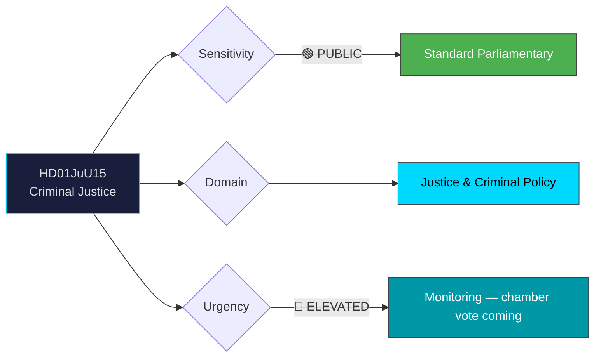

# Document Analysis: Kriminalvårdsfrågor

**Generated**: 2026-04-06 14:20 UTC
**dok_id**: HD01JuU15
**Document Type**: Committee Report (betänkande)
**Committee**: JuU (Justice Committee)
**Date**: 2026-04-02
**Riksmöte**: 2025/26
**Significance**: 🟡 Medium (6/10)
**Confidence**: HIGH (80%)

---

## 🎯 Executive Summary

The Justice Committee rejected 13+ opposition motions on criminal justice reform covering recidivism prevention, prison capacity, conditional release, and electronic monitoring. Notably, Reservation 1 united S, V, C, and MP — a broad opposition alignment on Trygghetsberedningen proposals (safety preparedness). The government coalition (M, SD, KD, L) maintained discipline to defeat all motions. Key policy areas include prison expansion, women's exit programs, and single-cell occupancy. **[HIGH confidence]**

---

## 📊 Political Classification

---

## 💼 SWOT Analysis

### ✅ Strengths

| # | Statement | Evidence (dok_id) | Confidence | Impact |
|---|-----------|-------------------|:----------:|:------:|
| S1 | Government coalition maintains unified position — all 13+ motions rejected | HD01JuU15 all points | H | H |
| S2 | SD alignment on law-and-order agenda remains strong (no defections) | HD01JuU15 voting pattern | H | M |

### ⚠️ Weaknesses

| # | Statement | Evidence (dok_id) | Confidence | Impact |
|---|-----------|-------------------|:----------:|:------:|
| W1 | Broad 4-party opposition alignment (S+V+C+MP) on Trygghetsberedningen — signals coordinated challenge | HD01JuU15 Res. 1 | H | M |
| W2 | Prison capacity concerns unresolved — S demands expansion scrutiny | HD01JuU15 Res. 5 | M | H |
| W3 | Women inmates and single-cell standards remain below Nordic norms | HD01JuU15 Res. 6-8 | M | M |

### 🌟 Opportunities

| # | Statement | Evidence (dok_id) | Confidence | Impact |
|---|-----------|-------------------|:----------:|:------:|
| O1 | Potential cross-party consensus on women's exit programs (V+C+MP alignment) | HD01JuU15 Res. 4 | M | M |
| O2 | Government can point to Kriminalvården investment as tough-on-crime record | HD01JuU15 context | M | M |

### 🔴 Threats

| # | Statement | Evidence (dok_id) | Confidence | Impact |
|---|-----------|-------------------|:----------:|:------:|
| T1 | Overcrowding incidents could become electoral liability if unaddressed | HD01JuU15 Res. 5-6 | M | H |
| T2 | Human rights criticism on prison conditions may intensify from V+MP | HD01JuU15 Res. 6-8 | M | M |

---

## 🎭 Risk Assessment

| Risk ID | Description | L (1-5) | I (1-5) | Score | Trend |
|---------|-------------|:-------:|:-------:|:-----:|:-----:|
| RSK-1 | Prison overcrowding crisis during expansion phase | 3 | 4 | 12 | ↑ |
| RSK-2 | Opposition coordination on safety policy strengthens ahead of 2026 election | 2 | 3 | 6 | ↑ |

---

## 👥 Stakeholder Impact

| Stakeholder | Impact | Key Concern | dok_id |
|-------------|:------:|-------------|--------|
| Citizens | 🟡 Mixed | Tougher stance but recidivism programs rejected | HD01JuU15 |
| Government (M, KD, L, SD) | 🟢 Positive | Law-and-order agenda maintained | HD01JuU15 |
| Opposition (S, V, C, MP) | 🔴 Negative | All motions rejected despite broad coalition | HD01JuU15 Res. 1 |
| Prison staff (SEKO) | 🟡 Mixed | Solo work ban rejected but capacity concerns noted | HD01JuU15 Res. 7 |
| Incarcerated women | 🔴 Negative | Needs study and exit program rejected | HD01JuU15 Res. 4, 8 |

---

## 🔗 Cross-Document References

- **HD03235** (Prop: Stricter deportation rules) — part of government's broader criminal justice package
- **HD03227** (Prop: Investigating youth crime) — complementary justice reform
- **HD03222** (Prop: Victim-focused compensation) — victim-centered justice agenda

---

## 📈 Forward Indicators

| Indicator | Trigger | Timeline | MCP Tool |
|-----------|---------|----------|----------|
| Chamber vote on JuU15 | Scheduled debate | April 2026 | search_voteringar |
| Prison capacity data release | Kriminalvården statistics | Q2 2026 | search_regering |
| S criminal justice counter-platform | Election campaign launch | Summer 2026 | search_anforanden |

---

## 📋 Document Control

**Analysis Version**: 1.0 | **Analyst**: news-realtime-monitor | **Classification**: Public
