# Document Analysis: Beredskapsflygplats Scandinavian Mountain Airport

**Generated**: 2026-04-06 14:20 UTC
**dok_id**: HD10428
**Document Type**: Interpellation
**Committee**: N/A (directed to Infrastructure Minister)
**Date**: 2026-04-02
**Author**: Peter Hultqvist (S)
**Party**: S
**Riksmöte**: 2025/26
**Significance**: 🟡 Medium (5/10)
**Confidence**: HIGH (90%)

---

## 🎯 Executive Summary

Former Defense Minister Peter Hultqvist (S) challenges Infrastructure Minister Andreas Carlson (KD) on Trafikverket's refusal to designate Scandinavian Mountain Airport (Malung-Sälen) as an emergency/preparedness airport. Hultqvist argues the airport's 2,500m runway, 24/7 capability, tourism traffic, and total defense role warrant the designation. This interpellation connects to the broader civil defense modernization debate (cf. HD01FöU12) and SD's rural infrastructure agenda. Response due April 23. **[HIGH confidence]**

---

## 📊 Political Classification

```mermaid
graph LR
    A["HD10428<br/>Emergency Airport"] --> B{Sensitivity}
    B -->|"🟡 SENSITIVE"| D["Defense Infrastructure"]

    A --> G{Domain}
    G --> H["Transport & Defense"]

    A --> I{Urgency}
    I -->|"🔵 ELEVATED"| L["Ministerial response due April 23"]

    style A fill:#1a1e3d,stroke:#00d9ff,color:#e0e0e0
    style D fill:#FFC107,stroke:#424242,color:#000000
    style H fill:#00d9ff,stroke:#424242,color:#000000
    style L fill:#0097A7,stroke:#424242,color:#FFFFFF
```

---

## 💼 SWOT Analysis

### ✅ Strengths

| # | Statement | Evidence (dok_id) | Confidence | Impact |
|---|-----------|-------------------|:----------:|:------:|
| S1 | S leverages Hultqvist's defense credibility (ex-Defense Minister) to pressure government on total defense gaps | HD10428 | H | M |
| S2 | Airport has objective merit: 2,500m runway, 24/7 operations, rescue/ambulance needs | HD10428 text | H | M |

### ⚠️ Weaknesses

| # | Statement | Evidence (dok_id) | Confidence | Impact |
|---|-----------|-------------------|:----------:|:------:|
| W1 | KD-led infrastructure ministry may face tension with SD rural support base on airport funding | HD10428 context | M | M |
| W2 | Trafikverket's professional assessment contradicts political pressure | HD10428 | H | L |

### 🌟 Opportunities

| # | Statement | Evidence (dok_id) | Confidence | Impact |
|---|-----------|-------------------|:----------:|:------:|
| O1 | Total defense debate creates opening for designating critical regional airports | HD10428, HD01FöU12 | M | M |

### 🔴 Threats

| # | Statement | Evidence (dok_id) | Confidence | Impact |
|---|-----------|-------------------|:----------:|:------:|
| T1 | Government may appear weak on total defense if it sides with Trafikverket against preparedness argument | HD10428 | M | M |

---

## 🎭 Risk Assessment

| Risk ID | Description | L (1-5) | I (1-5) | Score | Trend |
|---------|-------------|:-------:|:-------:|:-----:|:-----:|
| RSK-1 | Government forced to choose between agency independence and total defense narrative | 2 | 3 | 6 | → |

---

## 👥 Stakeholder Impact

| Stakeholder | Impact | Key Concern | dok_id |
|-------------|:------:|-------------|--------|
| Malung-Sälen municipality | 🟢 Positive | Hultqvist amplifies local airport status case | HD10428 |
| Trafikverket | 🟡 Mixed | Professional assessment under political challenge | HD10428 |
| Defense sector | 🟢 Positive | Total defense infrastructure argument strengthened | HD10428, HD01FöU12 |
| Andreas Carlson (KD) | 🟠 Pressured | Must balance agency and coalition dynamics | HD10428 |

---

## 🔗 Cross-Document References

- **HD01FöU12** (Bet: Civilian protection) — total defense infrastructure context
- **HD03214** (Prop: Cybersecurity center) — defense infrastructure modernization theme

---

## 📈 Forward Indicators

| Indicator | Trigger | Timeline | MCP Tool |
|-----------|---------|----------|----------|
| Ministerial response to IP:428 | Answer due | April 23, 2026 | search_dokument |
| Interpellation debate scheduled | Anmäld | April 13, 2026 | get_calendar_events |

---

## 📋 Document Control

**Analysis Version**: 1.0 | **Analyst**: news-realtime-monitor | **Classification**: Public
