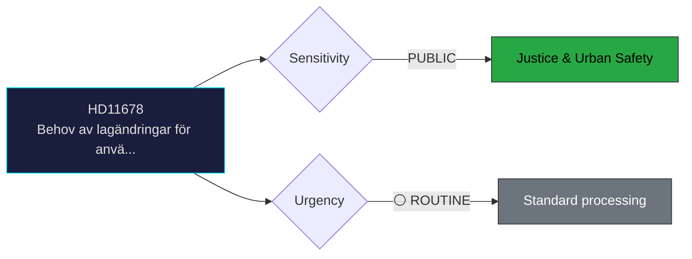

# Document Analysis: Behov av lagändringar för användande av bullerkameror

**Generated**: 2026-04-06 14:20 UTC
**dok_id**: HD11678
**Document Type**: Written Question (skriftlig fråga)
**Committee**: N/A (directed to minister)
**Date**: 2026-04-02
**Author**: Malte Tängmark Roos (MP)
**Party**: MP
**Riksmöte**: 2025/26
**Significance**: 🟢 Low (3/10)
**Confidence**: HIGH (85%)

---

## 🎯 Executive Summary

MP's Malte Tängmark Roos questions Justice Minister Gunnar Strömmer (M) on the need for legislative changes to enable noise cameras to combat reckless driving. This connects to urban safety policy and cross-party concern about street racing. The question highlights MP's pivot toward urban safety issues alongside environmental policy. **[HIGH confidence]**

---

## 📊 Political Classification

---

## 💼 SWOT Analysis

### ✅ Strengths

| # | Statement | Evidence (dok_id) | Confidence | Impact |
|---|-----------|-------------------|:----------:|:------:|
| S1 | MP positions itself on urban safety — expanding beyond traditional environmental niche | HD11678 | M | M |

### ⚠️ Weaknesses

| # | Statement | Evidence (dok_id) | Confidence | Impact |
|---|-----------|-------------------|:----------:|:------:|
| W1 | Noise camera legislation faces privacy and surveillance concerns from civil liberties perspective | HD11678 | M | M |

### 🔴 Threats

| # | Statement | Evidence (dok_id) | Confidence | Impact |
|---|-----------|-------------------|:----------:|:------:|
| T1 | Low electoral impact; primarily a positioning tool for MP in urban constituencies | HD11678 | L | M |

---

## 🎭 Risk Assessment

| Risk ID | Description | L (1-5) | I (1-5) | Score | Trend |
|---------|-------------|:-------:|:-------:|:-----:|:-----:|
| RSK-1 | Written question generates limited political risk; primarily a positioning tool | 1 | 2 | 2 | → |

---

## 👥 Stakeholder Impact

| Stakeholder | Impact | Key Concern | dok_id |
|-------------|:------:|-------------|--------|
| Questioning party (MP) | 🟢 Positive | Gains visibility on policy issue | HD11678 |
| Responding minister | 🟡 Neutral | Standard ministerial response obligation | HD11678 |
| Citizens | 🟡 Mixed | Issue awareness raised | HD11678 |

---

## 🔗 Cross-Document References

- HD01JuU15 (criminal justice context), HD03227 (youth crime investigation tools)

---

## 📈 Forward Indicators

| Indicator | Trigger | Timeline | MCP Tool |
|-----------|---------|----------|----------|
| Ministerial written answer | Standard response period | 2-4 weeks | search_dokument |
| Follow-up interpellation if answer unsatisfactory | Opposition decision | Q2 2026 | get_interpellationer |

---

## 📋 Document Control

**Analysis Version**: 1.0 | **Analyst**: news-realtime-monitor | **Classification**: Public
