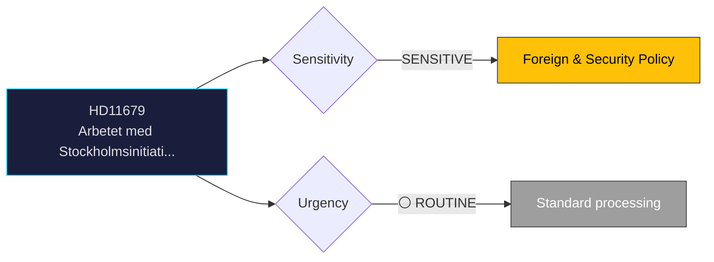

# Document Analysis: Arbetet med Stockholmsinitiativet

**Generated**: 2026-04-06 14:20 UTC
**dok_id**: HD11679
**Document Type**: Written Question (skriftlig fråga)
**Committee**: N/A (directed to minister)
**Date**: 2026-04-02
**Author**: Laila Naraghi (S)
**Party**: S
**Riksmöte**: 2025/26
**Significance**: 🟡 Medium (4/10)
**Confidence**: HIGH (85%)

---

## 🎯 Executive Summary

S's Laila Naraghi questions Foreign Minister Maria Malmer Stenergard (M) on Sweden's engagement with the Stockholm Initiative on Nuclear Disarmament, launched in 2020 by 15 foreign ministers. This tests the government's commitment to multilateral arms control in the context of Sweden's NATO membership and shifting security paradigm. **[HIGH confidence]**

---

## 📊 Political Classification

---

## 💼 SWOT Analysis

### ✅ Strengths

| # | Statement | Evidence (dok_id) | Confidence | Impact |
|---|-----------|-------------------|:----------:|:------:|
| S1 | S leverages Sweden's historical arms control leadership to challenge government foreign policy | HD11679 | M | M |

### ⚠️ Weaknesses

| # | Statement | Evidence (dok_id) | Confidence | Impact |
|---|-----------|-------------------|:----------:|:------:|
| W1 | NATO membership creates tension with Sweden's traditional non-alignment and disarmament stance | HD11679 | M | M |

### 🔴 Threats

| # | Statement | Evidence (dok_id) | Confidence | Impact |
|---|-----------|-------------------|:----------:|:------:|
| T1 | Government may appear to deprioritize disarmament in favor of alliance commitments | HD11679 | L | M |

---

## 🎭 Risk Assessment

| Risk ID | Description | L (1-5) | I (1-5) | Score | Trend |
|---------|-------------|:-------:|:-------:|:-----:|:-----:|
| RSK-1 | Written question generates limited political risk; primarily a positioning tool | 1 | 2 | 2 | → |

---

## 👥 Stakeholder Impact

| Stakeholder | Impact | Key Concern | dok_id |
|-------------|:------:|-------------|--------|
| Questioning party (S) | 🟢 Positive | Gains visibility on policy issue | HD11679 |
| Responding minister | 🟡 Neutral | Standard ministerial response obligation | HD11679 |
| Citizens | 🟡 Mixed | Issue awareness raised | HD11679 |

---

## 🔗 Cross-Document References

- HD01FöU12 (defense posture), HD11680 (international human rights)

---

## 📈 Forward Indicators

| Indicator | Trigger | Timeline | MCP Tool |
|-----------|---------|----------|----------|
| Ministerial written answer | Standard response period | 2-4 weeks | search_dokument |
| Follow-up interpellation if answer unsatisfactory | Opposition decision | Q2 2026 | get_interpellationer |

---

## 📋 Document Control

**Analysis Version**: 1.0 | **Analyst**: news-realtime-monitor | **Classification**: Public
