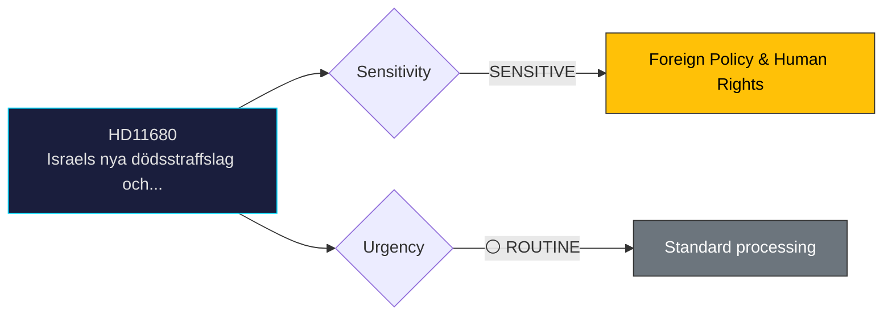

# Document Analysis: Israels nya dödsstraffslag och rättsstatens principer

**Generated**: 2026-04-06 14:20 UTC
**dok_id**: HD11680
**Document Type**: Written Question (skriftlig fråga)
**Committee**: N/A (directed to minister)
**Date**: 2026-04-02
**Author**: Jamal El-Haj
**Party**: Independent (-)
**Riksmöte**: 2025/26
**Significance**: 🟡 Medium (4/10)
**Confidence**: HIGH (85%)

---

## 🎯 Executive Summary

Independent MP Jamal El-Haj questions Foreign Minister Stenergard on Israel's new death penalty legislation and rule of law principles. This touches on highly sensitive Middle East policy, international law, and Sweden's bilateral relationship with Israel. The question pressures the government on its stance on Israeli domestic legislation. **[HIGH confidence]**

---

## 📊 Political Classification

---

## 💼 SWOT Analysis

### ✅ Strengths

| # | Statement | Evidence (dok_id) | Confidence | Impact |
|---|-----------|-------------------|:----------:|:------:|
| S1 | Raises legitimate rule-of-law concerns aligned with Sweden's human rights tradition | HD11680 | M | M |

### ⚠️ Weaknesses

| # | Statement | Evidence (dok_id) | Confidence | Impact |
|---|-----------|-------------------|:----------:|:------:|
| W1 | Politically sensitive topic with potential for domestic community polarization | HD11680 | M | M |

### 🔴 Threats

| # | Statement | Evidence (dok_id) | Confidence | Impact |
|---|-----------|-------------------|:----------:|:------:|
| T1 | Government must balance Israel relations, human rights commitments, and domestic politics | HD11680 | L | M |

---

## 🎭 Risk Assessment

| Risk ID | Description | L (1-5) | I (1-5) | Score | Trend |
|---------|-------------|:-------:|:-------:|:-----:|:-----:|
| RSK-1 | Written question generates limited political risk; primarily a positioning tool | 1 | 2 | 2 | → |

---

## 👥 Stakeholder Impact

| Stakeholder | Impact | Key Concern | dok_id |
|-------------|:------:|-------------|--------|
| Questioning party (Independent (-)) | 🟢 Positive | Gains visibility on policy issue | HD11680 |
| Responding minister | 🟡 Neutral | Standard ministerial response obligation | HD11680 |
| Citizens | 🟡 Mixed | Issue awareness raised | HD11680 |

---

## 🔗 Cross-Document References

- HD11683 (minority persecution in Syria), HD11679 (foreign policy questioning pattern)

---

## 📈 Forward Indicators

| Indicator | Trigger | Timeline | MCP Tool |
|-----------|---------|----------|----------|
| Ministerial written answer | Standard response period | 2-4 weeks | search_dokument |
| Follow-up interpellation if answer unsatisfactory | Opposition decision | Q2 2026 | get_interpellationer |

---

## 📋 Document Control

**Analysis Version**: 1.0 | **Analyst**: news-realtime-monitor | **Classification**: Public
