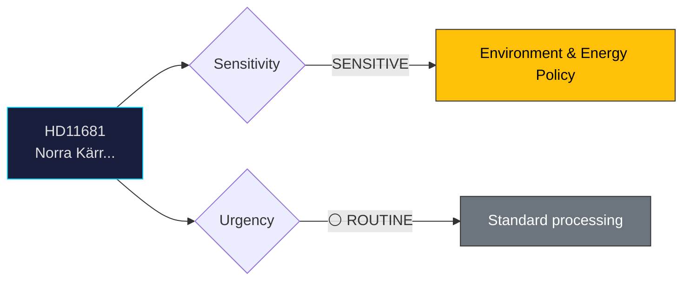

# Document Analysis: Norra Kärr

**Generated**: 2026-04-06 14:20 UTC
**dok_id**: HD11681
**Document Type**: Written Question (skriftlig fråga)
**Committee**: N/A (directed to minister)
**Date**: 2026-04-02
**Author**: Rebecka Le Moine (MP)
**Party**: MP
**Riksmöte**: 2025/26
**Significance**: 🟡 Medium (5/10)
**Confidence**: HIGH (85%)

---

## 🎯 Executive Summary

MP's Rebecka Le Moine questions Energy Minister Ebba Busch (KD) about the Norra Kärr mining concession within a UNESCO biosphere reserve. This pits rare earth mineral extraction (critical for green tech and defense) against biodiversity protection. The conflict between energy transition needs and environmental conservation is a key fault line in Swedish politics. **[HIGH confidence]**

---

## 📊 Political Classification

---

## 💼 SWOT Analysis

### ✅ Strengths

| # | Statement | Evidence (dok_id) | Confidence | Impact |
|---|-----------|-------------------|:----------:|:------:|
| S1 | MP highlights genuine tension between green transition and environmental protection | HD11681 | M | M |

### ⚠️ Weaknesses

| # | Statement | Evidence (dok_id) | Confidence | Impact |
|---|-----------|-------------------|:----------:|:------:|
| W1 | Government faces dilemma: blocking mining undermines critical mineral security; approving it angers environmental base | HD11681 | M | M |

### 🔴 Threats

| # | Statement | Evidence (dok_id) | Confidence | Impact |
|---|-----------|-------------------|:----------:|:------:|
| T1 | Norra Kärr decision could set precedent for mining in protected areas across Sweden | HD11681 | L | M |

---

## 🎭 Risk Assessment

| Risk ID | Description | L (1-5) | I (1-5) | Score | Trend |
|---------|-------------|:-------:|:-------:|:-----:|:-----:|
| RSK-1 | Written question generates limited political risk; primarily a positioning tool | 1 | 2 | 2 | → |

---

## 👥 Stakeholder Impact

| Stakeholder | Impact | Key Concern | dok_id |
|-------------|:------:|-------------|--------|
| Questioning party (MP) | 🟢 Positive | Gains visibility on policy issue | HD11681 |
| Responding minister | 🟡 Neutral | Standard ministerial response obligation | HD11681 |
| Citizens | 🟡 Mixed | Issue awareness raised | HD11681 |

---

## 🔗 Cross-Document References

- HD11682 (environmental objectives), HD03205 (food supply preparedness — resource security theme)

---

## 📈 Forward Indicators

| Indicator | Trigger | Timeline | MCP Tool |
|-----------|---------|----------|----------|
| Ministerial written answer | Standard response period | 2-4 weeks | search_dokument |
| Follow-up interpellation if answer unsatisfactory | Opposition decision | Q2 2026 | get_interpellationer |

---

## 📋 Document Control

**Analysis Version**: 1.0 | **Analyst**: news-realtime-monitor | **Classification**: Public
