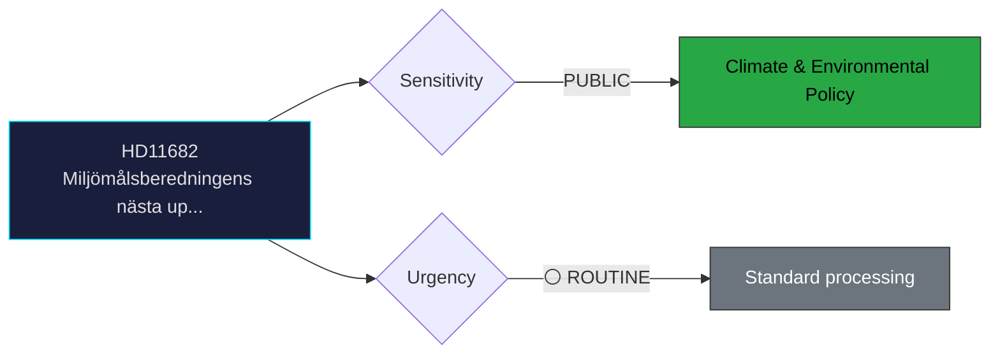

# Document Analysis: Miljömålsberedningens nästa uppdrag

**Generated**: 2026-04-06 14:20 UTC
**dok_id**: HD11682
**Document Type**: Written Question (skriftlig fråga)
**Committee**: N/A (directed to minister)
**Date**: 2026-04-02
**Author**: Rickard Nordin (C)
**Party**: C
**Riksmöte**: 2025/26
**Significance**: 🟢 Low (3/10)
**Confidence**: HIGH (85%)

---

## 🎯 Executive Summary

C's Rickard Nordin questions the acting Climate Minister Johan Britz (L) about the Environmental Objectives Committee's (Miljömålsberedningen) next mandate. The committee has been working on long-term environmental policy for years; this question probes whether the government will renew its mandate and scope. C positions itself as the constructive environmental voice from the center. **[HIGH confidence]**

---

## 📊 Political Classification

---

## 💼 SWOT Analysis

### ✅ Strengths

| # | Statement | Evidence (dok_id) | Confidence | Impact |
|---|-----------|-------------------|:----------:|:------:|
| S1 | C demonstrates environmental policy credibility distinct from MP's more confrontational approach | HD11682 | M | M |

### ⚠️ Weaknesses

| # | Statement | Evidence (dok_id) | Confidence | Impact |
|---|-----------|-------------------|:----------:|:------:|
| W1 | Question may receive bland reassurance rather than substantive policy commitment | HD11682 | M | M |

### 🔴 Threats

| # | Statement | Evidence (dok_id) | Confidence | Impact |
|---|-----------|-------------------|:----------:|:------:|
| T1 | Low — routine environmental governance question with limited electoral impact | HD11682 | L | M |

---

## 🎭 Risk Assessment

| Risk ID | Description | L (1-5) | I (1-5) | Score | Trend |
|---------|-------------|:-------:|:-------:|:-----:|:-----:|
| RSK-1 | Written question generates limited political risk; primarily a positioning tool | 1 | 2 | 2 | → |

---

## 👥 Stakeholder Impact

| Stakeholder | Impact | Key Concern | dok_id |
|-------------|:------:|-------------|--------|
| Questioning party (C) | 🟢 Positive | Gains visibility on policy issue | HD11682 |
| Responding minister | 🟡 Neutral | Standard ministerial response obligation | HD11682 |
| Citizens | 🟡 Mixed | Issue awareness raised | HD11682 |

---

## 🔗 Cross-Document References

- HD11681 (Norra Kärr mining), HD01MJU30 (climate targets)

---

## 📈 Forward Indicators

| Indicator | Trigger | Timeline | MCP Tool |
|-----------|---------|----------|----------|
| Ministerial written answer | Standard response period | 2-4 weeks | search_dokument |
| Follow-up interpellation if answer unsatisfactory | Opposition decision | Q2 2026 | get_interpellationer |

---

## 📋 Document Control

**Analysis Version**: 1.0 | **Analyst**: news-realtime-monitor | **Classification**: Public
