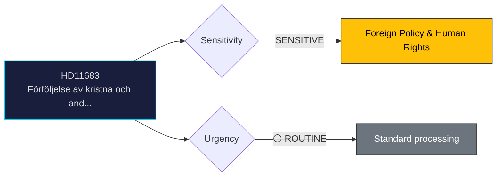

# Document Analysis: Förföljelse av kristna och andra minoriteter i Syrien

**Generated**: 2026-04-06 14:20 UTC
**dok_id**: HD11683
**Document Type**: Written Question (skriftlig fråga)
**Committee**: N/A (directed to minister)
**Date**: 2026-04-02
**Author**: Linnéa Wickman (S)
**Party**: S
**Riksmöte**: 2025/26
**Significance**: 🟡 Medium (4/10)
**Confidence**: HIGH (85%)

---

## 🎯 Executive Summary

S's Linnéa Wickman questions Foreign Minister Stenergard about persecution of Christians and other minorities in Syria following recent alarming reports. This connects to Sweden's humanitarian tradition and the ongoing Middle East instability. The question tests the government's response to religious persecution in the context of reduced Swedish foreign aid and changing Syria policy. **[HIGH confidence]**

---

## 📊 Political Classification

---

## 💼 SWOT Analysis

### ✅ Strengths

| # | Statement | Evidence (dok_id) | Confidence | Impact |
|---|-----------|-------------------|:----------:|:------:|
| S1 | S highlights humanitarian concerns that resonate with Swedish public opinion across party lines | HD11683 | M | M |

### ⚠️ Weaknesses

| # | Statement | Evidence (dok_id) | Confidence | Impact |
|---|-----------|-------------------|:----------:|:------:|
| W1 | Sweden's reduced aid budget limits policy options for addressing minority persecution | HD11683 | M | M |

### 🔴 Threats

| # | Statement | Evidence (dok_id) | Confidence | Impact |
|---|-----------|-------------------|:----------:|:------:|
| T1 | Government may face criticism from both left (insufficient aid) and right (migration implications) | HD11683 | L | M |

---

## 🎭 Risk Assessment

| Risk ID | Description | L (1-5) | I (1-5) | Score | Trend |
|---------|-------------|:-------:|:-------:|:-----:|:-----:|
| RSK-1 | Written question generates limited political risk; primarily a positioning tool | 1 | 2 | 2 | → |

---

## 👥 Stakeholder Impact

| Stakeholder | Impact | Key Concern | dok_id |
|-------------|:------:|-------------|--------|
| Questioning party (S) | 🟢 Positive | Gains visibility on policy issue | HD11683 |
| Responding minister | 🟡 Neutral | Standard ministerial response obligation | HD11683 |
| Citizens | 🟡 Mixed | Issue awareness raised | HD11683 |

---

## 🔗 Cross-Document References

- HD11680 (Israel human rights), HD11679 (Stockholm Initiative — foreign policy pattern)

---

## 📈 Forward Indicators

| Indicator | Trigger | Timeline | MCP Tool |
|-----------|---------|----------|----------|
| Ministerial written answer | Standard response period | 2-4 weeks | search_dokument |
| Follow-up interpellation if answer unsatisfactory | Opposition decision | Q2 2026 | get_interpellationer |

---

## 📋 Document Control

**Analysis Version**: 1.0 | **Analyst**: news-realtime-monitor | **Classification**: Public
