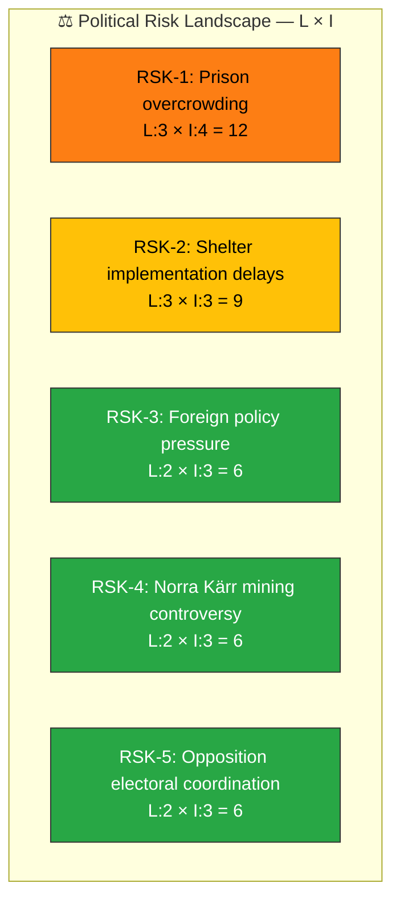
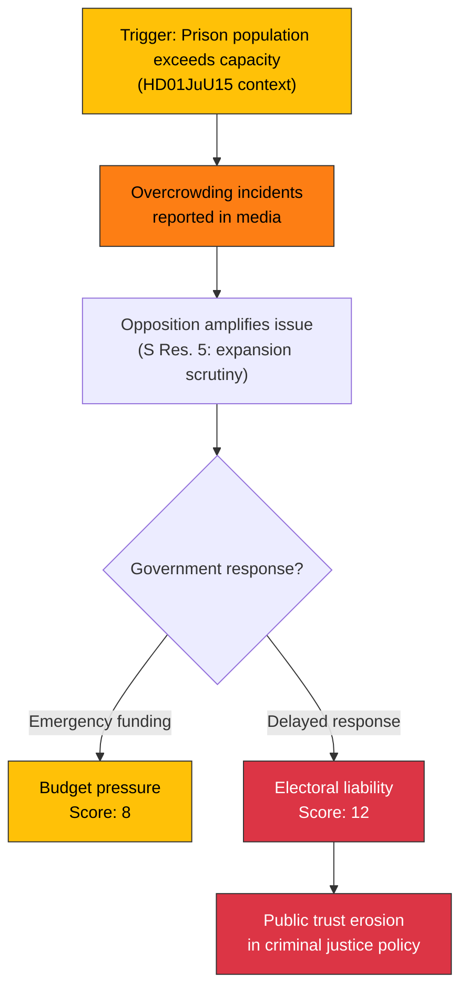

# ⚠️ Political Risk Assessment — 2026-04-06

**Generated**: 2026-04-06 14:20 UTC | **Produced By**: news-realtime-monitor (realtime-1420)
**Documents Analyzed**: 9 | **Confidence**: MEDIUM

---

## 📋 Risk Context

| Field | Value |
|-------|-------|
| **Risk Assessment ID** | RSK-2026-04-06-1420 |
| **Assessment Date** | 2026-04-06 14:20 UTC |
| **Assessment Period** | 2026-04-02 (lookback from Easter recess) |
| **Produced By** | news-realtime-monitor |
| **Political Context** | Kristersson government (M+KD+L+SD support) in Easter recess. Coalition stability at 83/100, majority margin 175 seats. Last votes March 4. |
| **Riksmöte** | 2025/26 |
| **Overall Risk Level** | LOW |

---

## 🗂️ Risk Inventory

### Risk Heat Map

---

### Detailed Risk Register

| Risk ID | Category | Description | L (1-5) | I (1-5) | Score | Evidence (dok_id) | Confidence | Trend |
|---------|----------|-------------|:-------:|:-------:|:-----:|-------------------|:----------:|:-----:|
| RSK-1 | Policy | Prison overcrowding during expansion phase — opposition demands scrutiny | 3 | 4 | 12 | HD01JuU15 Res. 5 | M | ↑ |
| RSK-2 | Policy | Municipal capacity to implement new shelter requirements | 3 | 3 | 9 | HD01FöU12 Res. 1 | M | → |
| RSK-3 | Electoral | S building systematic foreign policy critique via parliamentary questions | 2 | 3 | 6 | HD11679, HD11680, HD11683 | M | ↑ |
| RSK-4 | Policy | Norra Kärr mining decision precedent for protected areas | 2 | 3 | 6 | HD11681 | M | → |
| RSK-5 | Coalition | 4-party opposition alignment (S+V+C+MP) on safety policy | 2 | 3 | 6 | HD01JuU15 Res. 1 | H | ↑ |

---

### Cascading Risk Chain — RSK-1 (Prison Overcrowding)

---

## 📈 Forward Indicators

| Indicator | Trigger Level | Monitoring Method | Current Status |
|-----------|:------------:|-------------------|:--------------:|
| Prison occupancy rate | > 95% | Kriminalvården quarterly report | ⚠️ Watch |
| Shelter construction permits issued | < 50% target by Q3 | Municipal reporting | 🟢 Normal |
| Opposition coordination meetings | Cross-party policy platform announced | search_anforanden | 🟢 Normal |

---

## 📋 Document Control

**Analysis Version**: 1.0 | **Analyst**: news-realtime-monitor | **Classification**: Public
