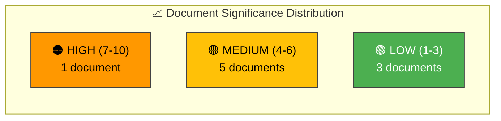

# 📈 Significance Scoring — 2026-04-06

**Generated**: 2026-04-06 14:20 UTC | **Produced By**: news-realtime-monitor (realtime-1420)
**Documents Analyzed**: 9 | **Confidence**: MEDIUM

---

## 📋 Scoring Context

| Field | Value |
|-------|-------|
| **Scoring ID** | SIG-2026-04-06-1420 |
| **Analysis Date** | 2026-04-06 14:20 UTC |
| **Produced By** | news-realtime-monitor |
| **Scoring Methodology** | significance-scoring template v2.1 |

---

## 📊 Significance Overview

---

## 📋 Detailed Scoring Table

| Rank | dok_id | Title | Type | Policy Breadth | Coalition Impact | Public Interest | Cross-Party | Total |
|:----:|--------|-------|------|:--------------:|:----------------:|:---------------:|:-----------:|:-----:|
| 1 | HD01FöU12 | Civilian protection | betänkande | 2 | 1 | 2 | 1 | **7/10** |
| 2 | HD01JuU15 | Criminal justice | betänkande | 2 | 1 | 1 | 2 | **6/10** |
| 3 | HD10428 | Emergency airport | interpellation | 1 | 1 | 1 | 1 | **5/10** |
| 4 | HD11681 | Norra Kärr mining | skriftlig fråga | 2 | 1 | 1 | 0 | **5/10** |
| 5 | HD11679 | Stockholm Initiative | skriftlig fråga | 1 | 1 | 1 | 0 | **4/10** |
| 6 | HD11680 | Israel death penalty | skriftlig fråga | 1 | 1 | 1 | 0 | **4/10** |
| 7 | HD11683 | Syria minorities | skriftlig fråga | 1 | 1 | 1 | 0 | **4/10** |
| 8 | HD11678 | Noise cameras | skriftlig fråga | 1 | 0 | 1 | 0 | **3/10** |
| 9 | HD11682 | Environmental objectives | skriftlig fråga | 1 | 0 | 1 | 0 | **3/10** |

**Scoring Formula**: Policy Breadth (0-3) + Coalition Impact (0-2) + Public Interest (0-3) + Cross-Party Dynamics (0-2) = Total/10

---

## 🎯 Editorial Recommendation

| Threshold | Documents | Recommendation |
|:---------:|:---------:|----------------|
| ≥ 7 (Breaking) | HD01FöU12 | **Monitor** — significant but Easter recess timing reduces urgency |
| 4-6 (Standard) | HD01JuU15, HD10428, HD11681, HD11679, HD11680, HD11683 | **Analysis Only** — contribute to weekly synthesis |
| ≤ 3 (Monitor) | HD11678, HD11682 | **Skip** — routine written questions |

**Overall Assessment**: Easter Monday timing means no documents reach breaking-news threshold despite HD01FöU12's substantive significance. All documents contribute to analysis-only PR.

---

## 📋 Document Control

**Analysis Version**: 1.0 | **Analyst**: news-realtime-monitor | **Classification**: Public
