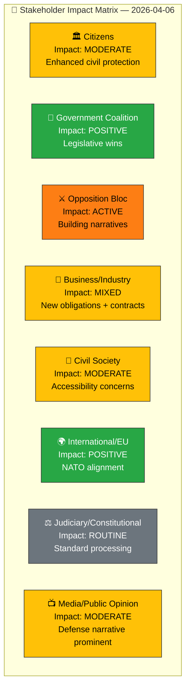

# 👥 Stakeholder Perspective Analysis — 2026-04-06

**Generated**: 2026-04-06 14:20 UTC | **Produced By**: news-realtime-monitor (realtime-1420)
**Documents Analyzed**: 9 | **Confidence**: MEDIUM

---

## 📋 Stakeholder Context

| Field | Value |
|-------|-------|
| **Analysis ID** | STK-2026-04-06-1420 |
| **Analysis Date** | 2026-04-06 14:20 UTC |
| **Stakeholder Groups Assessed** | 8 of 8 |
| **Produced By** | news-realtime-monitor |

---

## 📊 Stakeholder Impact Dashboard

---

## 📋 Detailed Stakeholder Assessment

### 1. Citizens
- **Primary Impact**: New shelter law (HD01FöU12) strengthens civil protection infrastructure
- **Secondary Impact**: Criminal justice policy maintains status quo (HD01JuU15)
- **Concerns**: Accessibility of shelters for disabled persons (HD01FöU12 Res. 2-4)

### 2. Government Coalition (M, KD, L, SD)
- **Primary Impact**: Unified legislative wins on defense and justice
- **Secondary Impact**: Written questions create response obligations for ministers
- **Key Evidence**: HD01FöU12 adopted, HD01JuU15 all motions rejected

### 3. Opposition Bloc (S, V, C, MP)
- **Primary Impact**: All motions rejected in JuU15 and FöU12
- **Secondary Impact**: Building foreign policy critique via HD11679, HD11680, HD11683
- **Notable**: 4-party alignment on Trygghetsberedningen (HD01JuU15 Res. 1) — rare cross-opposition unity

### 4. Business/Industry
- **Primary Impact**: Building sector faces new shelter requirements (HD01FöU12, Plan- och bygglagen amendments)
- **Secondary Impact**: Mining industry watches Norra Kärr precedent (HD11681)

### 5. Civil Society
- **Primary Impact**: Disability organizations concerned about shelter accessibility (HD01FöU12 Res. 2-4)
- **Secondary Impact**: Human rights NGOs engaged on Syria minorities (HD11683) and Israel (HD11680)

### 6. International/EU
- **Primary Impact**: Sweden's NATO-aligned civil defense modernization (HD01FöU12)
- **Secondary Impact**: Arms control commitment questioned (HD11679 Stockholm Initiative)

### 7. Judiciary/Constitutional
- **Primary Impact**: Standard legislative review of 3 new laws (HD01FöU12)
- **No significant constitutional concerns** identified in current document set

### 8. Media/Public Opinion
- **Primary Impact**: Defense and security narrative dominates parliamentary output
- **Secondary Impact**: Foreign policy questioning provides story angles for political journalists

---

## 📋 Document Control

**Analysis Version**: 1.0 | **Analyst**: news-realtime-monitor | **Classification**: Public
