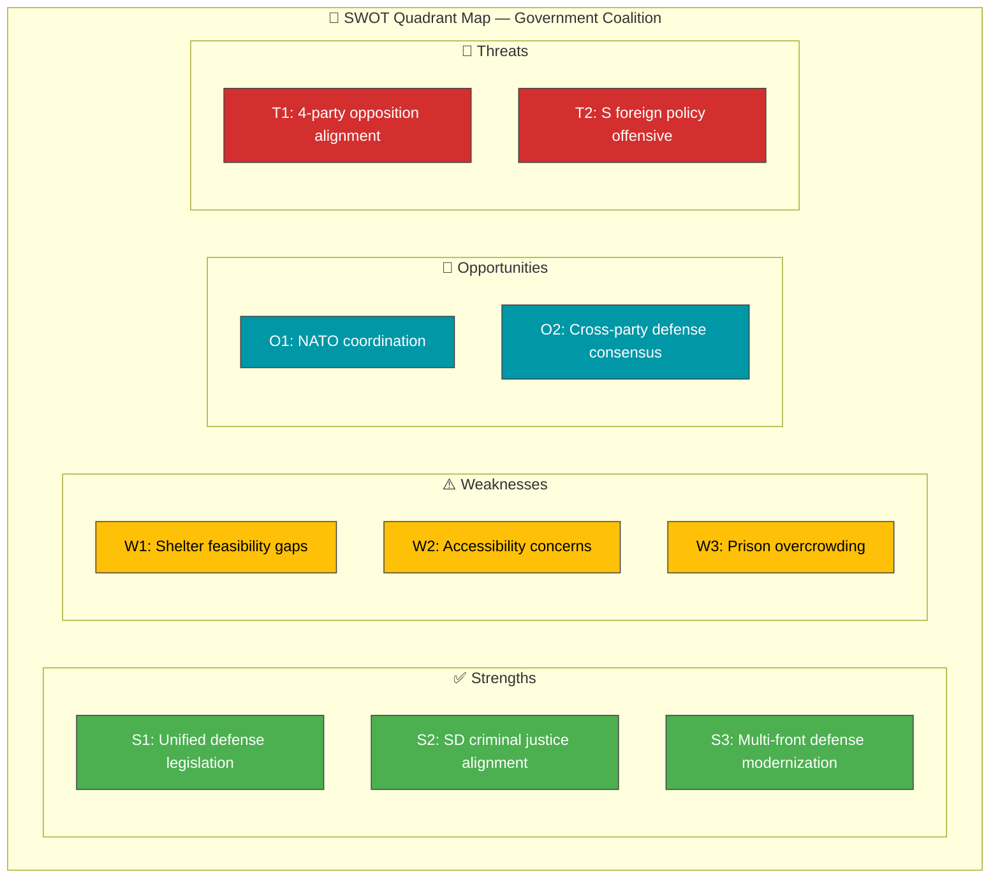

# 💼 Political SWOT Analysis — 2026-04-06

**Generated**: 2026-04-06 14:20 UTC | **Produced By**: news-realtime-monitor (realtime-1420)
**Documents Analyzed**: 9 | **Confidence**: MEDIUM

---

## 📋 SWOT Context

| Field | Value |
|-------|-------|
| **SWOT ID** | SWT-2026-04-06-1420 |
| **Analysis Date** | 2026-04-06 14:20 UTC |
| **Analysis Scope** | Government coalition and opposition dynamics |
| **Reference Period** | 2026-W14 (Easter recess, data from 2026-04-02) |
| **Produced By** | news-realtime-monitor |
| **Primary MCP Sources** | get_betankanden, get_propositioner, search_dokument |
| **Validity Window** | Valid until 2026-04-13 (next parliamentary session) |

---

## 🏛️ Government Coalition SWOT

### ✅ Strengths — Government Coalition

| # | Strength Statement | Evidence (dok_id) | Confidence | Impact | Entry Date |
|---|-------------------|-------------------|:----------:|:------:|:----------:|
| S1 | Coalition maintains unified defense legislation front — 3 new laws adopted in FöU12 | HD01FöU12 | H | H | 2026-04-02 |
| S2 | SD alignment on criminal justice remains strong — all 13+ opposition motions rejected in JuU15 | HD01JuU15 | H | H | 2026-04-02 |
| S3 | Government advances total defense modernization on multiple fronts simultaneously (shelters + cyber + war materiel) | HD01FöU12, HD03214, HD03228 | H | H | 2026-04-01 |
| S4 | Law-and-order agenda momentum maintained through Easter recess | HD01JuU15, HD03235, HD03227 | M | M | 2026-04-02 |

**Coalition Strength Summary:** The Kristersson government enters the Easter recess with legislative momentum on both defense and justice, maintaining SD support discipline.

---

### ⚠️ Weaknesses — Government Coalition

| # | Weakness Statement | Evidence (dok_id) | Confidence | Impact | Entry Date |
|---|-------------------|-------------------|:----------:|:------:|:----------:|
| W1 | Feasibility concerns on civilian protection — S+V cite implementation capacity gaps | HD01FöU12 Res. 1 | M | H | 2026-04-02 |
| W2 | Accessibility gaps in shelter law flagged by 3 opposition parties (V, C, MP) | HD01FöU12 Res. 2-4 | H | M | 2026-04-02 |
| W3 | Prison overcrowding unresolved despite policy rhetoric | HD01JuU15 Res. 5-6 | M | H | 2026-04-02 |
| W4 | Norra Kärr mining dilemma exposes tension between green transition and environment | HD11681 | M | M | 2026-04-02 |

**Coalition Weakness Summary:** The government faces implementation credibility challenges on defense and justice, with accessibility and capacity gaps providing opposition ammunition.

---

### 🌟 Opportunities — Government Coalition

| # | Opportunity Statement | Evidence (dok_id) | Confidence | Impact | Entry Date |
|---|----------------------|-------------------|:----------:|:------:|:----------:|
| O1 | NATO membership enables international coordination on civil protection | HD01FöU12, HD03214 | M | H | 2026-04-02 |
| O2 | Cross-party agreement on defense direction (disputes are on scope, not principle) | HD01FöU12 all reservations | H | M | 2026-04-02 |
| O3 | Total defense narrative resonates with public concern over security environment | HD01FöU12, HD10428 | M | H | 2026-04-02 |

---

### 🔴 Threats — Government Coalition

| # | Threat Statement | Evidence (dok_id) | Confidence | Impact | Entry Date |
|---|-----------------|-------------------|:----------:|:------:|:----------:|
| T1 | Broad 4-party opposition alignment on Trygghetsberedningen (S+V+C+MP in JuU15 Res. 1) — signals electoral coordination | HD01JuU15 Res. 1 | H | M | 2026-04-02 |
| T2 | Systematic foreign policy questioning by S (3 questions to FM Stenergard in one day) | HD11679, HD11680, HD11683 | M | M | 2026-04-02 |
| T3 | Environmental policy tension could alienate green-leaning voters from L and KD | HD11681, HD11682 | L | M | 2026-04-02 |

---

## 📊 SWOT Quadrant Mapping

---

## 🔀 TOWS Strategic Options

| Strategy | SWOT Combination | Description |
|----------|:----------------:|-------------|
| **SO: Leverage NATO for shelter standards** | S1 + O1 | Use NATO civil protection frameworks to justify shelter modernization and deflect feasibility criticism |
| **WT: Address prison capacity proactively** | W3 + T1 | Announce prison expansion timeline before opposition can use overcrowding as election issue |

---

## 📋 Document Control

**Analysis Version**: 1.0 | **Analyst**: news-realtime-monitor | **Classification**: Public
