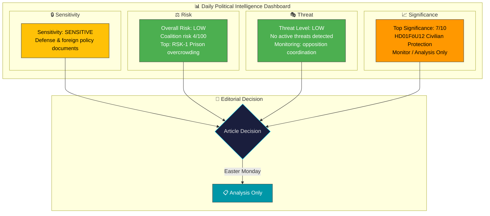

# 🧩 Political Intelligence Synthesis — 2026-04-06

**Generated**: 2026-04-06 14:20 UTC | **Produced By**: news-realtime-monitor (realtime-1420)
**Documents Analyzed**: 9 | **Data Freshness**: Documents sourced from **2026-04-02** (Easter recess lookback)
**Overall Confidence**: MEDIUM | **Risk Level**: LOW

---

## 📋 Synthesis Context

| Field | Value |
|-------|-------|
| **Synthesis ID** | SYN-2026-04-06-1420 |
| **Analysis Date** | 2026-04-06 14:20 UTC |
| **Documents Analyzed** | 9 |
| **Analysis Period** | 2026-04-02 (lookback from Easter Monday 2026-04-06) |
| **Produced By** | news-realtime-monitor |
| **Overall Confidence** | MEDIUM |

---

## 📊 Intelligence Dashboard

---

## 📈 Document Significance Ranking

| Rank | Score | dok_id | Title | Type | Key Finding |
|:----:|:-----:|--------|-------|------|-------------|
| 1 | 7/10 | HD01FöU12 | Civilian protection during heightened readiness | Committee Report (FöU) | New shelter law adopted; 6 opposition reservations |
| 2 | 6/10 | HD01JuU15 | Criminal justice issues | Committee Report (JuU) | 13+ motions rejected; 4-party opposition alignment on Res. 1 |
| 3 | 5/10 | HD10428 | Emergency airport Scandinavian Mountain Airport | Interpellation | Hultqvist (S) challenges KD on total defense infrastructure |
| 4 | 5/10 | HD11681 | Norra Kärr mining | Written Question | MP vs KD on mining in biosphere reserve |
| 5 | 4/10 | HD11679 | Stockholm Initiative | Written Question | S probes arms control commitment post-NATO |
| 6 | 4/10 | HD11680 | Israel death penalty law | Written Question | Human rights / Middle East policy |
| 7 | 4/10 | HD11683 | Persecution of minorities in Syria | Written Question | Humanitarian concerns / foreign policy |
| 8 | 3/10 | HD11678 | Noise cameras | Written Question | MP urban safety positioning |
| 9 | 3/10 | HD11682 | Environmental objectives committee | Written Question | C probes environmental governance |

---

## 🔍 Cross-Document Patterns

### Theme 1: Defense & Total Defense Modernization
Documents HD01FöU12, HD10428, and HD03214 (referenced) form a coherent defense modernization narrative. The government is advancing civilian protection (shelters), cybersecurity infrastructure, and war materiel regulations simultaneously. Opposition (S, V) supports the direction but challenges feasibility and accessibility.

### Theme 2: Foreign Policy Accountability
Three written questions (HD11679, HD11680, HD11683) target Foreign Minister Stenergard on arms control, Israel, and Syria. This suggests S is building a systematic foreign policy critique ahead of election season.

### Theme 3: Environmental Policy Tensions
HD11681 (Norra Kärr mining) and HD11682 (environmental objectives) highlight the government's unresolved tension between green transition resource needs and environmental protection commitments.

---

## 🎯 Aggregate SWOT Summary

| Quadrant | Key Finding | Evidence |
|----------|-------------|----------|
| **Strengths** | Coalition maintains unified voting discipline across defense and justice | HD01FöU12, HD01JuU15 |
| **Weaknesses** | Broad 4-party opposition alignment (S+V+C+MP) signals coordinated challenge | HD01JuU15 Res. 1 |
| **Opportunities** | Defense modernization narrative resonates with public security concerns | HD01FöU12, HD10428 |
| **Threats** | Foreign policy questioning pattern could intensify electoral pressure | HD11679, HD11680, HD11683 |

---

## 📈 Forward Intelligence

| Watch Item | Trigger | Timeline | Significance |
|------------|---------|----------|:------------:|
| Chamber vote on FöU12 (civilian protection) | Scheduled debate April 14 | This week | HIGH |
| Ministerial response to IP:428 (emergency airport) | Due April 23 | 2 weeks | MEDIUM |
| Post-Easter parliamentary resumption | Riksdag reconvenes | April 13-14 | HIGH |
| Written question responses (HD11678-HD11683) | Standard 2-4 week response | April-May 2026 | LOW |

---

## 📋 Document Control

**Analysis Version**: 1.0 | **Analyst**: news-realtime-monitor | **Classification**: Public
**Data Freshness**: Documents sourced from **2026-04-02** via lookback fallback (article date: 2026-04-06).
